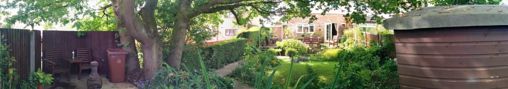
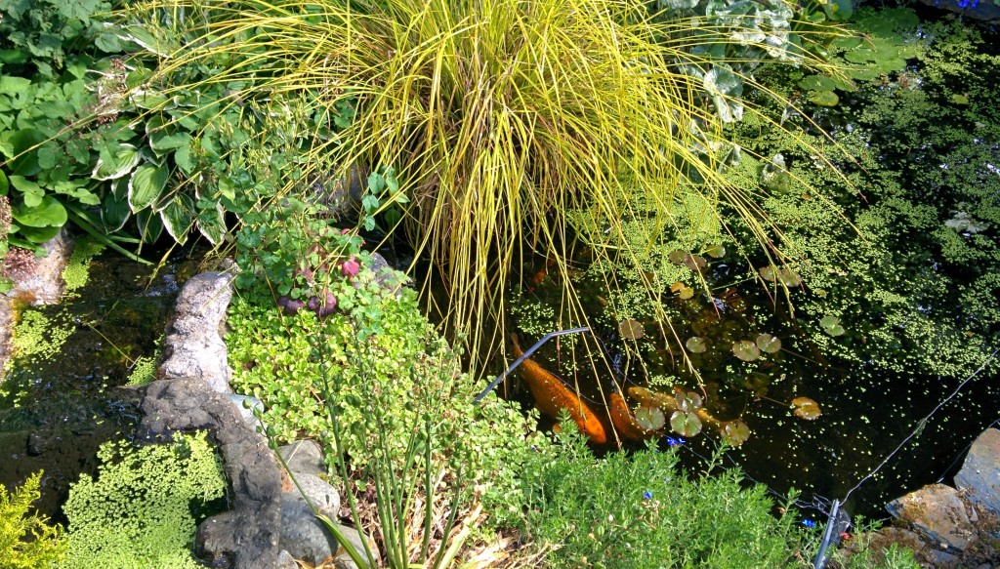
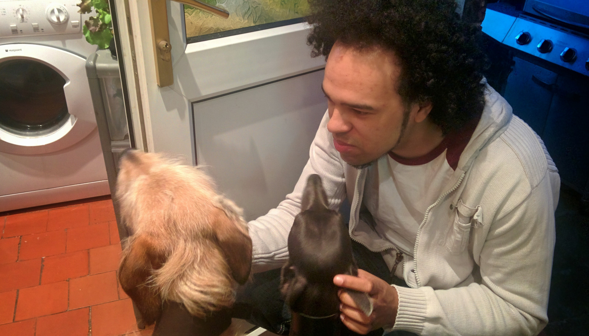
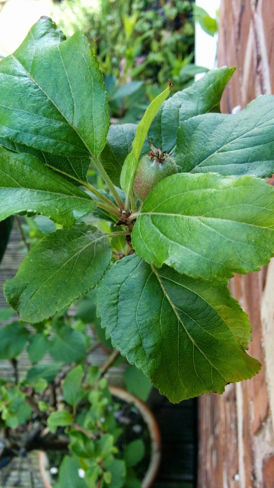

Where ever you are in the world, home is always where the heart is. My mom puts so much love and attention into our home, it makes it an honour to come home and look after the place while they go on a short holiday.

{{}}

{{}}

Over 10 years of tinkering to get a garden that looks as colourful and delightful as this. We have two dogs, 3 chickens, and a pond full of fish.

{{}}

Not forgetting a whole collection of herbs, fruit and vegetables growing. This year is the first year the Apple tree I planted from a seed is producing fruit, I planted this seed in a tiny pot in the early 90's.

Hope next time I'm home after my travels the garden is still bursting with life, and my little-big Apple tree has more fruit.

{{}}
