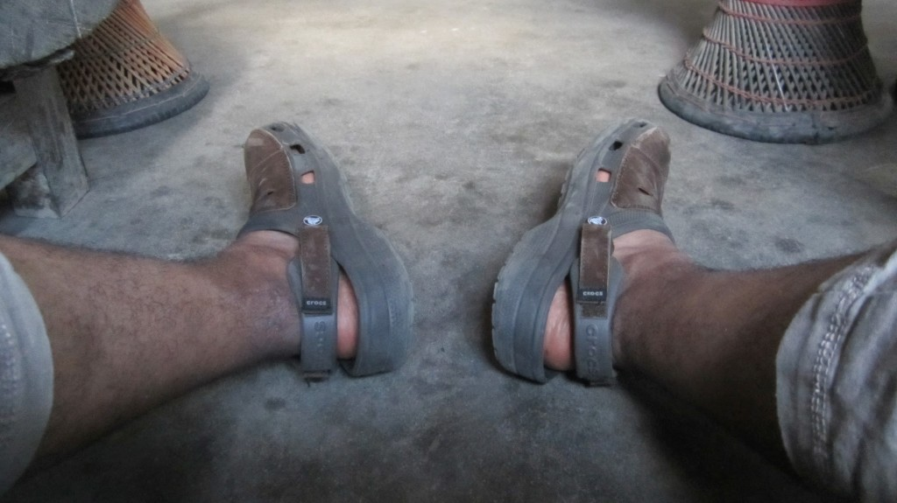
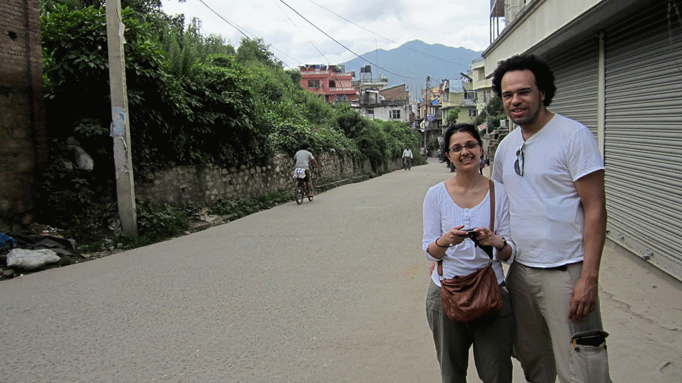
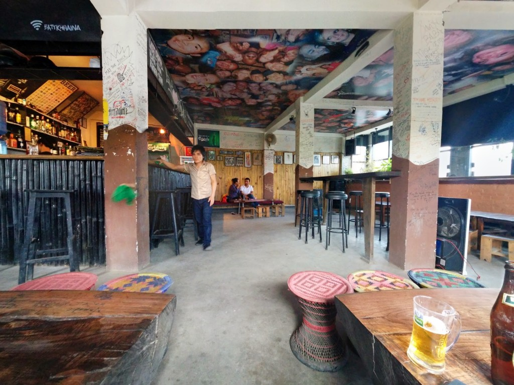
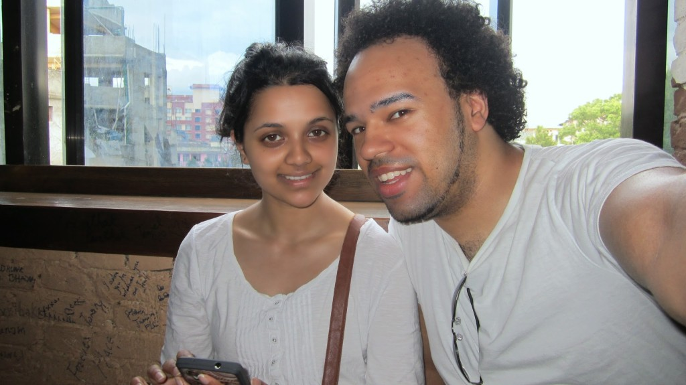
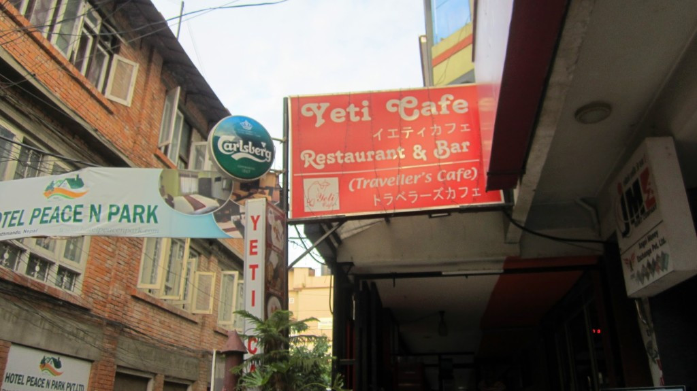

Friday we decided to expand our knowledge of the local area, we picked a direction and started walking until we decided to try a new direction.  After crossing a really busy road, We found [Samakhusi](http://en.wikipedia.org/wiki/Samakhushi) a more cultural area not far outside of [Thamel](http://en.wikipedia.org/wiki/Thamel).



We got a gist of how some of Kathmandu residents live - small dark rooms, trash piles in just off the road, the odd sleeping dog and people watching us walk by.  However we still seen clothing trade is a relatively big deal.  Ability to get nice western looking cloths in a few shops.

 

It was about mid-day so we had to stop for a drink. We stopped for a Fanta at a place called [The Tasty Corner](https://www.facebook.com/pages/The-Tasty-Corner/224081751086915 "The Tasty Corner on Facebook"), the place did not look like somewhere we would like to test its name. The kitchen only had one dim lightbulb and the ceiling and walls were covered in spent frying oil.

We decided to find some places to chill out, something a bit more comfortable. We ended up finding the British embassy and Indian embassy, both fortified with high walls and big gates. Next to the embassies was a respectful looking place (forgotten its name) where we grabbed a Hot Honey & Lemon (our new favourite drink).  Checking my Google saved places, [Jazz Upstairs](http://www.tripadvisor.co.uk/Restaurant_Review-g293890-d4609291-Reviews-Jazz_upstairs-Kathmandu_Kathmandu_Valley_Bagmati_Zone_Central_Region.html "Jazz Upstairs on TripAdvisor") was just around the corner, a place we can chill for a few hours. Was not too disappointed I grabbed a beer and sat on a couch watching the traffic and enjoying the hills around.

Did not stay too late because we were getting hungry.

We seen a place [Yeti Restaurant and Bar](http://www.tripadvisor.co.uk/Restaurant_Review-g293890-d2149656-Reviews-Yeti_Cafe_Restaurant_and_Bar-Kathmandu_Kathmandu_Valley_Bagmati_Zone_Central_Regi.html "Yeti Restaurant and Bar on TripAdvisor") on TripAdvisor which had decent Reviews and was not too far from where we are staying.  While browsing the menu there was a waiter stood not far from us waiting anxiously to pounce take our order (this was rather off-putting). We ordered Fried Chicken MoMo, Vegetable Biryani and a Chicken Fried Rice.  Sadly the dishes where awful!  Lacking seasoning, rushed and bland in flavour. The Vegetables in the Biryani where too hard and the rice was mashed together, the dish was warm but not piping hot.  The Chicken Fried Rice lacked seasoning, and presentation was poor (a big plate of rice, no garnish).  The Fried Chicken MoMo's although crunchy and bearable, the taste reminds me of the streets we visited earlier. It was the worst meal we have had so far (luckily we were not ill). Paying and requesting exact change we headed back to find out what was current, everybody was up for the German vs France world cup football match.  We decided to go to the [Hard Rock Cafe](https://plus.google.com/108439595283957867261/about?gl=uk&hl=en) (it's not officially listed on [HardRock.com](http://www.hardrock.com/locations.aspx?q=nepal "Search Nepal on HardRock.com")) everybody went somewhere else, luckily for us Hard Rock was nicely air-conditioned with a live band, oh and the game was on big screen.

We attempted to get a simple bite at [Crazy Burger](http://www.tripadvisor.co.uk/Restaurant_Review-g293890-d3536488-Reviews-Crazy_Burger-Kathmandu_Kathmandu_Valley_Bagmati_Zone_Central_Region.html "Crazy Burger on TripAdvisor"), after being pressured to make an order we finally chose Pizza and Fries.  The Pizza base was not fresh, the cheese was solid and over all lacked the values of a Pizza.  The fries came with complementary cockroach leg.   This was not a great day for food.

We spent ₨2585 (about £15.54) this day.
