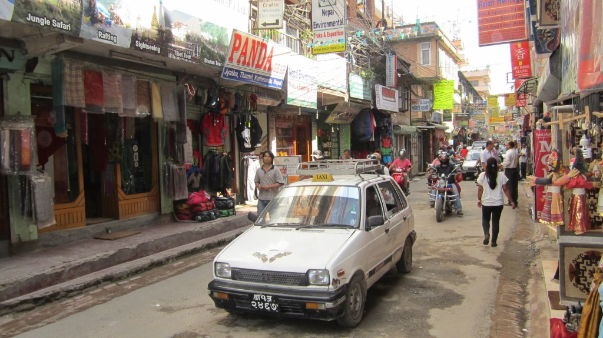
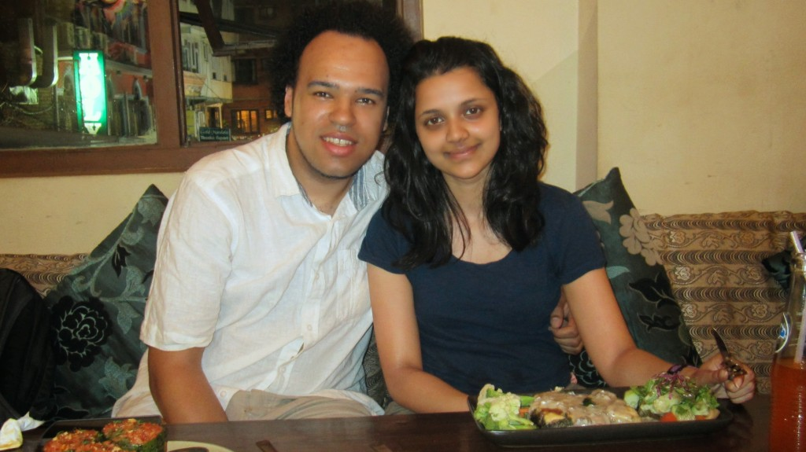
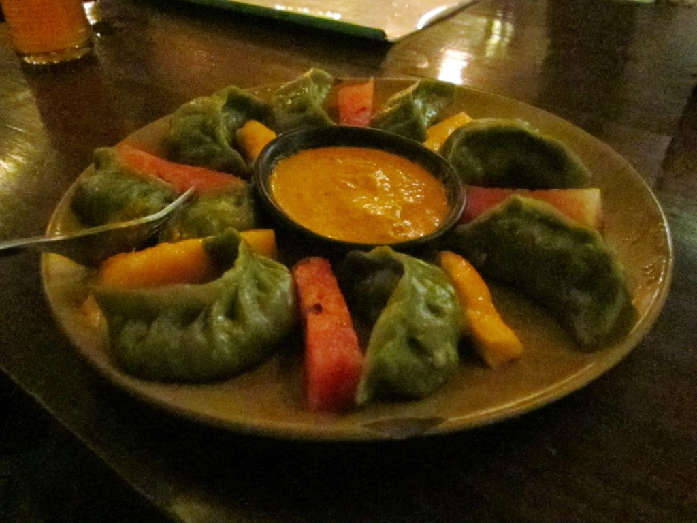
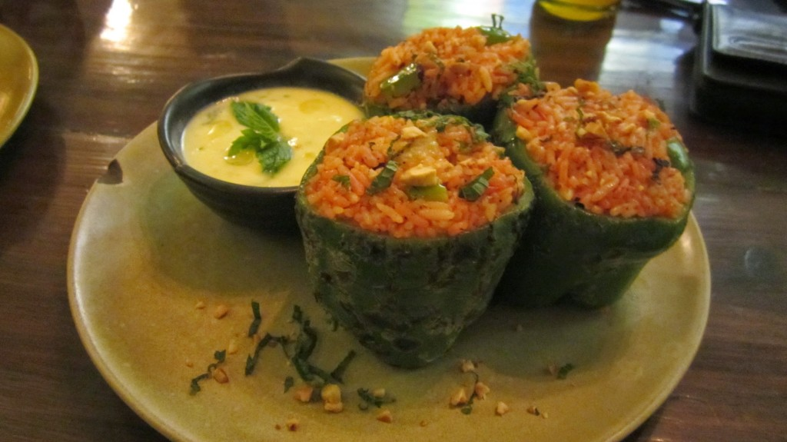
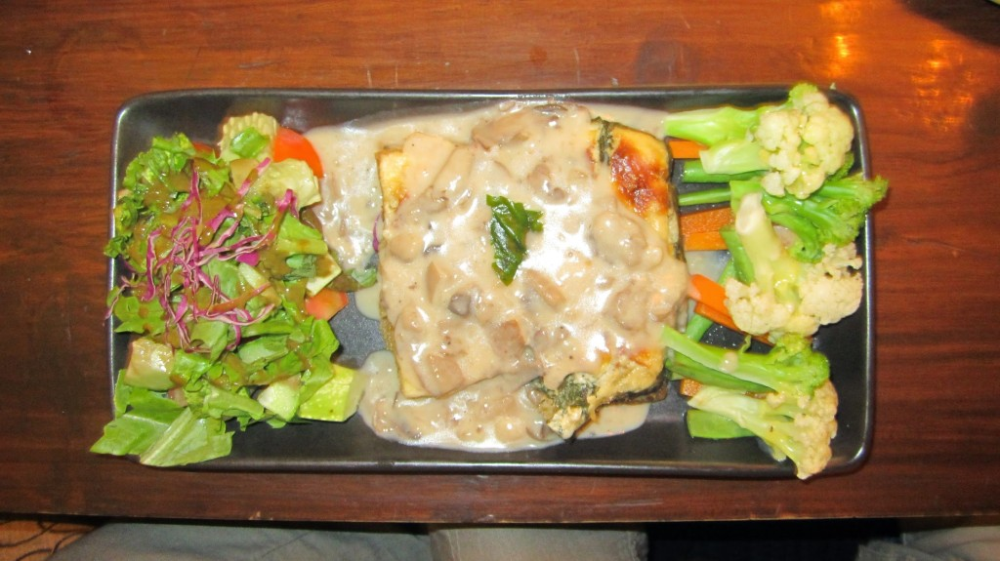

Saturday we chilled at [Himalayan Java](http://www.tripadvisor.co.uk/Restaurant_Review-g293890-d1846797-Reviews-Himalayan_Java_Coffee-Kathmandu_Kathmandu_Valley_Bagmati_Zone_Central_Region.html "Himalayan Java on TripAdvisor") and [Places](http://www.tripadvisor.co.uk/Restaurant_Review-g293890-d4283853-Reviews-Places_Restaurant_Bar-Kathmandu_Kathmandu_Valley_Bagmati_Zone_Central_Region.html "Places on Trip Advisor") catching up on the news, emails and getting some work done.  It did seem a bit busier with people trying to sell you things, and the odd taxi man approaching you saying "I have taxi" (fed up with pestering taxi men, I responded "Good on you"!).



It also rained today, first tropical monsoon rain we've experienced while being here.

[Places](http://www.tripadvisor.co.uk/Restaurant_Review-g293890-d4283853-Reviews-Places_Restaurant_Bar-Kathmandu_Kathmandu_Valley_Bagmati_Zone_Central_Region.html "Places on Trip Advisor") is a Vegetarian restaurant that is laid-back and chilled, most people here utilising the fast internet and creative atmosphere to get things done or just relax.

{{}}

{{}}

{{}}

The food here was great for a strictly vegetarian meal, kudos to the atmosphere too.

As we didn't really go far or eat much, we only spent ₨1936.78 (about £11.64) this day.
