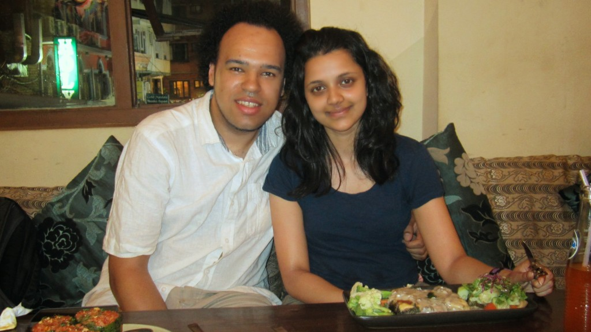

[Places Restaurant & Bar](http://www.tripadvisor.co.uk/Restaurant_Review-g293890-d4283853-Reviews-Places_Restaurant_Bar-Kathmandu_Kathmandu_Valley_Bagmati_Zone_Central_Region.html "Places on Trip Advisor")
 is a Vegetarian restaurant that is laid-back and chilled, most people here utilising the fast internet and creative atmosphere to get things done or just relax. We order Pesto Dough MoMo, Biber Dolmasi, and Taste Platter all the dishes were prepared with care and delivered in taste experience. 

{{}}

{{}}

{{}}

{{}}

We have since been a few more times during the day for light bites and drinks, this place has the perfect atmosphere to let a day drift on by.
