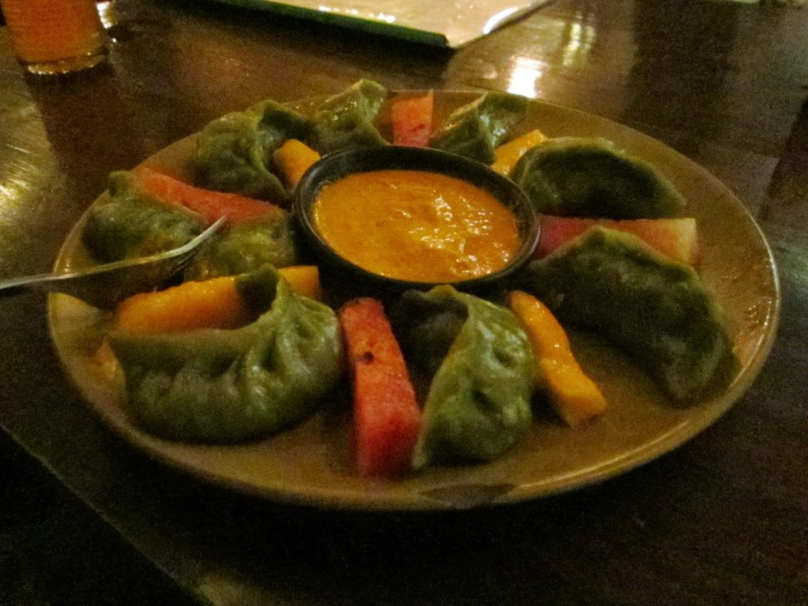
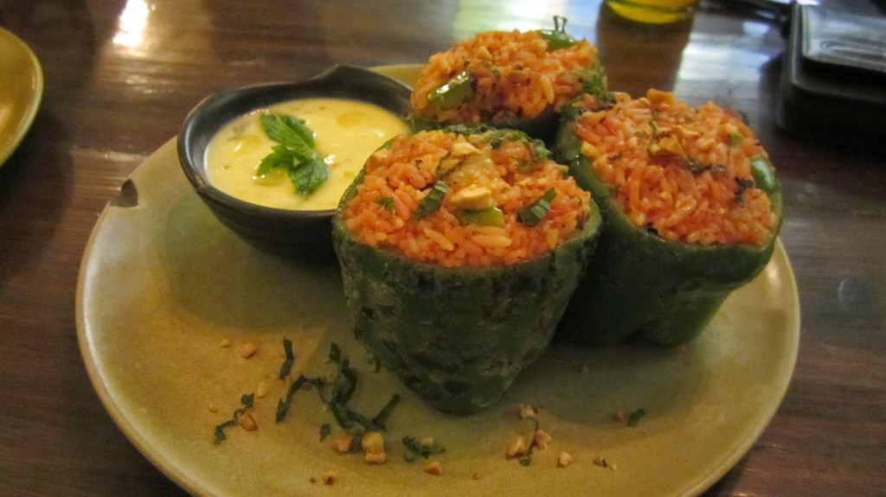
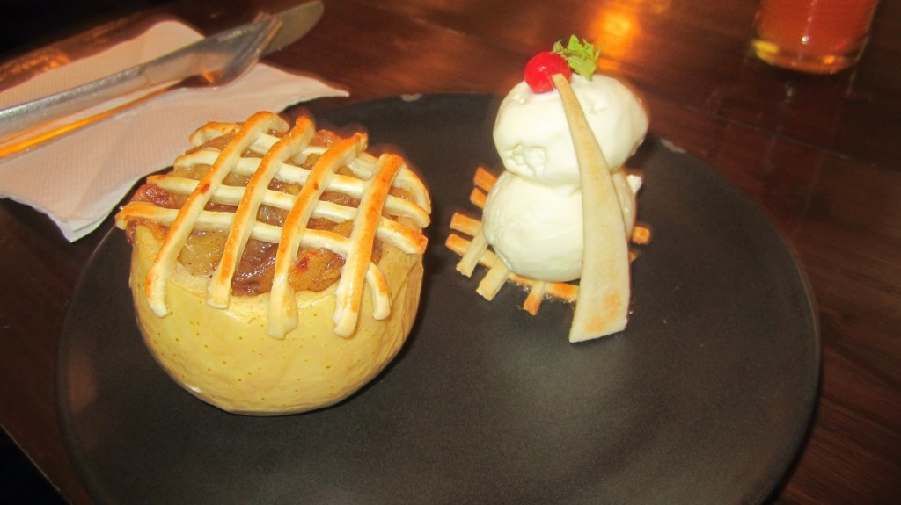

[Places Restaurant & Bar](http://www.tripadvisor.co.uk/Restaurant_Review-g293890-d4283853-Reviews-Places_Restaurant_Bar-Kathmandu_Kathmandu_Valley_Bagmati_Zone_Central_Region.html "Places on Trip Advisor") (Rated #5 our of 385 restaurants in on TripAdvisor) is a Vegetarian restaurant that is laid-back and chilled, most people here utilising the fast internet and creative atmosphere to get things done or just relax. We order Pesto Dough MoMo, Biber Dolmasi, and Taste Platter all the dishes were prepared with care and delivered in taste experience. 

\[caption id="attachment\_161" align="aligncenter" width="700"\] Vegetarian Pesto Dough MoMo's\[/caption\]

\[caption id="attachment\_162" align="aligncenter" width="700"\] Biber Dolmasi (Stuffed Peppers)\[/caption\]

\[caption id="attachment\_163" align="aligncenter" width="700"\] Taste Platter - Spinach Pie, Baked Potato Tortilla, Steamed Vegetable Salad\[/caption\]

\[caption id="attachment\_251" align="aligncenter" width="700"\] Fresh Apple Pie\[/caption\]

We have since been a few more times during the day for light bites and drinks, this place has the perfect atmosphere to let a day drift on by.
