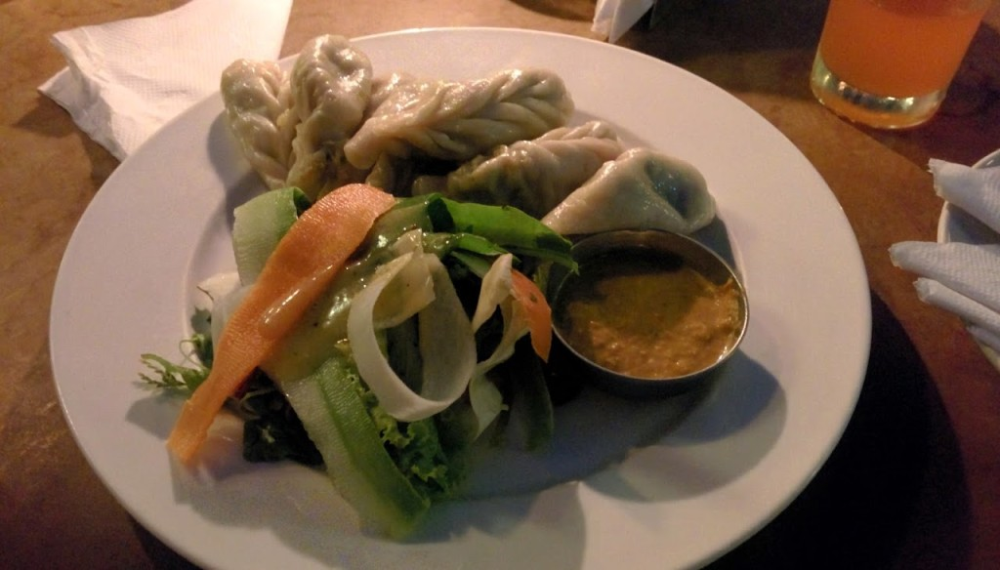
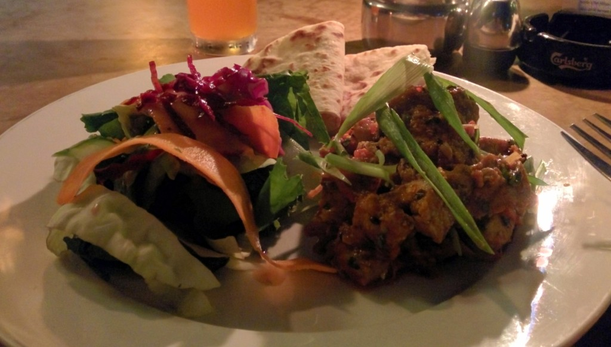
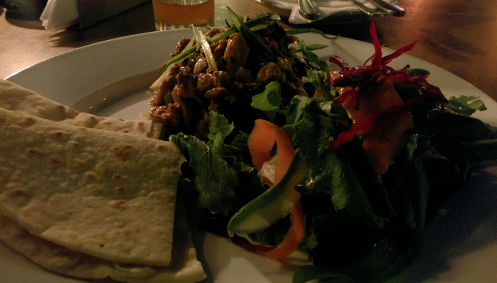
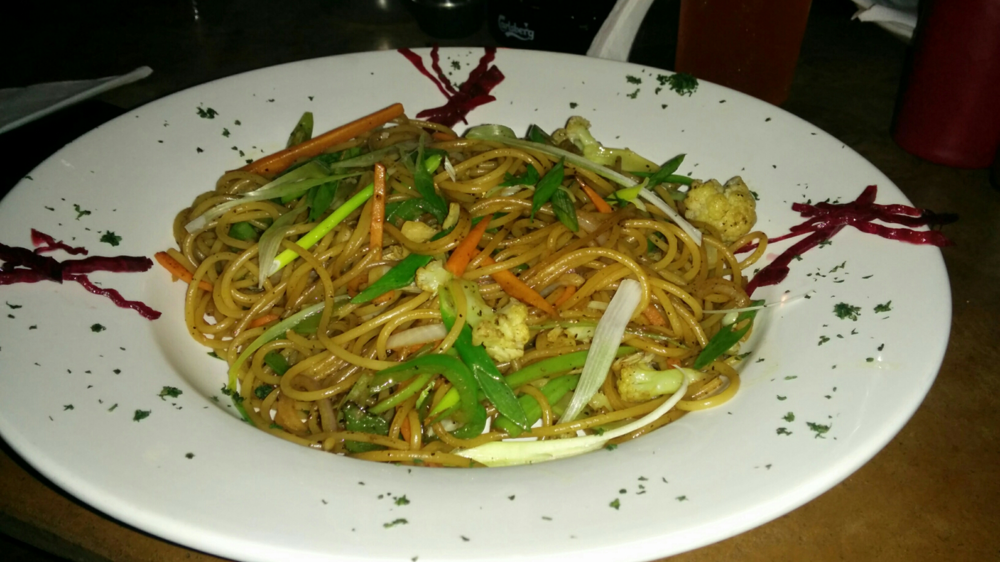

After the peaceful visit to the [Gardens of Dreams](http:///2014/07/garden-of-dreams/), food was on the mind. Checking TripAdvisor we found a Black Olives Cafe and Bar (rated #4 out of 383 restaurants on Trip Advisor). Using this information we went in pursuit for an assumed good food experience. Initially sent down a quiet back-alley according to TripAdvisor’s map, but could not find it. We decided to go for a back-up option on Chaksibari Marg and surprise surprise, we found Black Olives Cafe. As it was the first option we walk right in and was seated in a nice open air dining space. We were presented a single sided laminated A3 size menu with many dish options from Western to Local. The waiter was pleasant but (like other restaurants we have been) was eager to take an order for drinks with out much time to study the options. A safe cold cheap Fanta for us both. After studying the food menu, we chose Vegetable MoMo, Chicken Choila and Chicken Sandaco Kathmandu.

\[caption id="attachment\_199" align="aligncenter" width="700"\] Vegetable MoMo\[/caption\]

The MoMo came first, and was O.K. tasting the sauce it comes with was pleasant, we ate all of them. Near immediately after finishing the last bite of MoMo the mains arrived.

\[caption id="attachment\_200" align="aligncenter" width="700"\] Chicken Choila\[/caption\]

Smelling very appealing we grabbed the chapatti and dug in (in high expectation). The flavours of what we where searching for in the Choila where like we have tasted at Namaste Nepal back at home. Sadly the texture of the chicken did not agree to us, It was chewy with loads of joining fat (like the meat was not thoroughly cooked). We rejected the meals and ordered Vegetable Fried Noodles as we were still hungry.

Many Apologies were given and the replacement dish came out in good time. The noodles looked more like spaghetti, we ate it anyway. It was well seasoned but nothing special, the vegetables were not great quality, we left nearly all of them.

This not so great experience cost ₨561 (about £3.42) we was not charged for the rejected meals.
