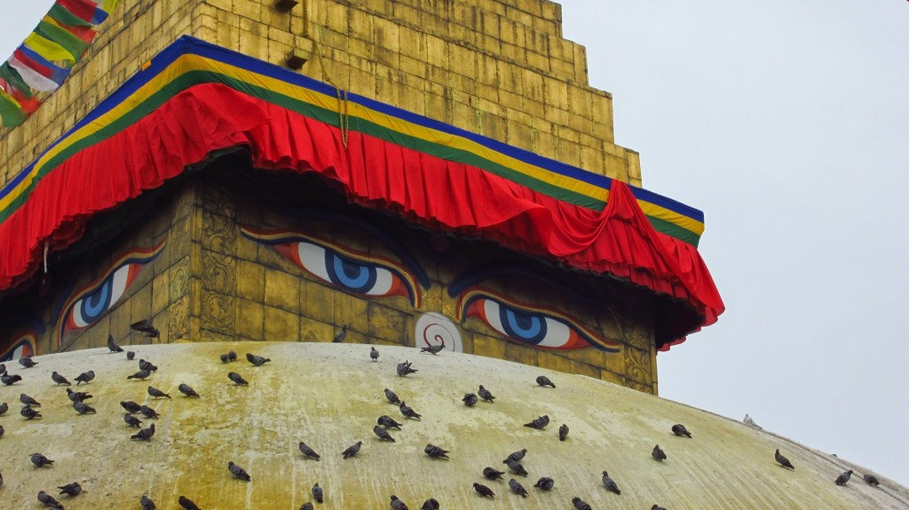
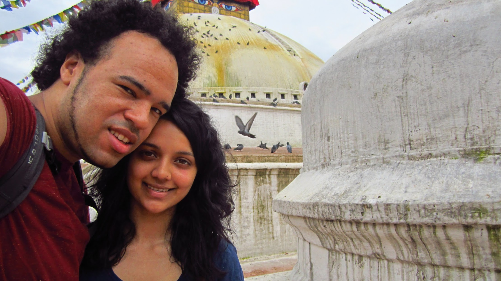
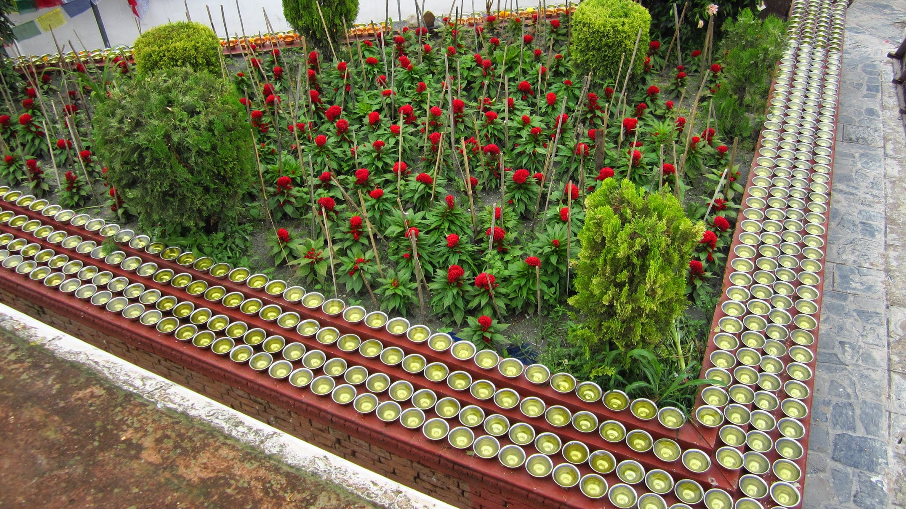
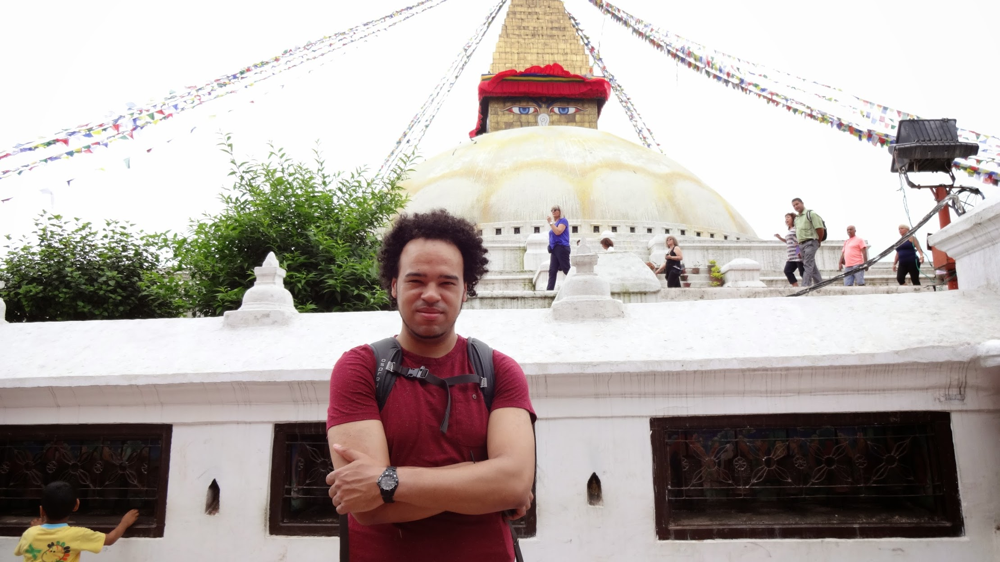
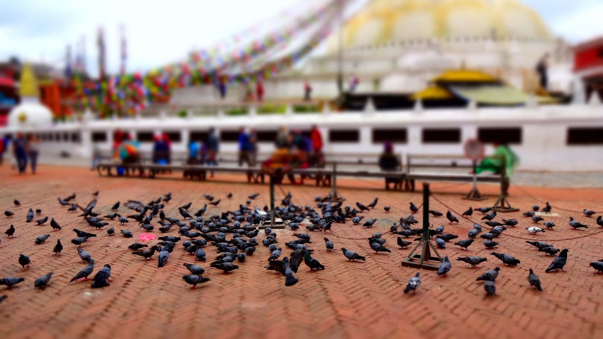
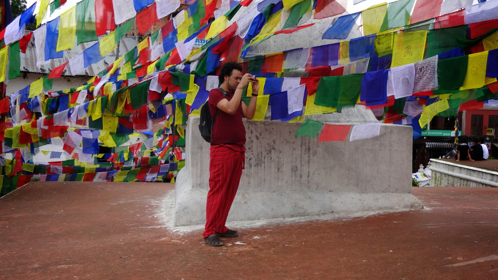
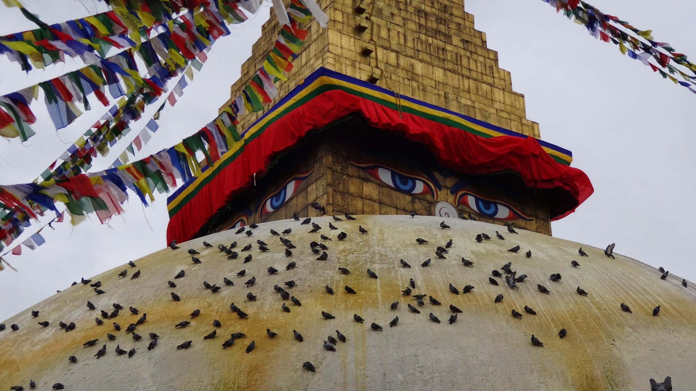
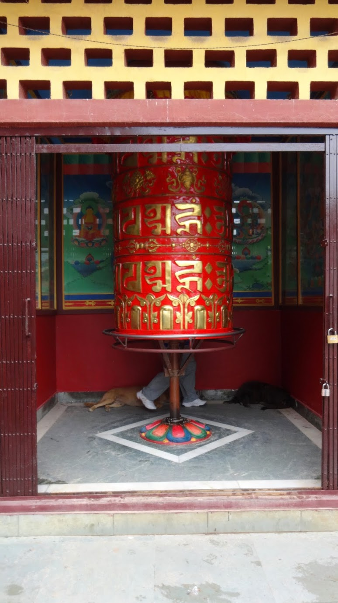

This is one of the worlds biggest Buddhist shrines (rated #1 out of 66 attractions in Kathmandu on [TripAdvisor](http://www.tripadvisor.co.uk/Attraction_Review-g293890-d1963559-Reviews-Bodnath_Stupa-Kathmandu_Kathmandu_Valley_Bagmati_Zone_Central_Region.html)), it stands 118ft tall with a solid dome. Pigeons, dogs and cows are welcome guests to the shrine, and often given blessings from visitors to the shrine. A beautiful place to have a guide teach you about Buddhism.


  {{}}
  {{}}
  {{}}
  {{}}
  {{}}
  {{}}
  {{}}
  {{}}
  {{}}
  {{}}
  {{}}
  {{}}

