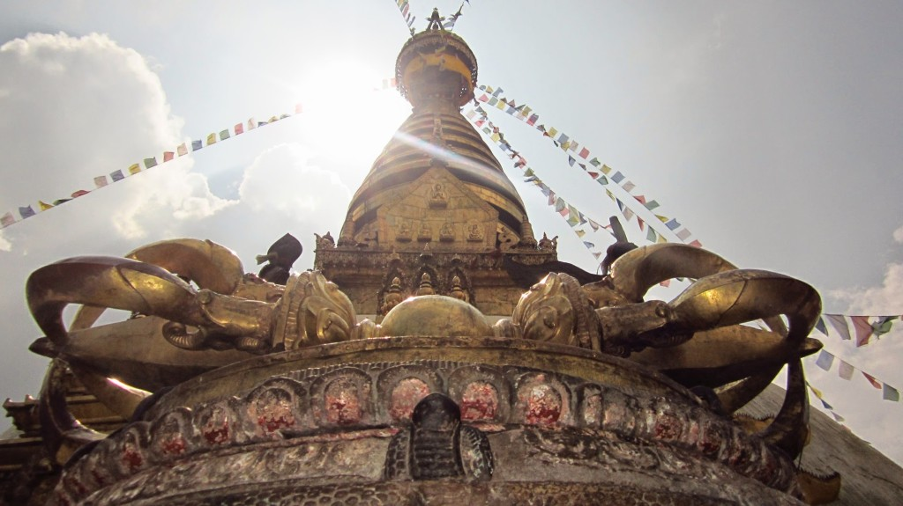

Thursday, We took a good walk across the city to the Harati Devi Temple (A.K.A Monkey Temple) to experience a wonderful landmark standing high just outside of Kathmandu. The views from here were amazing, You can seen the entire City and surrounding Mountains.

After walking though the calm streets of [Dhalko](https://www.google.co.uk/maps/place/Dhalko/@27.7113554,85.30491,17z/data=!3m1!4b1!4m2!3m1!1s0x39eb18fa2c321d93:0x73463153f9c32783) and [Dallu](https://www.google.co.uk/maps/place/Dallu/@27.7118967,85.2978521,17z/data=!3m1!4b1!4m2!3m1!1s0x39eb18f3e75c6c31:0xc7cefd747f90ca11), passing schools where students shout “hello” at us. We arrive at the Swayambhu East Entrance relieved we found it with little reliance on Google Maps.

Three buddhas sit tall marking the entrance to the temple area, following this are 365 steep ascending stairs to reach the temple at the top. Climbing these stairs was challenging, as you get higher the humidity increases.

When at the top you can not help but sweat but the sweating did not bother us, the view from this vantage point was absolutely amazing!

<iframe src="https://maps.google.com/maps?layer=c&amp;panoid=JDoZdXXPTmkAAAQfCLQdRw&amp;ie=UTF8&amp;source=embed&amp;output=svembed&amp;cbp=13%2C242.8384000000001%2C%2C0%2C0" width="700" height="394" frameborder="0" marginwidth="0" marginheight="0" scrolling="no"></iframe>

[Views](https://www.google.com/maps/views/): [Harati Devi Temple](https://www.google.com/maps/views/view/103958417703949399427/gphoto/6034848420778175426) by [Kyle Welsby](https://www.google.com/maps/views/profile/103958417703949399427)

Walking around the temple we wondered “where are the monkeys” was not long until we spotted a few monkeys in the trees. These monkeys where tame, and willing to sit close to people. Can not help but watch them do monkey stuff with amazement.

We found the World Peace Pond, shame this pond seemed more like a coin grabber than a meaningful attraction. Many people where having much fun throwing their coins to the center (aiming for the bucket). The pond water was green with no life (likely from the copper in the water).

\[gallery link="file" type="rectangular" ids="245,244,243,241,240,239,238,237,236,212,362,363,365,366,367,369,370,371,372,374,375,376,377" orderby="post\_date"\]
