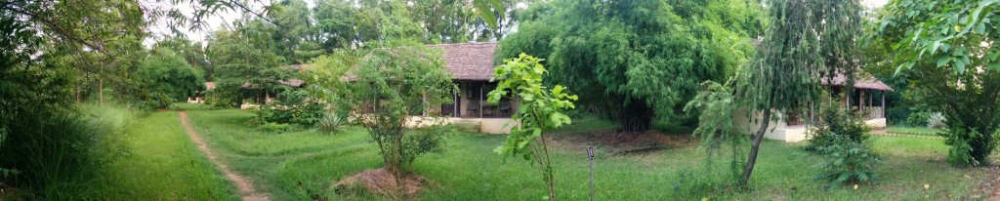
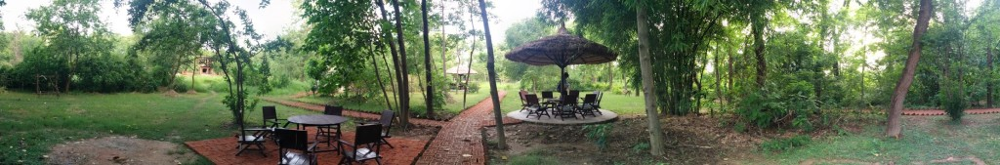

[Lumbini Buddha Garden Resort](http://www.agoda.com/lumbini-buddha-garden-resort/hotel/lumbini-np.html?cid=1649959 "Agoda: Lumbini Buddha Garden Resort") (rated #1 out of 14 in Lumbini on [TripAdvisor](http://www.tripadvisor.co.uk/Hotel_Review-g424940-d2153072-Reviews-Lumbini_Buddha_Garden-Lumbini_Lumbini_Zone_Western_Region.html "Lumbini Buddha Garden Resort on TripAdvisor")) is a lodge type resort where each guest gets an entire lodge to themselves. Located away from any town or village this resort is very calm and quiet, the views at night are spectacular. As there is no light pollution from nearby towns, many stars seen during a clear night, truly a sight to behold.

The resort hosts a simple bar and food buffet style, with friendly staff happy to help you. The rooms are spacious with a large tiled bathroom, warm water was not always available but the warm standard shower water was welcome.

<iframe src="https://maps.google.com/maps?layer=c&amp;panoid=vvLJH9meCUgAAAQfCQE4QQ&amp;ie=UTF8&amp;source=embed&amp;output=svembed&amp;cbp=13%2C223.39119999999997%2C%2C0%2C0" width="700" height="394" frameborder="0" marginwidth="0" marginheight="0" scrolling="no"></iframe>

[Views](https://www.google.com/maps/views/): [Lumbini Buddha Garden Resort](https://www.google.com/maps/views/view/103958417703949399427/gphoto/6041848645928953858) by [Kyle Welsby](https://www.google.com/maps/views/profile/103958417703949399427)

[Lumbini Buddha Garden Resort](http://www.agoda.com/lumbini-buddha-garden-resort/hotel/lumbini-np.html?cid=1649959 "Agoda: Lumbini Buddha Garden Resort") is found on the main road into Lumbini

> Lumbini Buddha Garden Resort,Telar River, Parsa Chauraha, Rupandehi, Lumbini, Nepal

You can book on [Agoda](http://www.agoda.com/lumbini-buddha-garden-resort/hotel/lumbini-np.html?cid=1649959) for about ₨4500 (about £28.10) per night
