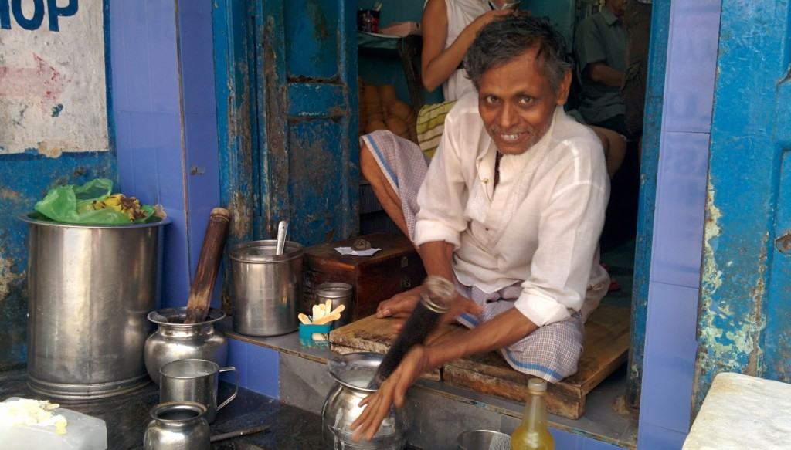
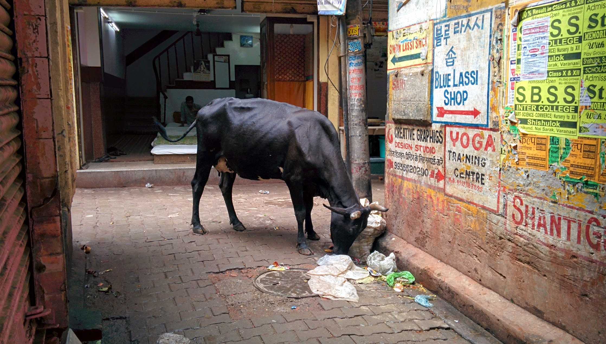
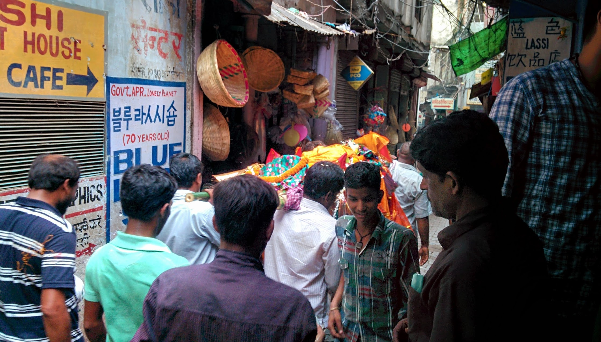
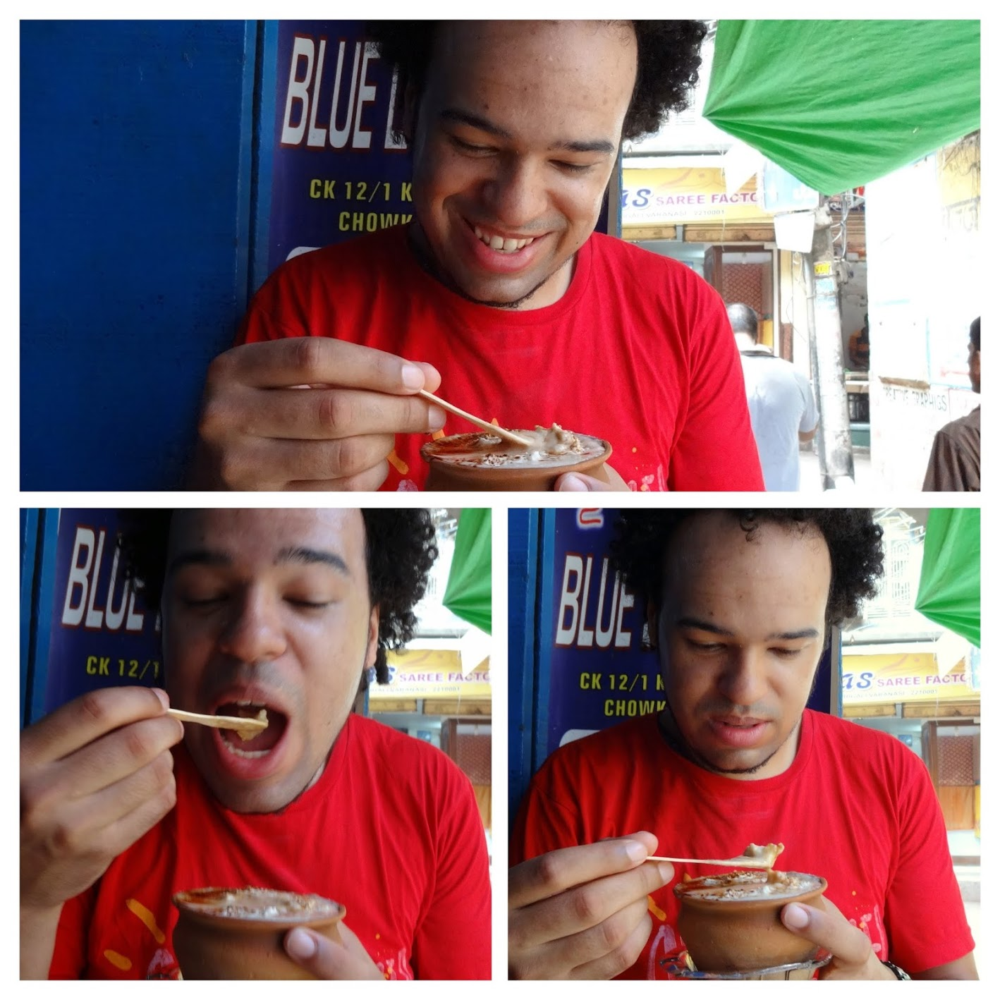
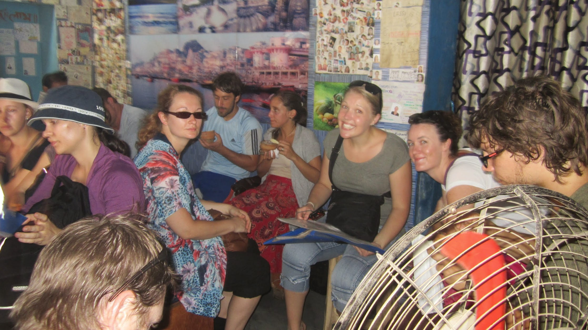

Located in the alleyways of central Varanasi, this little shop specialise in only Lassi (a popular, traditional, yogurt-based drink). The milk is churned by hand to a thick yoghurt consistency and served with flavouring and a layer of clotted cream.

I had coffee flavour Lassi, it was nice but I did not like the texture of the clotted cream.

While we where enjoying our Lassi, about 5 bodies were carried though the streets to the Ganges.

 


  {{}}
  {{}}
  {{}}
  {{}}
  {{}}
  {{}}

