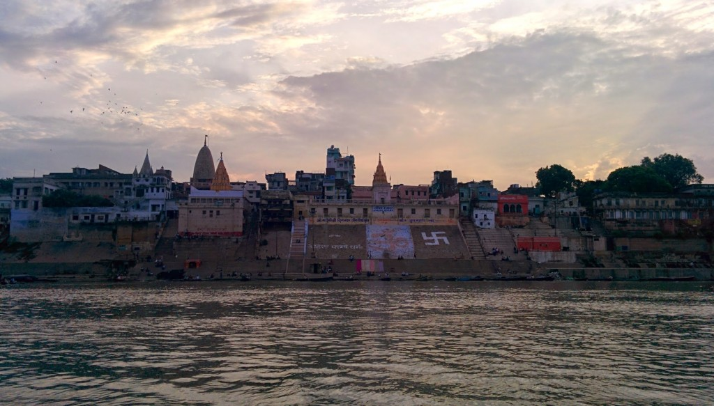

 

We visited the Ganges river for an entire day, there was a lot of activity to take in. We watched cremation during the day and in the evening we taken a boat ride along the river.  We gave lantern offerings to the river and watch the evening ceremony from a boat.

<iframe src="https://maps.google.com/maps?layer=c&amp;panoid=nZPC1EyDoKsAAAQfCQUSlg&amp;ie=UTF8&amp;source=embed&amp;output=svembed&amp;cbp=13%2C234.50800000000004%2C%2C0%2C0" width="700" height="394" frameborder="0" marginwidth="0" marginheight="0" scrolling="no"></iframe>

[Views](https://www.google.com/maps/views/): [Ganges River boat ride](https://www.google.com/maps/views/view/103958417703949399427/gphoto/6042234958518870658) by [Kyle Welsby](https://www.google.com/maps/views/profile/103958417703949399427)

 

\[gallery link="file" type="rectangular" ids="417,418,419,420,422,426,427,438,428,424,416,421,429,430,431,412,423,432,433" orderby="post\_date"\]
