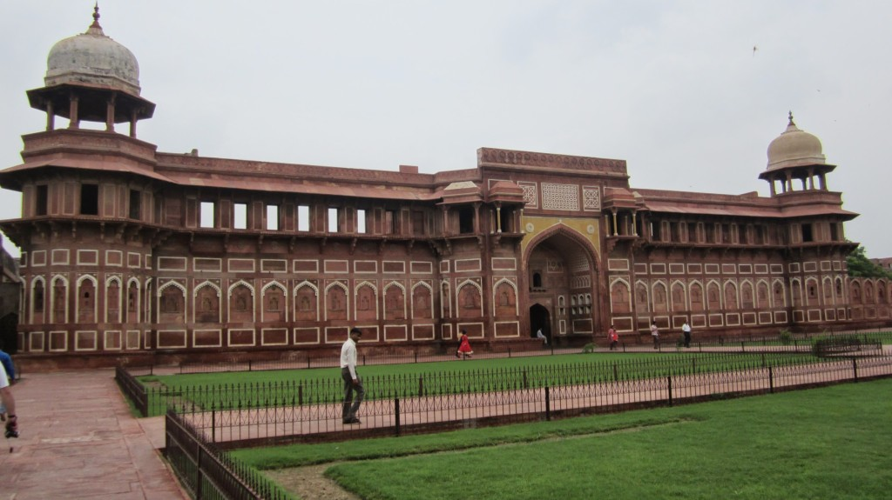

We were given a guided tour around Agra Fort, We learned how this fort was protected by a moat of crocodiles, a valley of tigers and a ramp of boulders and burning oil to stop any attacker attempting to take the fort. Apparently it was never attacked.

This breathtaking fort as a wonderful place to walk around and learn the luxuries kings and queens enjoyed.

<iframe src="https://maps.google.com/maps?layer=c&amp;panoid=hNvNzsL6Z0MAAAQfCQxzvg&amp;ie=UTF8&amp;source=embed&amp;output=svembed&amp;cbp=13%2C187.37145239738874%2C%2C0%2C-9.179341565001636" width="700" height="394" frameborder="0" marginwidth="0" marginheight="0" scrolling="no"></iframe>

[Views](https://www.google.com/maps/views/): [Diwan E Aam](https://www.google.com/maps/views/view/103958417703949399427/gphoto/6042920313141021346) by [Kyle Welsby](https://www.google.com/maps/views/profile/103958417703949399427)

\[gallery link="file" type="rectangular" ids="459,460,461,462,463,464,465,466,467,468,469,470,471,472,473,474,475,476,477,478,479,480,481,482,483,484,458,487,486" orderby="post\_date"\]
