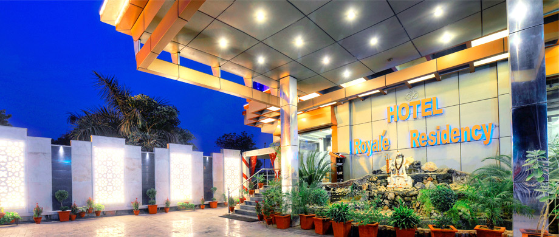
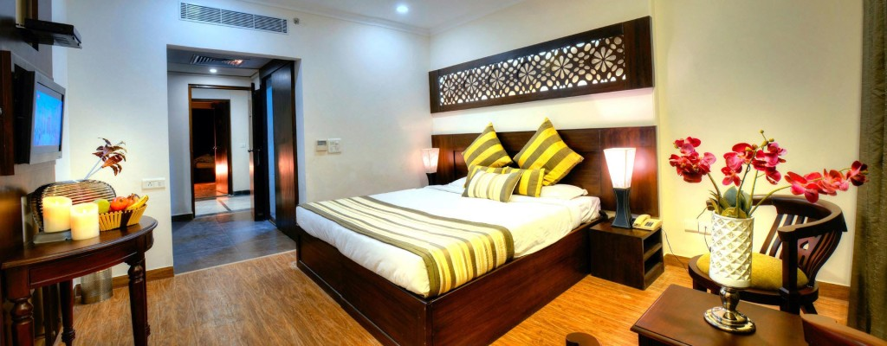
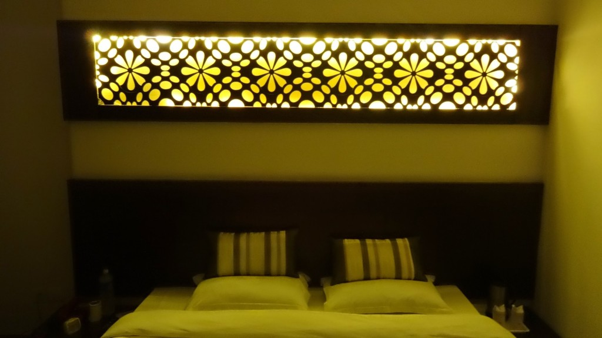

\[caption id="attachment\_492" align="aligncenter" width="920"\] Hotel Royale Residency official front photo\[/caption\]

While in Agra we stayed at [Hotel Royale Residency](http://www.agoda.com/en-gb/royale-residency-hotel/hotel/agra-in.html?cid=1649959 "Agoda: Hotel Royale Residency") (ranked #11 out of 108 hotels in Agra on [TripAdvisor](http://www.tripadvisor.co.uk/Hotel_Review-g297683-d735318-Reviews-Hotel_Royale_Residency-Agra_Uttar_Pradesh.html "Hotel Royal Residency on TripAdvisor")). The stay was pleasant, there was hot water, cable TV and in a clean comfortable room with brilliant lighting.

Would stay here again when in Agra.

\[caption id="attachment\_493" align="aligncenter" width="700"\] Hotel Royale Residency official room photo\[/caption\]

> Hotel Royale Residency, Fatehabad Road, Agra, India 282001,
> 
> Tel: +91 562 3243337, 2231661
> 
> Email: [info@hotelagraroyaleresidency.com](mailto:info@hotelagraroyaleresidency.com)
> 
> Website: [hotelroyaleresidency.com](http://hotelroyaleresidency.com/)
> 
>  

[Hotel Royale Residency](http://www.agoda.com/en-gb/royale-residency-hotel/hotel/agra-in.html?cid=1649959 "Agoda: Hotel Royale Residency") can be booked for about ₹1999 on [Agoda](http://www.agoda.com/en-gb/royale-residency-hotel/hotel/agra-in.html?cid=1649959 "Agoda: Hotel Royale Residency").
