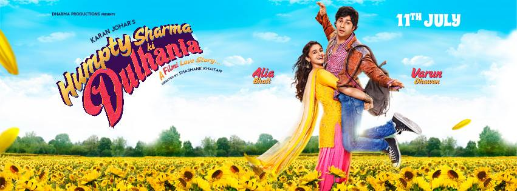

 

We watched [Humpty Sharma Ki Dulhania](http://www.imdb.com/title/tt3678938/ "Humpty Sharma Ki Dulhania on IMDB") (A modern Bollywood film) at [Raj Mandir Cinema](http://gonetraveling.me/2014/07/raj-mandir-cinema/ "Raj Mandir Cinema").  The experience was different than what I was expecting a Bollywood film to be like.  People in the audience cheers, whistled, took photos, and talked throughout the film.

\[caption id="attachment\_525" align="aligncenter" width="700"\] Raj Mandir movie poster.\[/caption\]
