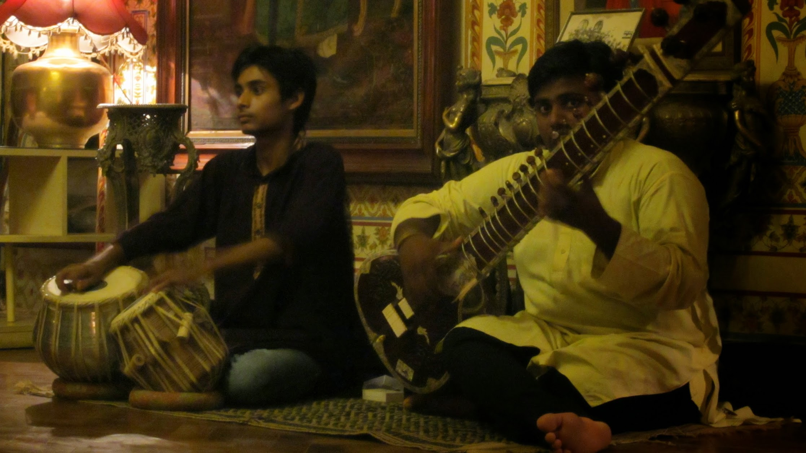
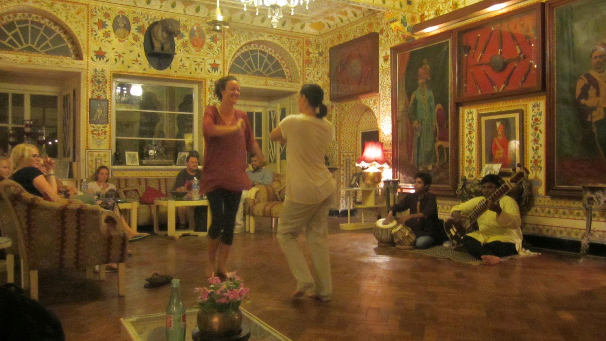
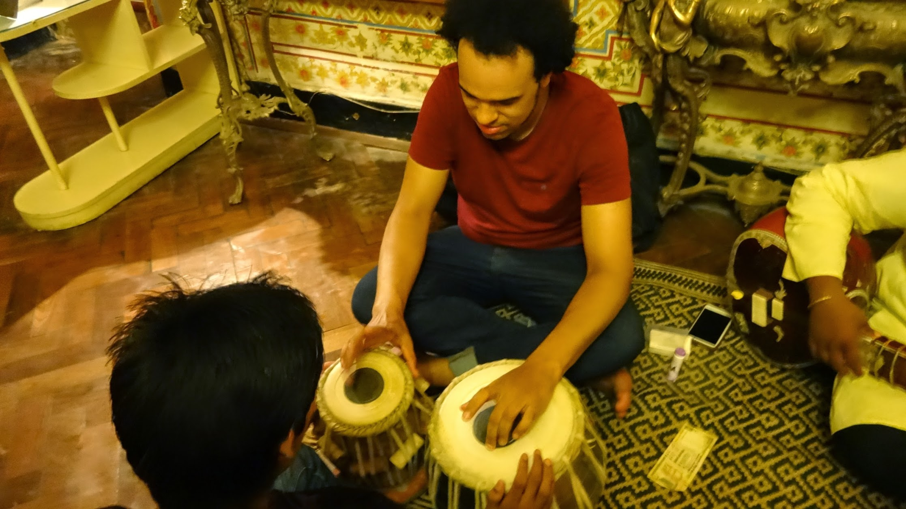

While at Hotel Bissau Palace, traditional live indian music was performed while we ate our dinner and had drinks. The stringed instrument (sitar) filled the room with homonymous sound, and the instruments were not amplified.

I got to try the percussion drums (tabla), the instrument has to be played very hard to get the volume of the sound.

 




  {{}}
  {{}}
  {{}}

