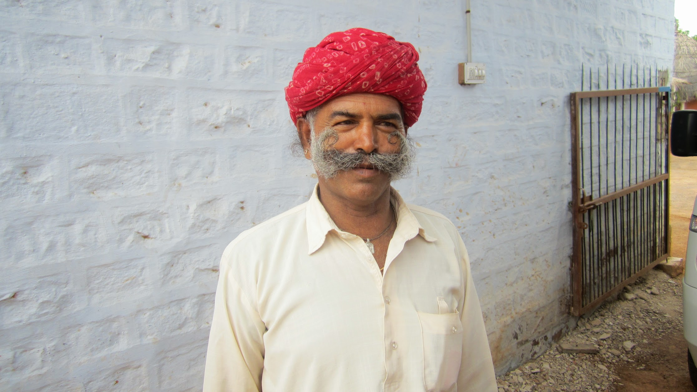

We visited Pukhraj Durry Udhyog for a few hours in the morning, having breakfast and shown how rugs are made by hand.  We loved the hospitality, the simple cooking, the brilliant flavour of the rice and pancakes. We seen a couple of rugs that taken our eye and could not resist to buy them.  




As an attrition, this village also has a clay pot makers which we also had the privilege to experience.

> Pukharaj Durry Udhyog, Salawas Village | Kumharon ki Dhani, Near Gosala, Jodhpur 342804, India
> 
> Tel: +91 9414720724 / +91 2912696744
> 
> Email: [chhotaramprajapat@rediffmail.com](mailto:chhotaramprajapat@rediffmail.com) / [cmhomestay37@gmail.com](mailto:cmhomestay37@gmail.com)
> 
> Website: [www.pukhrajdurry.com](http://www.pukhrajdurry.com/)

There is also has a home stay [Chhotaram Prajapat's Homestay](http://www.agoda.com/en-gb/chhotaram-prajapat-s-homestay/hotel/jodhpur-in.html?cid=1649959) for about ₹2200 per night on [Agoda.](http://www.agoda.com/en-gb/chhotaram-prajapat-s-homestay/hotel/jodhpur-in.html?cid=1649959) We where shown the rooms and they looked amazing for a ultimate out-back village experience.

  {{}}
  {{}}
  {{}}
  {{}}
  {{}}
  {{}}
  {{}}
  {{}}
  {{}}
