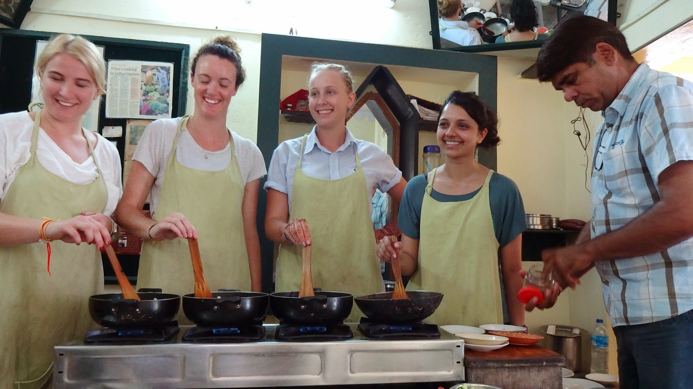
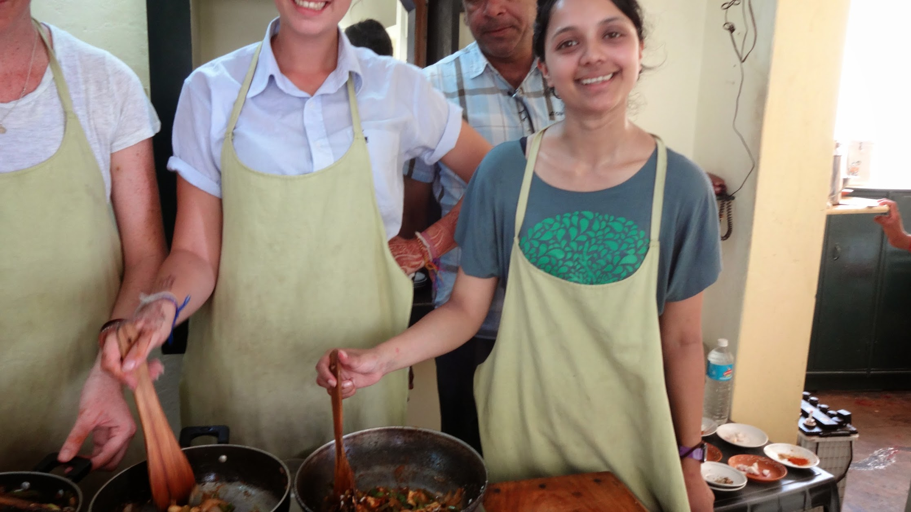
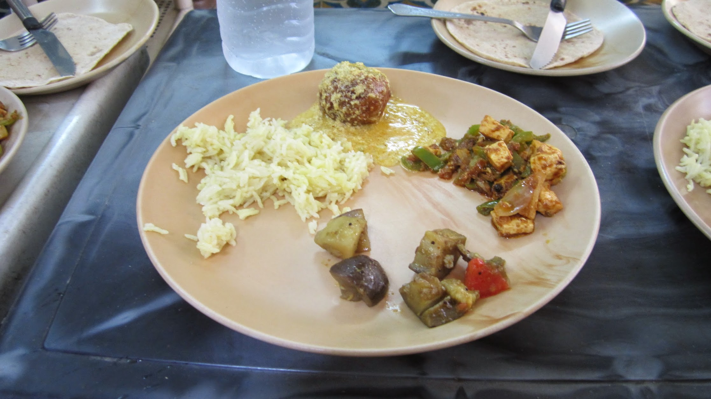
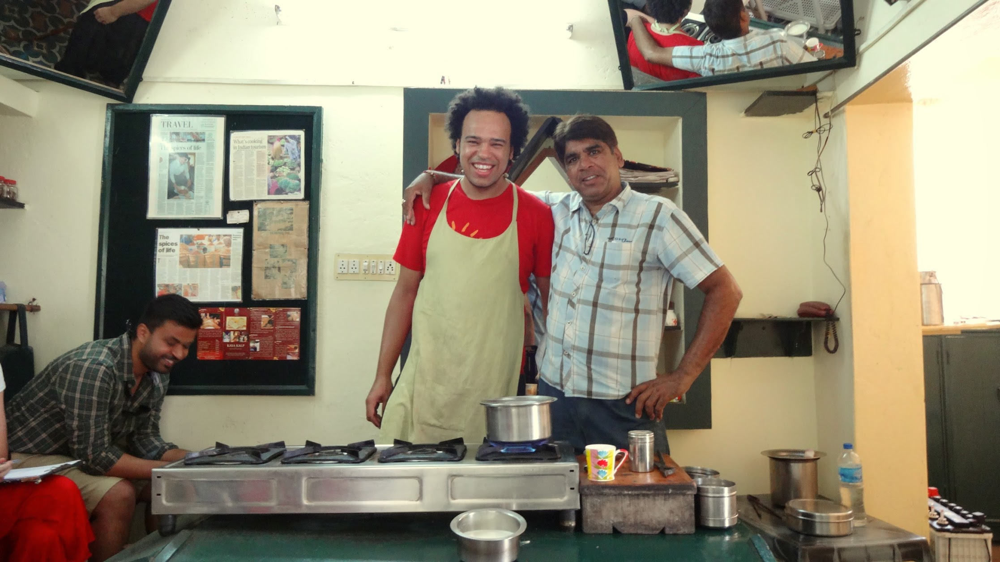

We joined the hotel owner Shakti Singh Inda in his group cooking kitchen to learn the roots of Indian cooking. We made Chai Masala Tea, Pannier Curry, a Korma type dish, aloo biryani and Roti.

We head great fun cooking and joking with Shakti and we got to eat a large lunch too.


  {{}}
  {{}}
  {{}}
  {{}}
  {{}}

