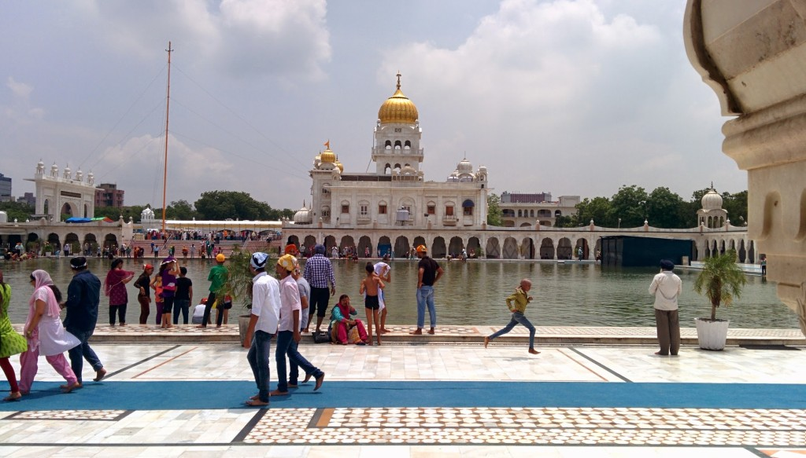
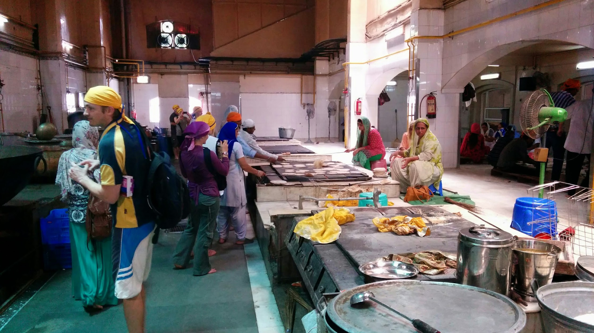
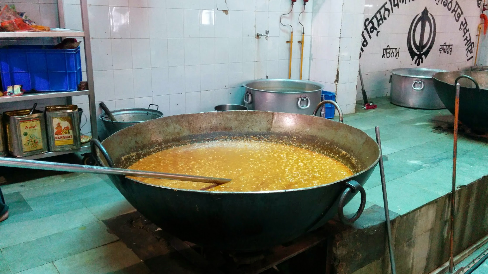
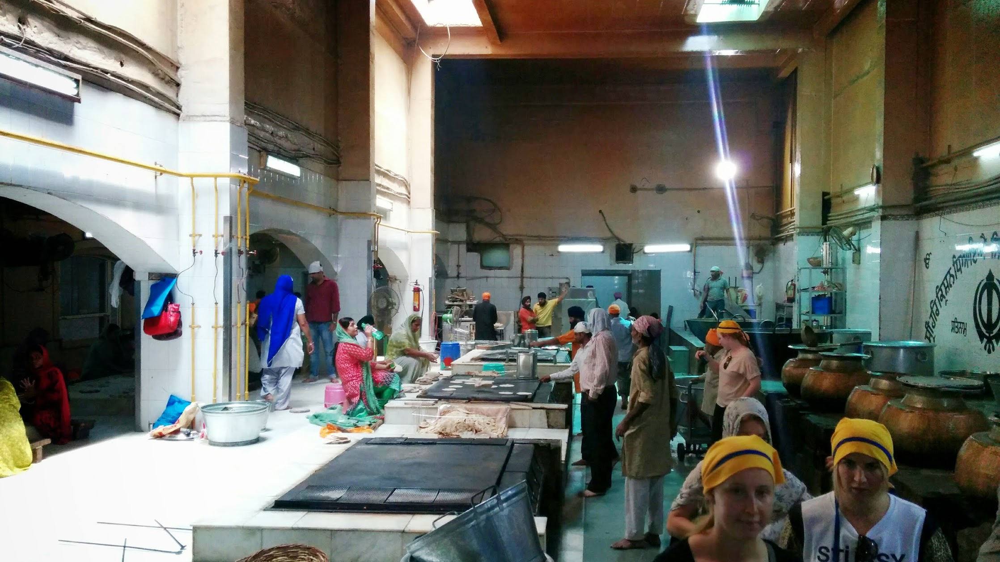
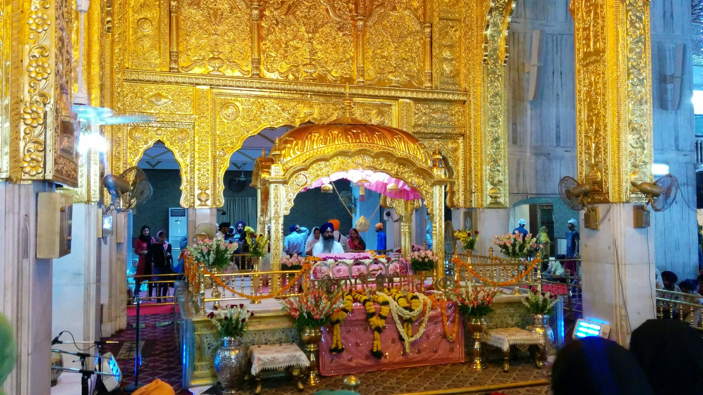
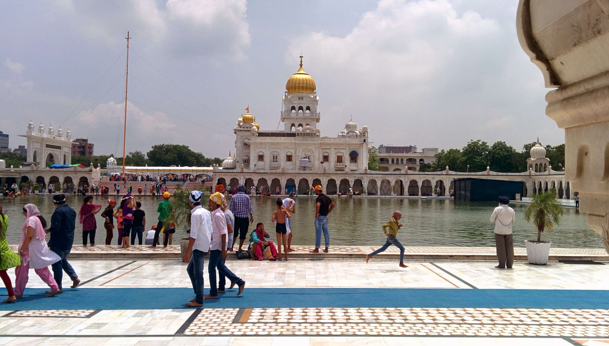

We visited Gurudwara Bangla Sahib to learn a bit about Sikhism religion. We were shown around the kitchens where mass food production was in progress to feed those who come. We sat and listened to a prayer ritual and walked around Bangla Sahib Sarovar (a pond to wash way sin).


  {{}}
  {{}}
  {{}}
  {{}}
  {{}}

