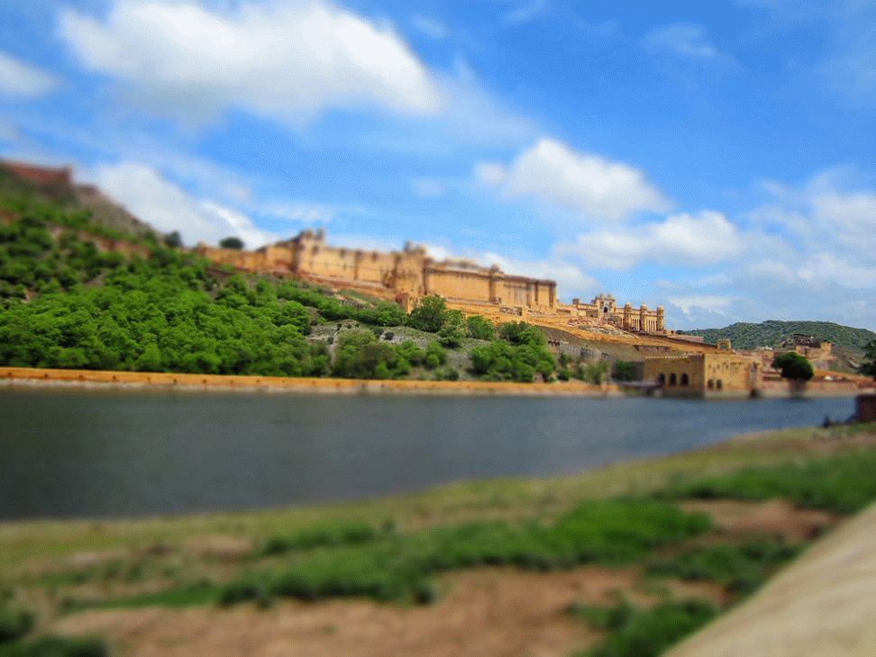

We booked a tour with Geckos Adventures "[Ain't no mountain high enough](https://www.geckosadventures.com/himalaya/nepal/aint-no-mountain-high-enough-2014)" as it's tour route from Nepal to India, and lowest price (£760.75 per person). [Ain't no Mountain High Enough - Geckos Adventures - Pre Departure Information (PDF)](brocure.pdf)

I shared this tour experience with 11 others.

Leaded by [Bikash Nepal](https://www.facebook.com/bikas.nepal.5) (Nepal leader), [Sukhjot Singh Gill](https://www.facebook.com/abcd03104) (India leader)

### TL:DR;

I enjoyed the stress free passenger experience of visiting many places which I may not have thought of. I especially enjoyed visiting the off-the be beaten track villages. I would recommend this tour for traveller who prefer a stress-free experience covering many miles.

**Pros:**

- Safety in numbers
- Local speaking guide to arrange things at the right price
- Sit-back passenger experience
- Less stress

**Cons:**

- Fast paced
- Obliged to stick with group
- Extra spends feel compulsory for enjoyment.
- Places where there are no other dining options, meals are not included.

Would I visit Nepal again? Yes! Would I visit India again? YES!

Would I recommend you to visit Nepal and/or India? Absolutely!

### Detailed tour itinerary

**Day 1 (12th July): Kathmandu**

We checked into [Hotel Shakti](/posts/2014-07-hotel-shakti/ "Hotel Shakti") in Thamel, Kathmandu, Nepal and met with our group leader and other travellers for the first time. We where then left to our own devices, we decided to go for a drink at [Sam's Bar](https://www.lonelyplanet.com/nepal/kathmandu/entertainment-nightlife/other/sams-bar).

**Day 2 (13th July): Kathmandu**

We were given a guided tour of two major sites in Kathmandu, [Bodhnath Stupa](/posts/2014-07-bodhnath-stupa/ "Bodhnath Stupa") (one of the biggest Buddhist shrines in the world) and [Pashupatinath](/posts/2014-07-pashupatinath/ "Pashupatinath") (the most significant Hindu temples of Shiva in the world). In the evening we went for an authentic Nepalese meal at [Thakali Kitchen](/posts/2014-07-thakali-kitchen/ "Thakali Kitchen").

**Day 3-5 (13th - 15th July): Kathmandu**

We spend these days in [CIWEC Clinic](/posts/2014-07-ciwec-clinic/ "CIWEC Clinic Travel Medicine Center") nursing Kim back to health. The clinic discharged Kim from Hospital and Himalayan Encounters arranged a new plan for us to catch up with the group. The plan is to catch the next local bus to Lumbini where the group would be up-to by time we arrive.

**Day 6 (16th July): Lumbini**

We got up early in the morning and checked out of the hotel. An scheduled escort by a Himalayan Encounters representative to catch the 8am local bus from Kathmandu to Lumbini, delayed until 7:45. In the rush to jump into the taxi to the bus station, I left my sun-glasses and mobile phone. If it was not for the quick response from the Hotel staff and having a local speaking representative with us they would have been gone! The hotel arranged a motorcyclist to catch-up with us to deliver my mobile phone and sun-glasses, it was not until 3 bus stops when the motorcyclist finally caught up with us. I was super grateful I handed ₨200 (about £1.20) and relaxed into my seat for the bumpy ride across the hills of Nepal south to Lumbini. The bus was not the most pleasant experience as the temperature and humidity increased and air-conditioning kept failing as the journey continued. We arrived in Lumbini around 17:30 and checked into [Lumbini Buddha Garden Resort](/posts/2014-07-lumbini-buddha-garden-resort/ "Lumbini Buddha Garden Resort").

{{}}

Luckily we had enough time to quickly visit the [Birthplace of Buddha](/posts/2014-07-birthplace-of-buddha/ "Birthplace of Buddha").

**Day 7 (17th July): Border Crossing**

We woke early in the morning while the air was still cool, packed our bags, loaded the minibus and headed for the [Sunauli](https://www.lonelyplanet.com/india/uttar-pradesh/sunauli-and-the-nepal-border) border crossing into India.

After sorting out the administration, we loaded our bags into jeeps and embarked on a 12+ hour drive to [Hotel Surya](/posts/2014-07-hotel-surya/ "Hotel Surya") in Varanasi where we checked in and rested for the evening.

**Day 8 (18th July):** **Varanasi**

It rained very hard during the early hours of the morning, **we woke to localised flooding**. We still continued on our itinerary for the day to visit the Ganges.

After taking a tuk-tuk to the city centre, we had to finish the last few metres ankle-deep in flood water to reach the bustling alleyways.

We stopped at [Blue Lassi Shop](/posts/2014-07-blue-lassi-shop/ "Blue Lassi Shop") recommended for its Lassi, while enjoying our Lassi, cows strolled on past and bodies were carried through the alleyways. We later find out where the bodies were being carried to.

A roof top location overlooked the Ganges and could see cremation happening on the riverside.

<iframe src="https://maps.google.com/maps?layer=c&amp;panoid=0GOfNDQnPRMAAAQfCQV2nw&amp;ie=UTF8&amp;source=embed&amp;output=svembed&amp;cbp=13%2C220.0728%2C%2C0%2C0" width="700" height="394" frameborder="0" marginwidth="0" marginheight="0" scrolling="no"></iframe>

[Views](https://www.google.com/maps/views/): [Manikarnika Kund Roof Top](https://www.google.com/maps/views/view/103958417703949399427/gphoto/6042227273711167794) by [Kyle Welsby](https://www.google.com/maps/views/profile/103958417703949399427)

In the evening we went on a boat ride on the Ganges, we gave some lantern offerings and experienced a nightly ceremony.

After the boat ride we went to [Pizzeria Vaatika Cafe](/posts/2014-07-pizzeria-vaatika-cafe/ "Pizzeria Vaatika Cafe"), which served the most horrible cheese I have ever tasted.

**Day 8 (19th July): Sleeper Train**

This day we mostly rested, before heading to [Varanasi Junction](https://maps.google.com/maps/place?hl=en&cid=1524393164933368088) to board the overnight train to Agra.

There are stores here that sell confectionaries at a very cheap price. Welcomed for a long train ride.

**Day 9 (20th July): Agra / Taj Mahal** 

Arriving early in the morning in Agra we got some breakfast at Costa Coffee and then was given a guided tour around [Agra Fort](/posts/2014-07-agra-fort/ "Agra Fort") before checking into [Hotel Royale Residency](/posts/2014-07-hotel-royale-residency/ "Hotel Royale Residency"). In the evening we took a walk around [Taj Mahal](/posts/2014-07-taj-mahal/ "Taj Mahal") a few hours before sunset.

**Day 10 (21st July): Tordi Garh**

We taken a local bus to switching at a point to off-road jeeps to Tordi Garh which is a small village 100km south of Jaipur. We checked into [Tordi Garh Hotel](/posts/2014-07-tordi-garh-hotel/ "Tordi Garh Hotel") (the only hotel in Tordi Garh) and given a traditional welcome to the grounds. We played cricket on the green before a camel back safari to the nearby hills to watch the sunset.

**Day 11 (22nd July): Jaipur**

We taken the jeeps to Jaipur checking into [Hotel Palms](/posts/2014-07-hotel-palms/ "Hotel Palms") and went to [Raj Mandir Cinema](/posts/2014-07-raj-mandir-cinema/ "Raj Mandir Cinema") to watch [Humpty Sharma Ki Dulhania](/posts/2014-07-humpty-sharma-ki-dulhania/ "Humpty Sharma Ki Dulhania") (a Bollywood movie) three big songs with dancing, love scene, and a tank.

**Day 12 (23rd July): Jaipur**

Tuk-tut's were arranged for our use all day. We started the morning with a visit to [Amber Fort](/posts/2014-07-amber-fort/ "Amber Fort"), then too a ride around town stopping at [Palace of Winds](/posts/2014-07-palace-of-winds/ "Palace of Winds") and then taken to Mughal India Crafts & Textiles asking them to make me a new pair of shorts I ripped in Tordi Garh playing cricket.

In the evening we went to Hotel Bissau Palace for dinner and enjoyed the traditional indian sounds of Sahil Khan

**Day 13 (24th July): Nimaj Bagh**

We took a mini-bus to Nimaj for some relaxation in a remarkable heritage accommodation [Rawla Bagh](/posts/2014-07-rawla-bagh/ "Rawla Bagh"). We did not do anything other than eat, sleep and swim.

**Day 14 (25th July): Jodhpur**

We started the day with a visit to [Pukhraj Durry Udhyog](/posts/2014-07-pukhraj-durry-udhyog/ "Pukhraj Durry Udhyog") which manufacture rugs by hand. Also in this village we were given a demonstration of hand-made clay pottery.

By afternoon we reached Jodhpur, we taken an audio guide tour of [Mehrangarh Fort](/posts/2014-07-mehrangarh-fort/ "Mehrangarh Fort"). After a walk down the blue city streets to the clock tower, we checked into [Leela Villas Guest House](/posts/2014-07-leela-villas-guest-house/ "Leela Villas Guest House").

**Day 15 (26th July): Udaipur**

We started our journey in the mini bus to Udaipur, (used for long journeys) we sat back and watched the scenery pass by. We started to climb hills, (I thought India was mostly flat) and had a lunch at [Aranyawas](/posts/2014-07-aranyawas/ "Aranyawas"). We quickly visited [Ranakpur](/posts/2014-07-ranakpur/ "Ranakpur"), before continuing to Udaipur. About an hour away, our mini bus got a puncture. The driver, Ian and I speedily replaced the punctured wheel.

<iframe src="https://maps.google.com/maps?layer=c&amp;panoid=fTFLx4kWNq8AAAQfCQ5coQ&amp;ie=UTF8&amp;source=embed&amp;output=svembed&amp;cbp=13%2C269.31880000000007%2C%2C0%2C0" width="700" height="394" frameborder="0" marginwidth="0" marginheight="0" scrolling="no"></iframe>

[Views](https://www.google.com/maps/views/): [Broken down MiniBus](https://www.google.com/maps/views/view/103958417703949399427/gphoto/6043073538881899570) by [Kyle Welsby](https://www.google.com/maps/views/profile/103958417703949399427)

Upon reaching Udaipur we switched to tuk-tuk's as the mini bus would not be able to navigate the tight windy hilly streets to Hotel [Pratrap Bhawan](/posts/2014-07-pratrap-bhawan/).

**Day 16 (27th July): Udaipur**

We took a short walk to visit the [City Palace](/posts/2014-07-udaipur-city-palace/ "Udaipur – City Palace") which was a pleasant way to spend the morning. Then we had a lunch Indian [cooking session](/posts/2014-07-indian-cooking-session/ "Indian Cooking Session"), in the evening we had a [boat ride](/posts/2014-07-udaipur-boat-ride/ "Udaipur Boat Ride"), and watched the sunset with beers.

**Day 17 (28th July): Udaipur**

Relaxed until our scheduled sleeper train to New Delhi.

**Day 18 (29th July): Delhi**

Arrived in New Delhi, we checked into [Hotel Perfect](/posts/2014-07-hotel-perfect/ "Hotel Perfect") and then went for a city tour. We visited [Gurudwara Bangla Sahib](/posts/2014-07-gurudwara-bangla-sahib/ "Gurudwara Bangla Sahib"), [India Gate](/posts/2014-07-india-gate/ "India Gate") and attempted to visit Gandhi Museum but it was not open. In the evening we went to [Raasta](/posts/2014-07-raasta/ "Raasta") in Hauz Khas Village for food and drinks. To my disappointment it was karaoke night (I hate karaoke).

**Day 19 (30th July): Delhi**

There was no formal end of tour meeting as people checked out at different times. We checked out by noon and continued our journey.

### Conclusion

I enjoyed the stress free passenger experience of visiting many places which I would have either missed. I especially enjoyed visiting the off-the be beaten track villages. It was a major advantage to have a local speaking guide to aid with any problems that may occur. I would recommend this tour for traveller who prefer a stress-free experience covering many miles.

I did not like the fast paced traveling were we may not have enough time to really appreciate a place before moving to the next, the obligation to stay with the tour group to make sure the enjoyment of all members, other extras that felt like they are compulsory to get the most out of the tour, and places where there are no other restaurants or dining options having to pay for the meals.

#### Nepal Specific

I found Nepal exciting with its beautiful landscapes, the calm comfortable welcome attitude, wonderful places of worship. I did not like the pungent smell of urine, people spitting, and constant demands from Taxi drivers.

#### India Specific

I loved India's welcoming villages where families and children would greet you with such love. The beautiful architecture expressed in everything from buildings to goods trucks, everything has decorative arches and colour. On the other side, I did find the excessive curiosity of locals annoying (as I would be asked many questions starting with "Where are you from?"), everywhere there are cows and with the cows there is faeces everywhere!, flies, flies, FLIES!

Would I visit Nepal again? Yes! Would I visit India again? YES!

Would I recommend you to visit Nepal and/or India? Absolutely!

  {{}}
  {{}}


  {{}}
  {{}}
  {{}}
  {{}}


  {{}}
  {{}}
  {{}}
  {{}}
  {{}}
  {{}}
  {{}}
  {{}}
  {{}}
  {{}}
  {{}}

