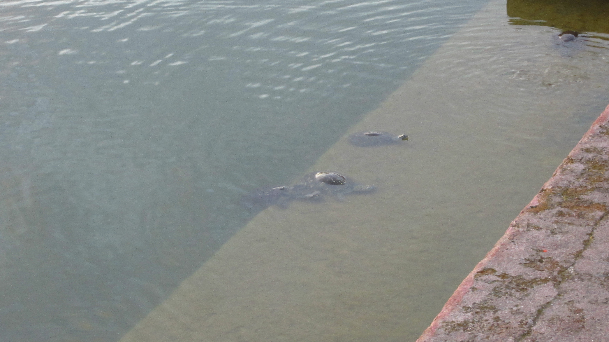

We had enough time in the evening to visit the Birth Place of Buddha. As the heat from the day is dissipating the light dimming this felt like the perfect time to visit this place. It was calm, cool and peaceful, even the turtles from the sacred pond came up to meet us.

Such a wonderful scriptural place to visit.

<iframe src="https://maps.google.com/maps?layer=c&amp;panoid=qptjnDzP46QAAAQfCQThzg&amp;ie=UTF8&amp;source=embed&amp;output=svembed&amp;cbp=13%2C209.178%2C%2C0%2C0" width="700" height="394" frameborder="0" marginwidth="0" marginheight="0" scrolling="no"></iframe>

[Views](https://www.google.com/maps/views/): [Bodhi tree and pond at Lumbini](https://www.google.com/maps/views/view/103958417703949399427/gphoto/6042187687527379970) by [Kyle Welsby](https://www.google.com/maps/views/profile/103958417703949399427)

 


  {{}}
  {{}}
  {{}}
  {{}}
  {{}}
  {{}}
  {{}}
  {{}}
  {{}}
  {{}}
  {{}}
  {{}}
  {{}}

