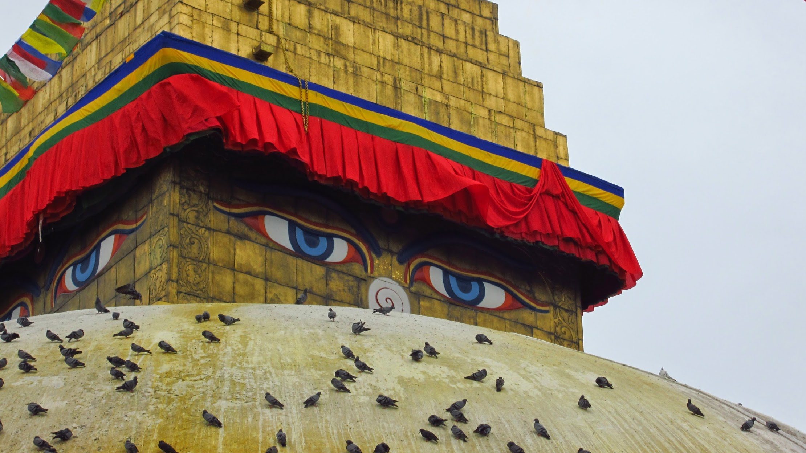
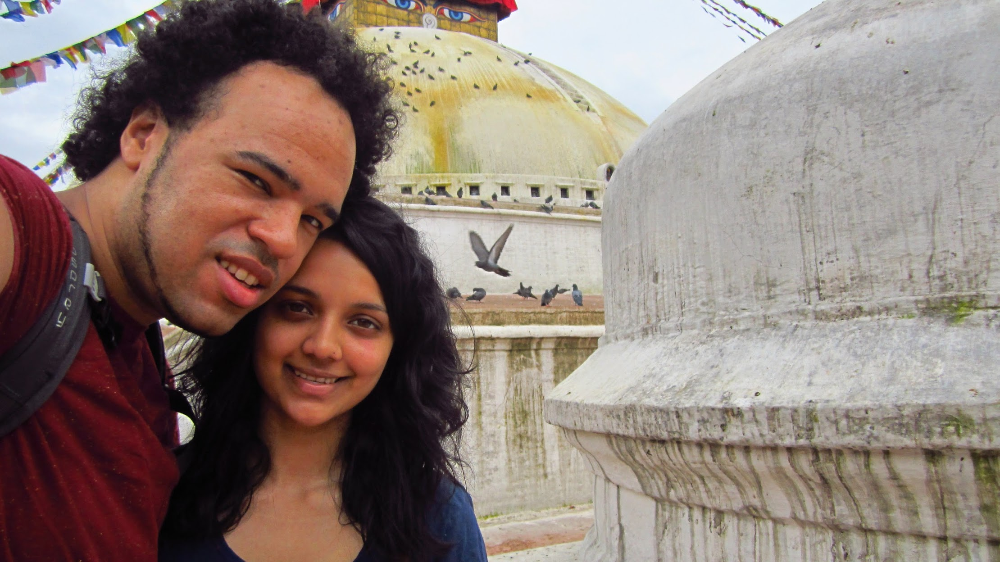
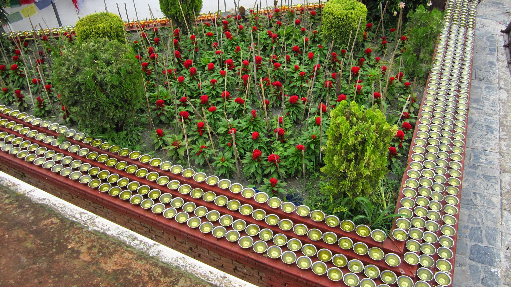
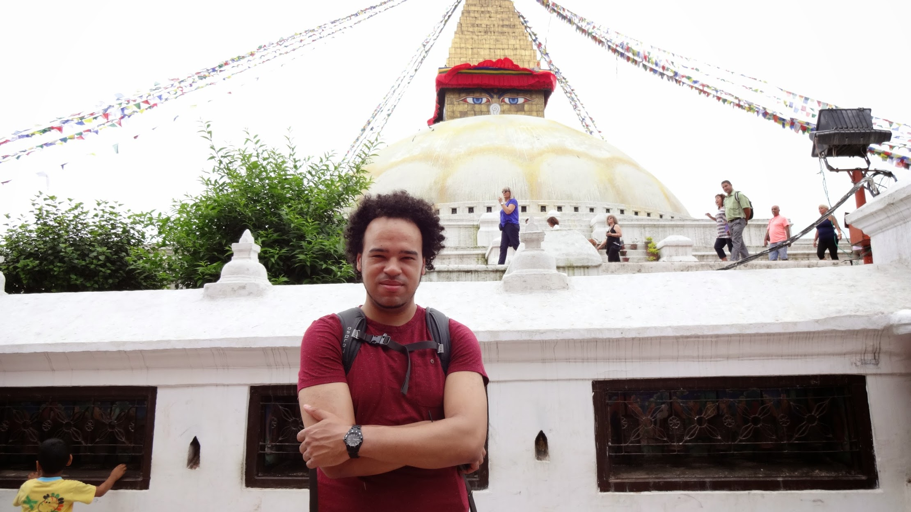
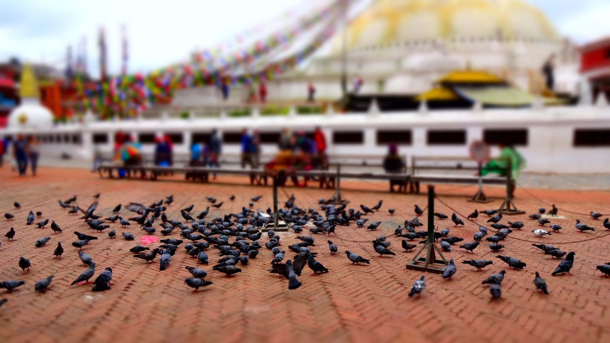
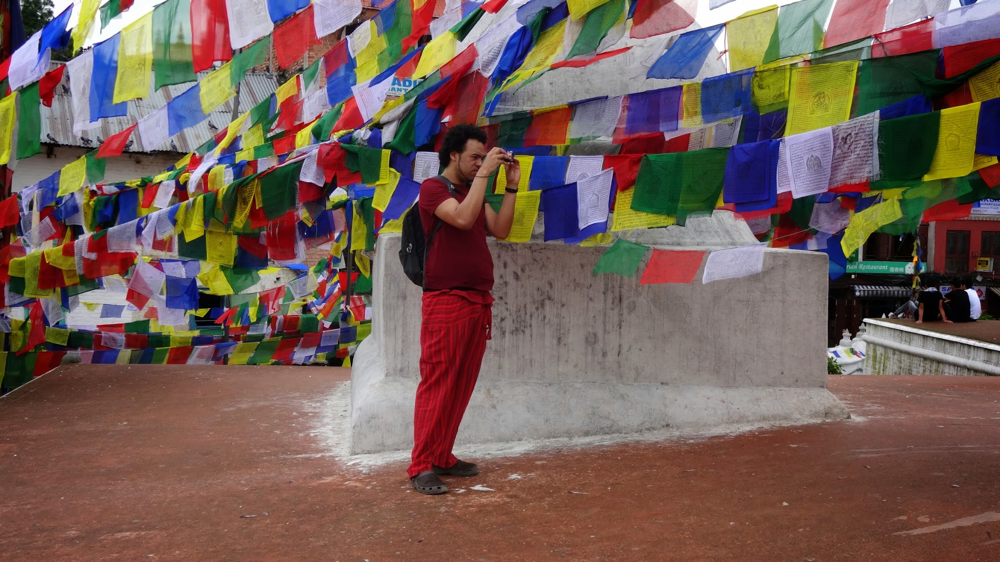
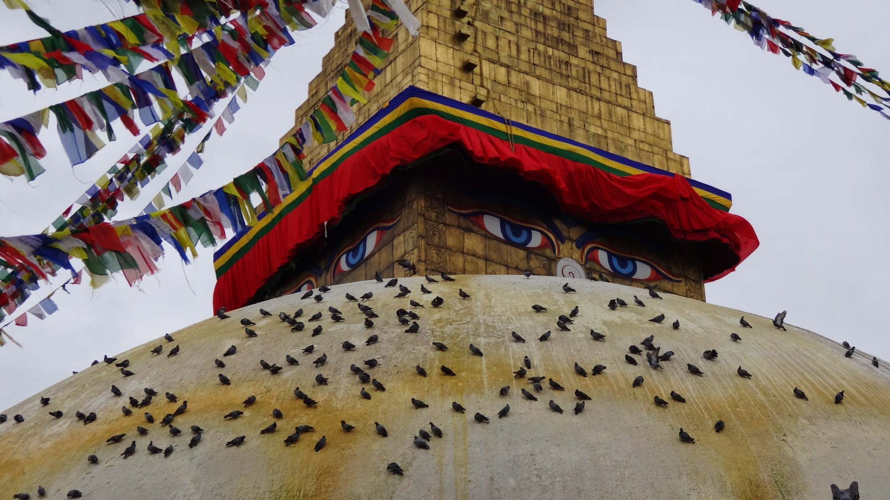
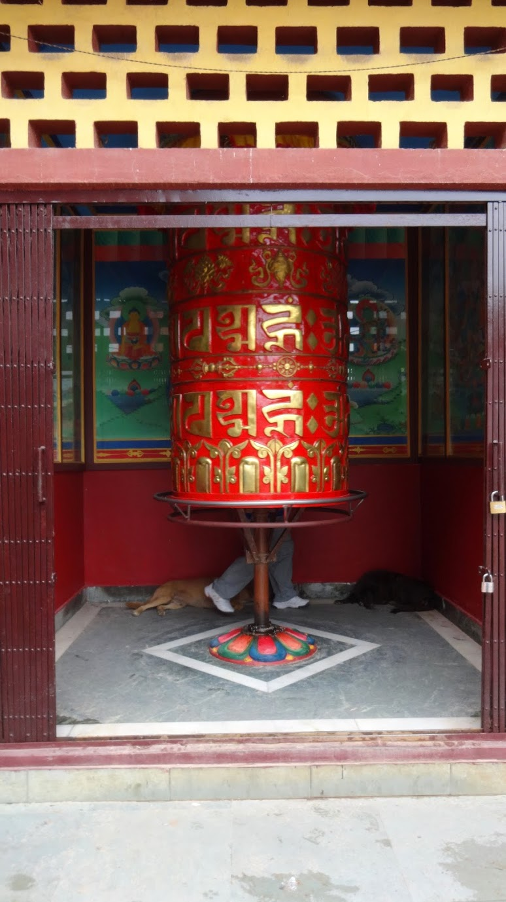

This is one of the worlds biggest Buddhist shrines , it stands 118ft tall with a solid dome. Pigeons, dogs and cows are welcome guests to the shrine, and often given blessings from visitors to the shrine. A beautiful place to have a guide teach you about Buddhism.


  {{}}
  {{}}
  {{}}
  {{}}
  {{}}
  {{}}
  {{}}
  {{}}
  {{}}
  {{}}
  {{}}
  {{}}

