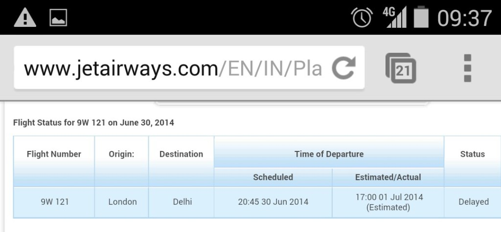
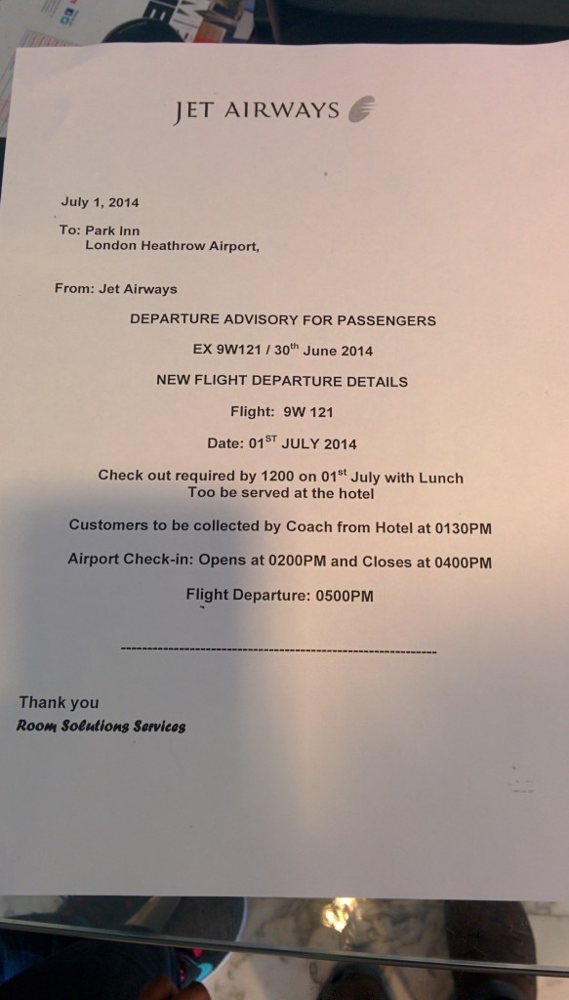

Sadly our Jet Airways flight from London Heathrow which was scheduled to leave at 22:45 failed to successfully leave. All passengers and luggage were boarded onto the craft and ready for departure.

Unfortunately due to a 'technical issue' we had to wait for the diagnostic, a part be ordered, and fitting to the craft. This took over 4 hours at which time was twenty past midnight.

We were served our evening meal like normal service even though we were still at the departure gate. Was constantly thinking we would not get in the air anytime soon if they are serving dinner? Because it was so late the flight could not leave, (assumed because the pilots would have been tired, airport traffic being closed, but more-so the runway was being resurfaced).

We were told to disembark, go through security and wait for coaches to take us to a nearby Park Inn hotel where we would be put up for the night.



It was not until 03:30 when we finally got to rest.

Sitting here having a breakfast buffet feeling tired but happy we had a real bed to sleep in, instead of being told to stay seated on the plane at the gate.

No information on when we will actually leave and how the logistics of our connection will work. We have contacted our hotel about the situation.

