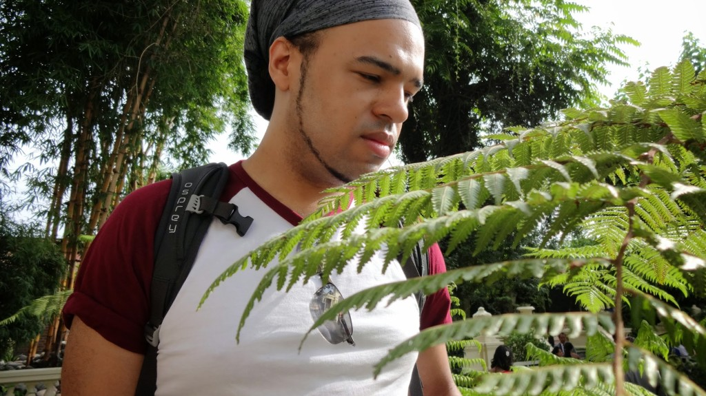
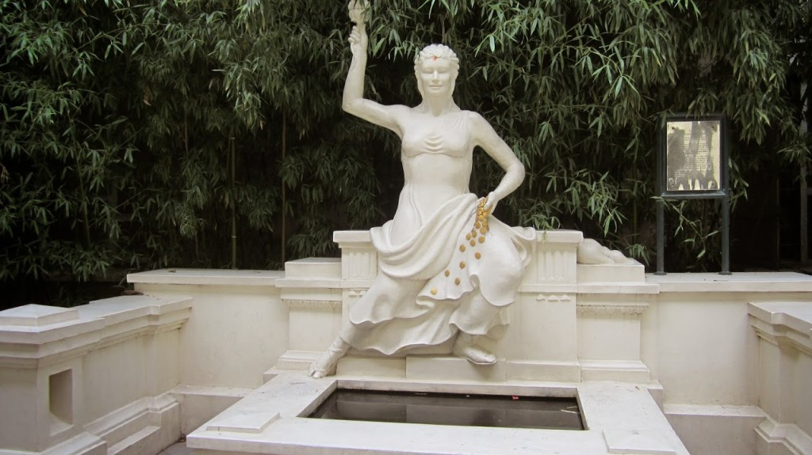
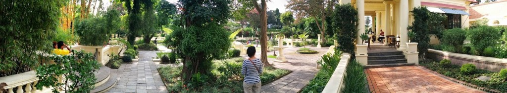
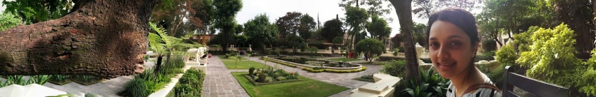
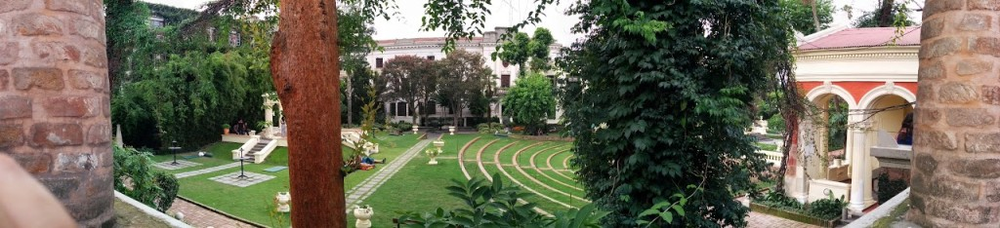

Monday morning we submitted our claim for the [Delayed Flight](https:///2014/07/delayed/) that caused earlier disruption to our travels.

We needed to relax a bit so we headed down the road to [The Garden of Dreams](https://www.tripadvisor.co.uk/Attraction_Review-g293890-d1463768-Reviews-Garden_of_Dreams-Kathmandu_Kathmandu_Valley_Bagmati_Zone_Central_Region.html). The garden was created by Field Marshal Kaiser Sumsher Rana in early 1920’s. After the demise of Kaiser Sumsher the garden was handed over to the Government of Nepal. Since then it was neglected for over 30 years until a project financed by the Australian Government restored The Garden of Dreams in the early 2000’s. The Garden of Dreams is now open to the public. Entry is ₨200 per person (about £1.22) which shows it goes towards the maintenance and continuing improvement of the Garden. This Garden is a small corner of busy Kathmandu where one can escape watching the water fountains, and wonderfully kept grounds live.

