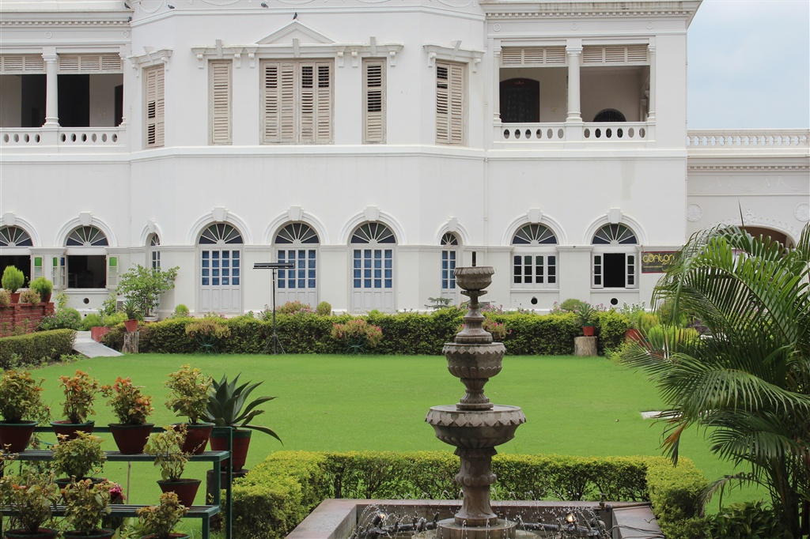

[Hotel Surya](https://www.agoda.com/en-gb/hotel-surya/hotel/varanasi-in.html?cid=1649959 "Agoda: Hotel Surya") is the first hotel we stayed at in India, the rooms are clean, spacious with cable television, hot water, paid Wi-Fi (₹150) which is mostly available around the hotel. The staffs are friendly and willing to help. The hotel includes a pool, but we did not have the time to take a swim.

We ate at the comfortable restaurant one evening and we were rather pleased with the food that they served.

[Hotel Surya](https://www.agoda.com/en-gb/hotel-surya/hotel/varanasi-in.html?cid=1649959 "Agoda: Hotel Surya") is in a quiet area away from the main centre:

> Hotel Surya, S 20/51, A-5, The Mall Road Varuna Bridge, Cantonment, Varanasi, India
> 
> Tel: 91-542-2508 465 | 66
> 
> Email: info@hotelsuryavns.com

It costs about ₹1600 (about £16) per night on [Agoda](https://www.agoda.com/en-gb/hotel-surya/hotel/varanasi-in.html?cid=1649959 "Agoda: Hotel Surya")
