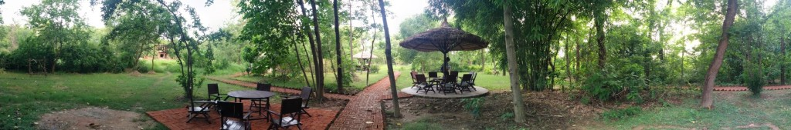

[Lumbini Buddha Garden Resort](https://www.agoda.com/lumbini-buddha-garden-resort/hotel/lumbini-np.html?cid=1649959 "Agoda: Lumbini Buddha Garden Resort")  is a lodge type resort where each guest gets an entire lodge to themselves. Located away from any town or village this resort is very calm and quiet, the views at night are spectacular. As there is no light pollution from nearby towns, many stars seen during a clear night, truly a sight to behold.

The resort hosts a simple bar and food buffet style, with friendly staff happy to help you. The rooms are spacious with a large tiled bathroom, warm water was not always available but the warm standard shower water was welcome.

<!-- [Lumbini Buddha Garden Resort](https://www.agoda.com/lumbini-buddha-garden-resort/hotel/lumbini-np.html?cid=1649959 "Agoda: Lumbini Buddha Garden Resort") is found on the main road into Lumbini -->



<!-- You can book on [Agoda](https://www.agoda.com/lumbini-buddha-garden-resort/hotel/lumbini-np.html?cid=1649959) for about ₨4500 (about £28.10) per night -->
