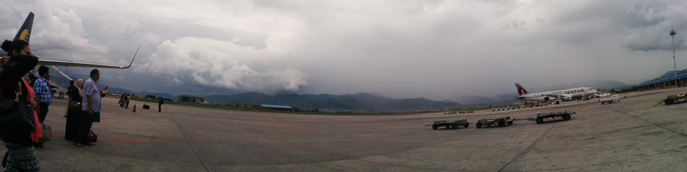
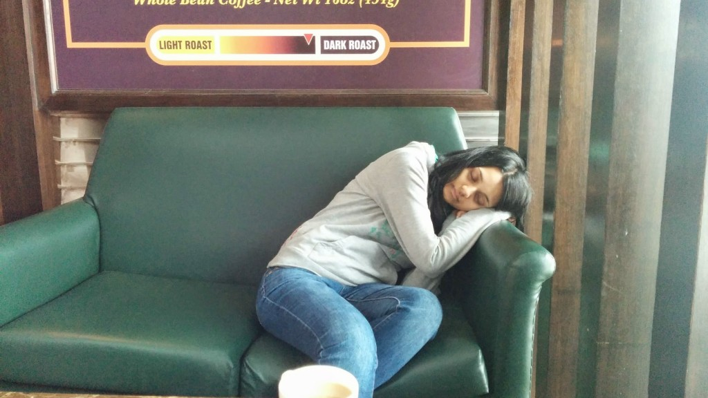
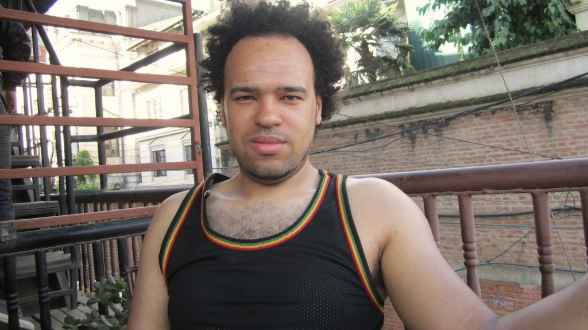
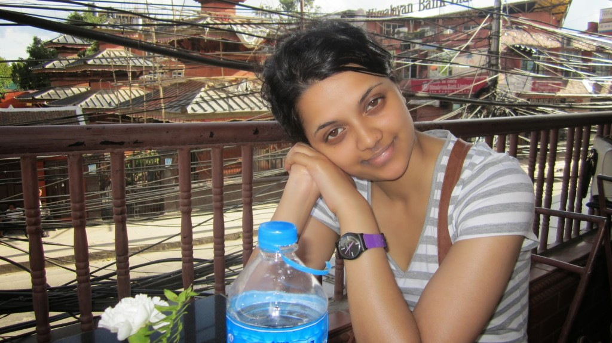
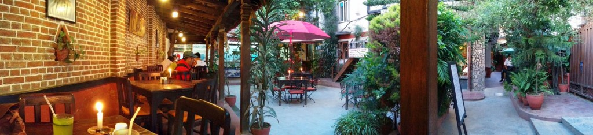
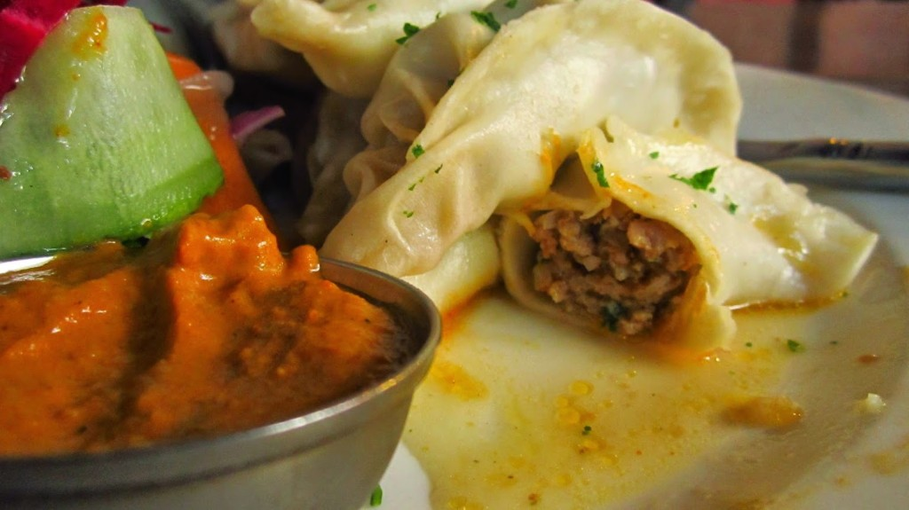
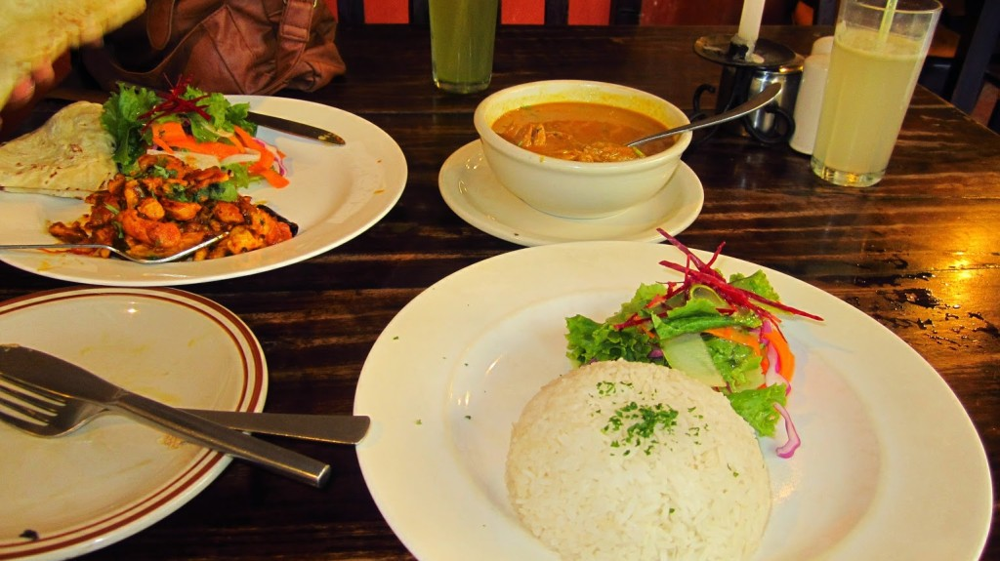
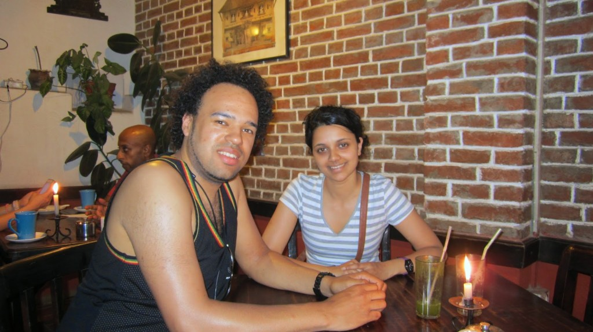
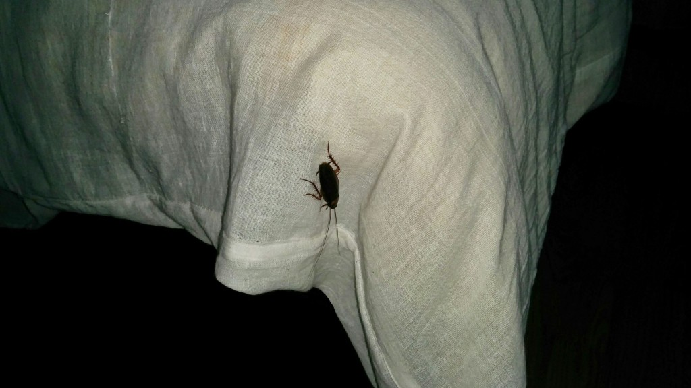

We're finally here, Kathmandu! After a delayed start we arrived into the mountainous Kathmandu airport, taken away by the beautiful scene surrounding us. The Airport staff were laid back, greeting us with smiles and jokes.

{{}}

We where kindly collected form the airport by Hari from [Zen Bed & Breakfast](https://www.tripadvisor.co.uk/Hotel_Review-g293890-d5820384-Reviews-Zen_Bed_Breakfast-Kathmandu_Kathmandu_Valley_Bagmati_Zone_Central_Region.html). We crammed ourselves into this little taxi and got on our way to the Thamel district. Not knowing how the road infrastructure was, (was amazed how anybody survived). Except from generally driving on the Left, there is no right of way it seems, motorcycles, cars, cyclists and pedestrians all go which ever way they can. Undertaking from both sides, and crossing the traffic with little warning. The entire journey felt like a 'near miss'. However this chaos had a sense of skill of fluke, have not experienced a road traffic accident. All road users use all the space well, and keep rage speed down. Crossing the road can be scary, you have to look all directions to make sure it is safe(enough) to cross.

{{}}

After checking in we Crashed, exhausted from our [delayed departure](/posts/2014-07-delayed/ "delayed…").

We found [Himalayan Java Coffee Shop](https://www.tripadvisor.co.uk/Restaurant_Review-g293890-d1846797-Reviews-Himalayan_Java_Coffee-Kathmandu_Kathmandu_Valley_Bagmati_Zone_Central_Region.html) (after spending 4 minutes waiting to cross the road). We sat back, and watched the world by. Watched how traffic flows and just enjoyed a different way of life.

In the evening we went to [Gaia Restaurant & Coffee Shop](https://www.tripadvisor.co.uk/Restaurant_Review-g293890-d1988042-Reviews-Gaia_Restaurant_Coffee_Shop-Kathmandu_Kathmandu_Valley_Bagmati_Zone_Central_Regio.html) in search for Nepali food.

{{}}

We had Chicken Momo (a starter we have tried a few times in [Nemaste Nepal](https://www.tripadvisor.co.uk/Restaurant_Review-g187069-d782333-Reviews-Namaste_Nepal-Manchester_Greater_Manchester_England.html) in Manchester).

{{}}

It was nice, subtle taste minced chicken with Nepal spiced wrapped thin dough.

We also had two different chicken dishes (Chicken Sandeko and Chicken Curry), both packed with flavour we never have tasted before.

This meal including drinks cost  1070 NPR (~ £6.60).

Today we spent 2780 NPR (~ £17), we did buy coffee, water, meals and confectionaries.

Just now I found a cockroach in our bed, likely seeking the cool water condensation left from some water bottles we bought.

{{}}
