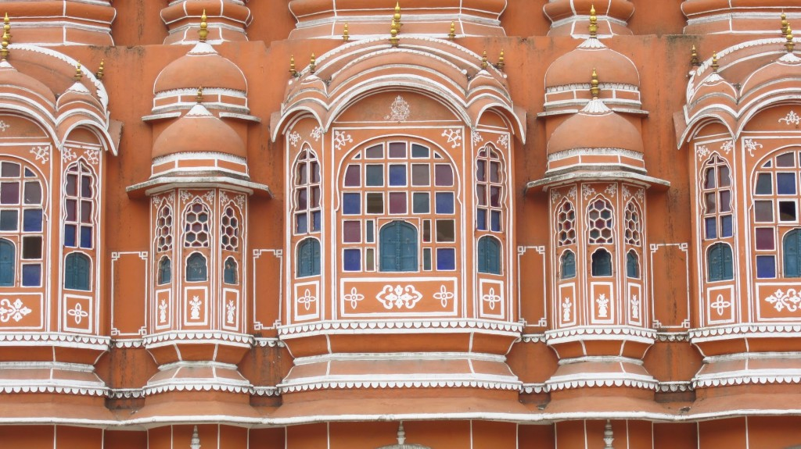

We stopped by Palace of Winds formally known as Hawa Mahal. We decided to not enter and climb the palace as we where tired from Amber Fort. The place is a beautiful tall structure overlooking Hawa Mahal Road, it allowed women of the royal household to see the street festivities without being seen from the outside.

\[gallery link="file" columns="3" orderby="post\_date"\]
