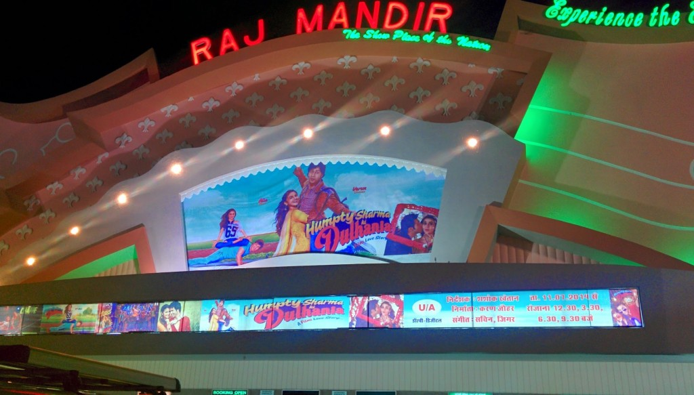
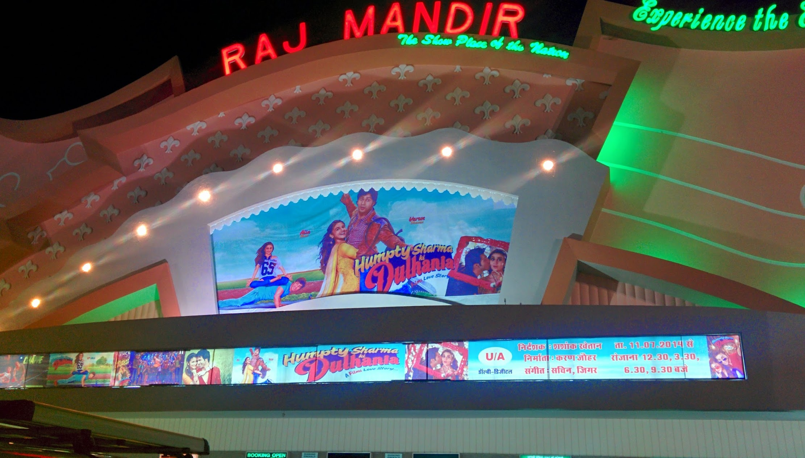
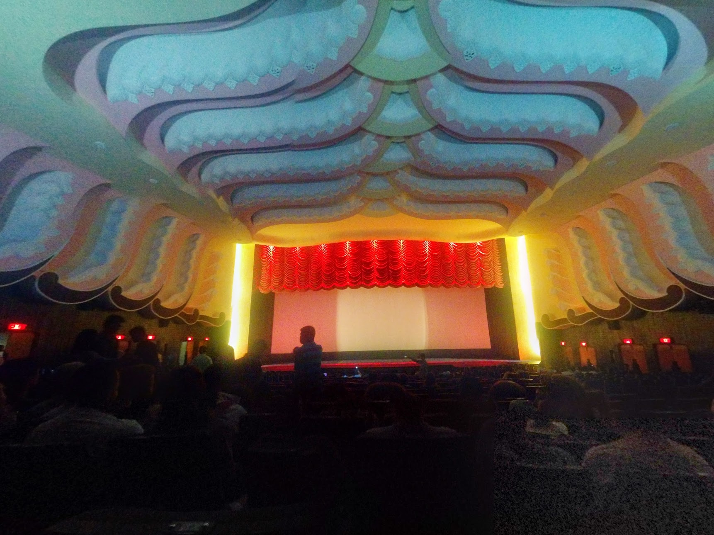
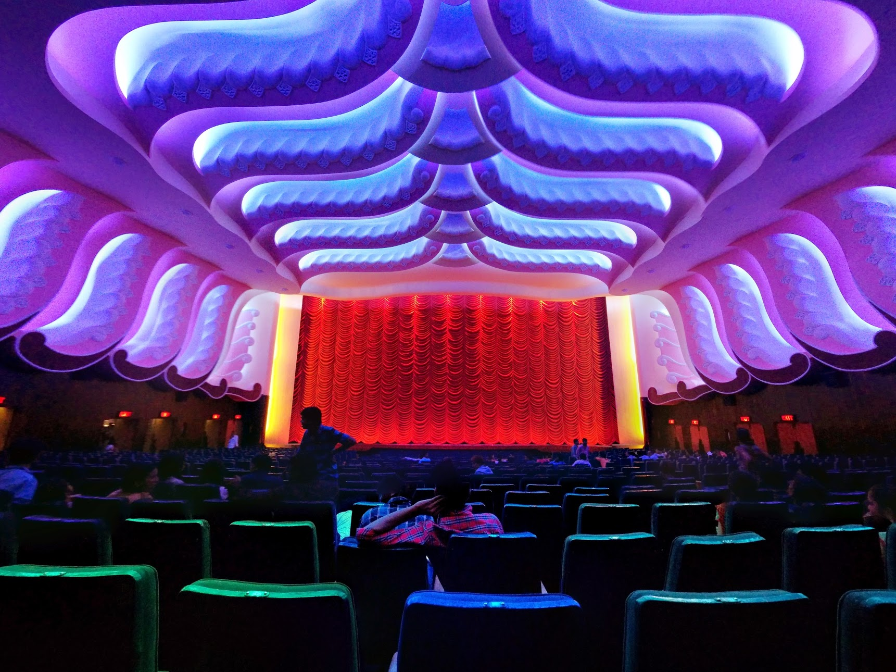

We went to Raj Mandir Cinema to watch Humpty Sharma Ki Dulhania (a bollywood movie). The cinema screen was nearly as large as an IMAX screen and featured a large red curtain that would present the screen when the movie starts. The cinema is grant with decorative lighting and large foyer.

The cinema appears to show one movie at a time multiple times a day.

> Raj Mandir Cinema, C-16,Bhagwandas Rd, Jaipur, Rajasthan 302001
> 
> Tel: +91 0141 237 9372
> 
> Website: [therajmandir.com](https://therajmandir.com/)

  {{}}
  {{}}
  {{}}

