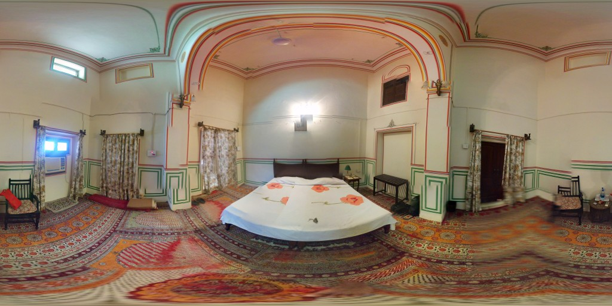

We stayed at [Rawla Bagh](https://www.agoda.com/en-gb/rawla-bagh-nimaj-a-heritage-resort/hotel/jodhpur-in.html?cid=1649959 "Agoda: Rawla Bagh") for some village relaxation time, there is a pool and well-kept grounds to relax around.

The room we were given was huge, high ceilings with colourful decorative paint, have air-conditioning and hot running water. The power rarely failed.

We enjoyed staying here, highly recommended.

\[gallery link="file" columns="3" orderby="post\_date"\]

> Rawla Bagh, Nimaj, Tehsil Jaitaran, Pali 306303, India
> 
> Tel: +91 094 13 371461
> 
> Email: [bhuvan@rawlabagh.com](mailto:bhuvan@rawlabagh.com)
> 
> Website: [www.rawlabagh.com](https://www.rawlabagh.com/)

[Rawla Bagh](https://www.agoda.com/en-gb/rawla-bagh-nimaj-a-heritage-resort/hotel/jodhpur-in.html?cid=1649959 "Rawla Bagh") can be booked for about ₹2550 per night on [Agoda](https://www.agoda.com/en-gb/rawla-bagh-nimaj-a-heritage-resort/hotel/jodhpur-in.html?cid=1649959 "Agoda: Rawla Bagh").
