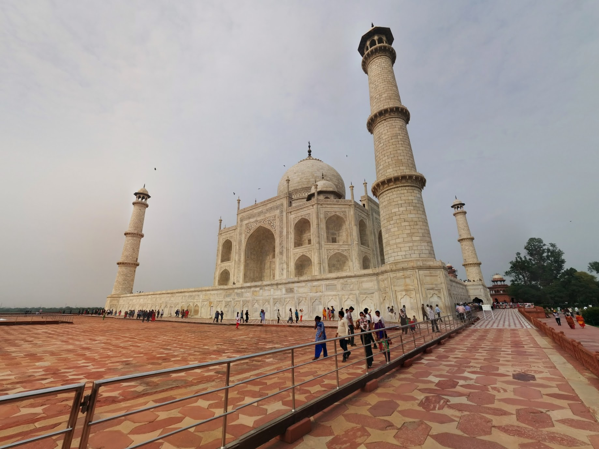

A trip to India is not complete without visiting the grant Taj Mahal, we could not miss the opportunity to visit this wonderful mausoleum. We were given a light guide introduction about the history of Taj Mahal. We leaned this white marble building designed and built within 22 years and emperor Shah Jahan ensured no other replica is constructed by retiring all the workers (paying for them to not work again). To express the unconditional love of emperor Shah Jahan's departed wife Taj Mahal was constructed.

I think its beautiful, not everybody can fund the construct of such a beautiful building for the memory of a loved one.

Our visit was ok, loads of free time to roam the grounds. It is a popular attraction so there are thousands of people passing though the attraction, getting in the way of your photos, asking you loads of questions about where you are from, and stepping on your toes.


  {{}}
  {{}}
  {{}}
  {{}}
  {{}}
  {{}}
  {{}}
  {{}}
  {{}}
  {{}}
  {{}}
  {{}}
  {{}}
  {{}}
  {{}}
  {{}}
  {{}}
  {{}}

