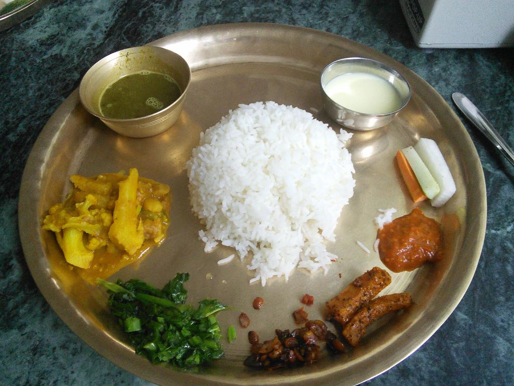

 We visited [Thakali Kitchen](https://www.tripadvisor.com/Restaurant_Review-g293890-d1156621-Reviews-Thakali_Kitchen-Kathmandu_Kathmandu_Valley_Bagmati_Zone_Central_Region.html)  as a group, recommended by our tour leader Bikash Nepal from [Himalayan Encounters](https://himalayanencounters.com/).

I ordered the recommended dish _Mutton Thakali Set_ along with some other group members while Kim ordered _Vegetable Thakali Set._ I decided to eat how locals do, with the right hand mixing the gravy with the rice and scooping it into the mouth (I did duly wash my hands before). Eating with hands was an interesting experience, breaking down the formalities and ‘just eating’.

I enjoyed my meal at the time, but did feel a bit fragile afterwards. Luckily I was not Ill, the same can not be said for Kim. She got admitted to Hospital.
