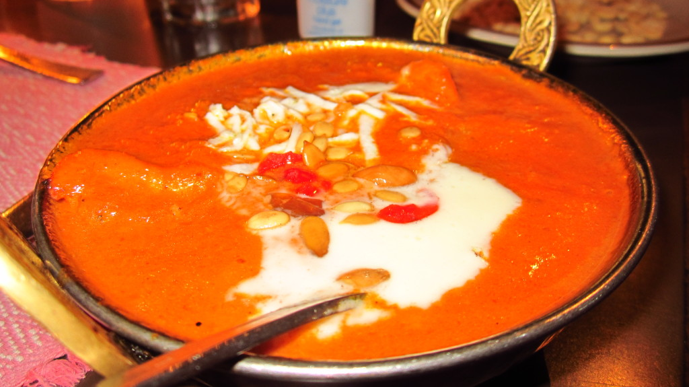
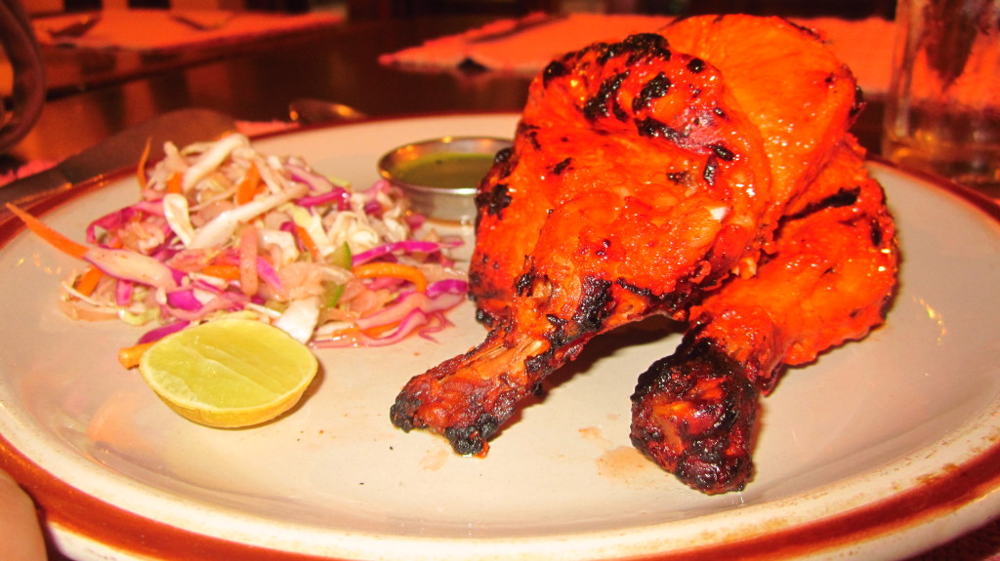

We visited the [Third Eye Restaurant](https://www.tripadvisor.co.uk/Restaurant_Review-g293890-d1156626-Reviews-Third_Eye_Restaurant-Kathmandu_Kathmandu_Valley_Bagmati_Zone_Central_Region.html#REVIEWS)  for evening dinner with high expectation for a decent tandoori curry. Seated upstairs we were given a plate of peanuts and menu to study. I chose Chicken Tikka Masala while Kim chose Chicken Tandoori as we wanted something simple and that would not upset our stomachs (as were already feeling fragile).

{{}}

{{}}

When the mains came out, I inspected Kim’s Chicken and discovered it was not cooked through, we requested it to be properly cooked. The meal returned about 10 minutes later, (after I had finished the Masala out of boredom) and the chicken still was not piping hot as expected. Kim refused the meal and we decided to pay and leave with disgust.

Retrospectively, the service we received was not pleasant. They told us off for cutting the tandoori chicken into smaller bits from the bone (as they will have to throw the meal away instead of re-sell it or something).

The prices on this menu did not include the 10% service charge or 13.5% Tax (common in most places), The bill came to ₨1013, we handed them ₨1020 and had to ask for the ₨2 change (as they assumed this was a tip).

On the walk back to the hotel my stomach and body was telling me "something is not right". I had to dart to our hotel, up all the stairs (as we’re on the top floor) and burst into the lavatory. What ever I had consumed decided to speed up its way though my system.

I would not recommend anybody visit this restaurant, the service was poor, and the food was terrible.
