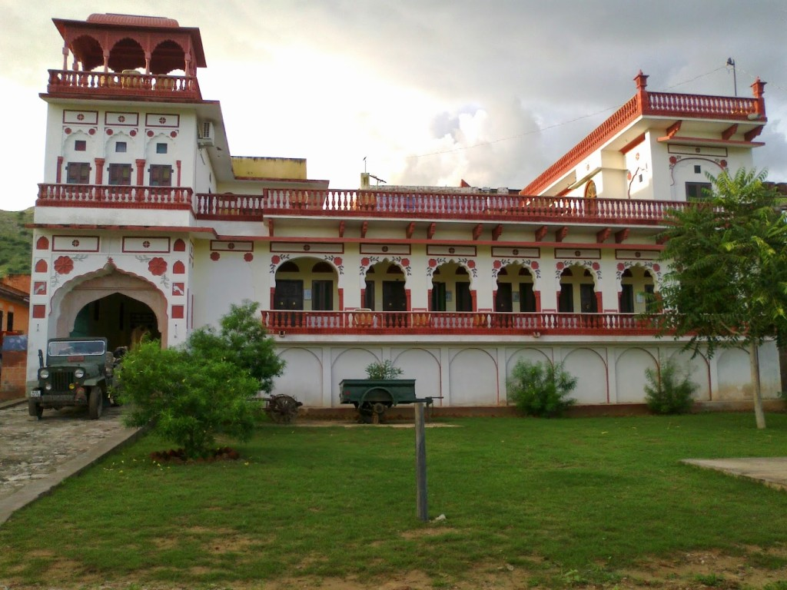

[Tordi Garh Hotel](https://www.agoda.com/en-in/tordi-garh-hotel/hotel/malpura-in.html?cid=1649959 "Agoda: Tordi Garh") (the only hotel in Tordi Garh) is a breathtaking hotel that the entire village welcomes you to. Families and children around the area all wave and greet you with open hearts and smiles. We are grateful to give our short time to the people here. The hospitality was exceptional, water, food and drinks all available. The rooms are spacious with air-conditioning, and own water heater.  Our stay was very pleasant indeed.

The hotel staff and village are willing to tour you around, we taken a walk up the nearby hill to watch the sunset with Chai-Masala Tea (a perfect way to spend an evening).

I recommend this hotel for people traveling away outside of the cities.

> Tordi Garh Hotel, Tordi Garh Village, Tehsil-Malpura, Tonk, Rajasthan 304502
> 
> Tel: +91-8003408428
> 
> Email: [reservation@tordigarh.com](mailto:reservation@tordigarh.com)
> 
> Website: [www.tordigarh.com](https://www.tordigarh.com/)

[Tordi Garh Hotel](https://www.agoda.com/en-in/tordi-garh-hotel/hotel/malpura-in.html?cid=1649959 "Agoda: Tordi Garh") can be booked ₹2200 on [Agoda](https://www.agoda.com/en-in/tordi-garh-hotel/hotel/malpura-in.html?cid=1649959).
