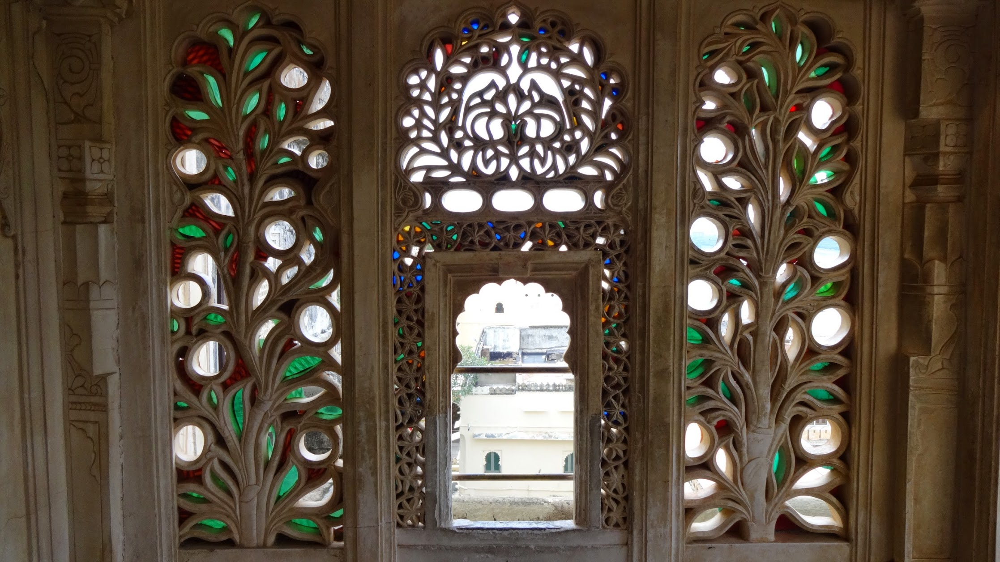

We visited the City Palace and had a guided tour around the paid-public sections of the palace. This palace is a neat sized building that engulfs a hill as part of its architecture so a roof top garden with large trees and a pool can exist. The palace features beautiful coloured glass, brilliantly maintained rooms and triumphant artwork. The grounds are wonderful to walk around and there are no pocket-sellers within the grounds.

This City Palace is well worth the visit.


  {{}}
  {{}}
  {{}}
  {{}}
  {{}}
  {{}}
  {{}}
  {{}}
  {{}}
  {{}}
  {{}}
  {{}}
  {{}}
  {{}}
  {{}}
  {{}}
  {{}}
  {{}}
  {{}}
  {{}}
  {{}}
  {{}}
  {{}}
  {{}}
  {{}}
  {{}}
  {{}}

