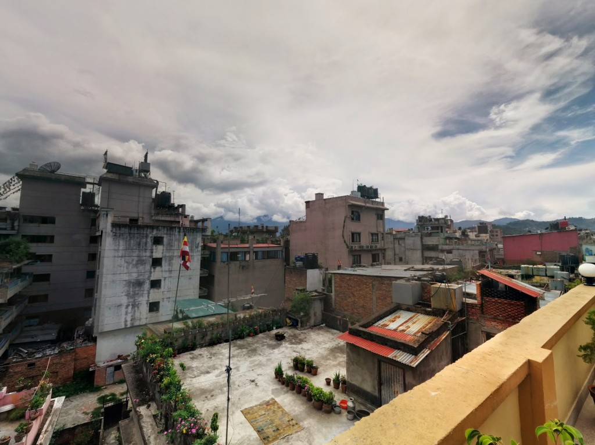
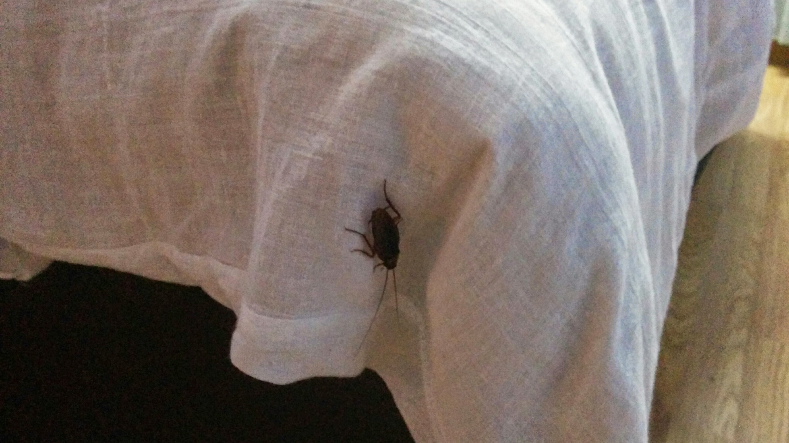
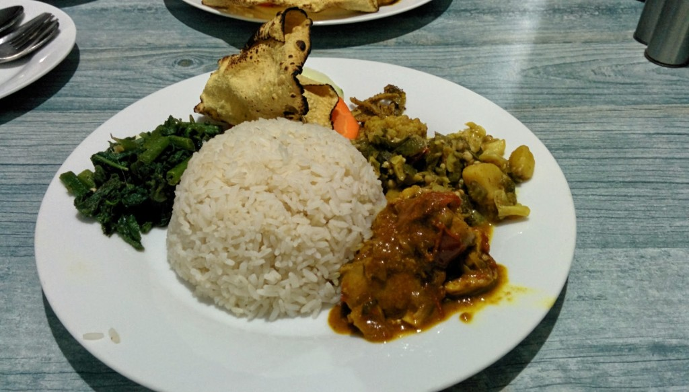

After major flight [delays](/delayed/ "delayed…"), We arrived into Kathmandu, Nepal and was given a complementary airport transfer to [Zen Bed and Breakfast](https://www.agoda.com/zen-bed-and-breakfast-kathmandu/hotel/kathmandu-np.html?cid=1649959) in a local taxi, Hari (the owner) personally collected us. Hari, kept in touch via SMS and had no problem with our delay, we was not charged for the unused night we missed from our delay.

<iframe src="https://maps.google.com/maps?layer=c&amp;panoid=g_flcpvhhToAAAQfCQEiJw&amp;ie=UTF8&amp;source=embed&amp;output=svembed&amp;cbp=13%2C226.9104%2C%2C0%2C0" width="700" height="394" frameborder="0" marginwidth="0" marginheight="0" scrolling="no"></iframe>

[Views](https://www.google.com/maps/views/): [Zen Bed and Breakfast Rooftop](https://www.google.com/maps/views/view/103958417703949399427/gphoto/6041926482835752658) by [Kyle Welsby](https://www.google.com/maps/views/profile/103958417703949399427)

The B&B is located just off the main roads which allowed some peace from the busy vendors on the roads but right in the centre of Thamel allowing convenient access to everything.

We were given the private double room on the top floor, the room had a large double bed, and en-suite toilet and shower room (but there was no door, just a curtain). The room television did not receive any channels.  The room was standing fan cooled (which was also home to a cockroach). Each night without fail we would find a cockroach each which we would have to end.

Breakfast each morning consists of Toast, Eggs and Spiced Potatoes, with Nepali Tea. The limited choice got boring after a few days, most days we had only toast by choice.

The B&B a large roof top balcony overlooks the city with tables and chairs to kick back and relax. Wi-Fi is only available in the Lobby and connection speeds are slow.

Power was intermittent in the room due to load-times (still do not understand what the problem is). Hot water was rarely available.

We where cooked a Nepali dish which was delicious.

The stay was pleasant enough for the price, we paid about ₨1700 (about £10.50) per night.

You can [book a room online](https://www.agoda.com/zen-bed-and-breakfast-kathmandu/hotel/kathmandu-np.html?cid=1649959) and not pay until you leave.
