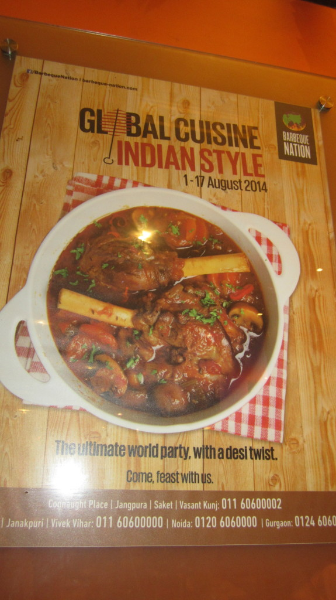

We went to [Barbeque Nation](http://www.tripadvisor.co.uk/Restaurant_Review-g304551-d4312086-Reviews-Barbeque_Nation-New_Delhi_National_Capital_Territory_of_Delhi.html "Barbeque Nation on TripAdvisor") Connaught Place (ranked #54 out of 3597 restaurants in New Delhi on [TripAdvisor](http://www.tripadvisor.co.uk/Restaurant_Review-g304551-d4312086-Reviews-Barbeque_Nation-New_Delhi_National_Capital_Territory_of_Delhi.html "Barbeque Nation on TripAdvisor")) for what we expected to be a simple meal.  We did not expect an all you can eat buffet with a real BBQ in the middle of the table.

We got given a table and hot coals were placed in the centre, then skewers of cooked chicken, fish, and prawns to be additionally cooked to the our liking. The skewers kept on coming until we asked for no more (this was just the starter).

After the BBQ starters we where able to enjoy the small but extremely tasty selection of main dishes. The dishes had a western meets indian fusion twist as there was a different menu promotion.

We enjoyed the food and atmosphere for the evening, eating until we could not eat anymore. The total bill was ₹1988 (about £19) for the two of us.

I would recommend this place for a food filled evening.

\[gallery type="rectangular" ids="443,445,444,446,447"\]

> Barberque Nation, N96, 2nd Floor, Outer Circle, Munshli Lal building, Cannaught Place, New Delhi, 110001, India
> 
> Tel: +91 11 43434071, 43434072, 43434073
> 
> Email: cp@barbeque-nation.com
> 
> Website: [www.barbeque-nation.com](http://www.barbeque-nation.com)
