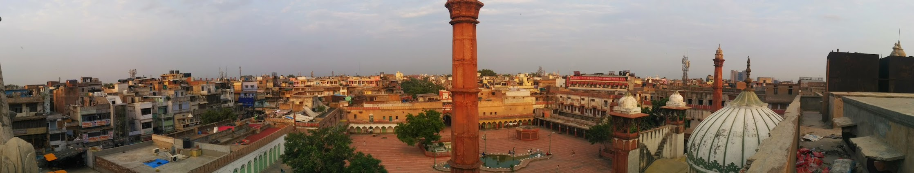
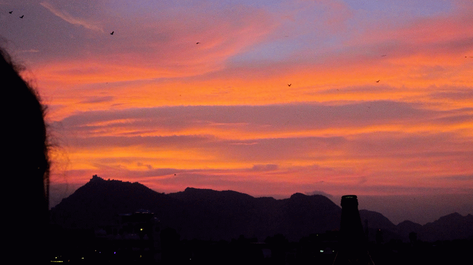

- Disclaimer: The following are my own opinions and are not intended to offend.

We spent a little over 3 weeks in India during July 2014 mostly with a guided tour [_Ain't no mountain high enough_](http://gonetraveling.me/2014/07/aint-no-mountain-high-enough/ "Ain’t no mountain high enough.") by Geckos Adventures. The India government air an advertisement campaign "Incredible India"

\[youtube=https://www.youtube.com/watch?v=r1kIOQbJRyY\]

"Incredible India" is one way to say it, India is both incredibly great and incredibly annoying at times too - I will explain in this post.

I visited India with my partner, as her descendants are Indian I have been told stories prior my visit, however I remained naïve and have an open mind regardless of what other people have told me - I needed to see, smell, feel, and experience India myself.

**Overland crossing**

We entered India overland from Nepal and I initially was disgusted, flies immediately swarmed around us, the roads covered in sloppy mud (and god knows what else), women burning piles of rubbish which contained mostly plastic, and the frantic sense of urgency on the road traffic to always overtake. This is something I have never experienced. The constant use of horns become the ongoing soundtrack of India - the horn almost seems ineffective.

\[soundcloud url="https://api.soundcloud.com/tracks/163380052?secret\_token=s-1ikrF" params="color=ff5500&auto\_play=false&hide\_related=false&show\_comments=true&show\_user=true&show\_reposts=false" width="100%" height="166" iframe="true" /\]

None the less, I was determined to explore India and find its beauty beyond the first introduction.

I was not disappointed, I saw pockets of sheer beauty. The architecture and design seen across the land is remarkable. Buildings and trucks feature non-functional decorative detail, distinctly Indian.

During our trip we visited all the remarkable places in the north of India, [The River Ganges](http://gonetraveling.me/2014/07/river-ganges/ "River Ganges"), [Taj Mahal](http://gonetraveling.me/2014/07/taj-mahal/ "Taj Mahal"), [Tordi Gardh](http://gonetraveling.me/2014/07/tordi-garh-hotel/ "Tordi Garh Hotel"), [Amber Fort](http://gonetraveling.me/2014/07/amber-fort/ "Amber Fort"), and [Udaipur](http://gonetraveling.me/2014/07/udaipur-city-palace/ "Udaipur – City Palace") to list a few.

\[caption id="attachment\_652" align="aligncenter" width="700"\] Pukharj and his mustache\[/caption\]

One of my favourite moments was meeting the [Pukhraj family](http://gonetraveling.me/2014/07/pukhraj-durry-udhyog/), they welcomed us with smiles food. A completely unforgettable experience.

It is hard to believe the population of India, there are people everywhere! Along with the massive population are hundreds of cows you will see casually grazing around the streets.

\[caption id="attachment\_546" align="aligncenter" width="700"\] curious cow\[/caption\]

There are moments during our tour when locals go out their way to help you. When you find somebody genuine, all they want to do is make sure you are happy.  We once hired a Tuk-Tuk driver for the entire day for ₹900, he took us all around the city of Jaipur in search of souvenirs (magnets and postcards). Jaipur doesn't have many tourist shops which stock these items, the main concentration is on textiles or poor quality items told to be 'good quality' sold by everybody wanting to make a simple buck. The driver drove us around Jaipur more than 3 times finding places to shop, he was more than happy to escort us.

I do have to mention the parts of India which I found displeasing, there where a few stressful moments though our tour which made it difficult to want to be there. It is mostly due to the lack of education and attitude from people.

**Money**

One of my biggest annoyances was the taxation system, don't get me wrong there are taxes everywhere you go. How restaurants in India approach this appears deliberately deceptive. The menu's will be printed with a price, then a small disclaimer will mention Service Charge, Service Tax and Value Added Tax are applicable. As they are compulsory additional charges are not included in the menu item, it makes it exceptionally difficult to adequately budget. Often 25% tax was added for drinks, 20% tax added to food, and 10% service charge is added to a bill total. - There were times I expressed my displeasure to this, as each time I would have to do the calculations to make sure I was not being scammed, either way I had no choice. I would prefer the maximum retail price to be printed on the menus.

The desperation to make a quick buck is constant while walking around in the cities. A Tuk-Tuk will stop in-front of you, point at you and then point to the back of there Tuk-Tuk, kindly declining the service another Tuk-Tuk right next to the first will express the same (this happens all the time). If it is not a Tuk-Tuk, it is a pedal rickshaw.

Sometimes people will approach you with a simple question "Where are you from?", innocent right? To not seem impolite I answer the question,  for the continuation of more penetrating questions - "Where are you going?" "What are you doing later?" etc... I later learn some these people are attempting to persuade you to a service of some-sort that will get you to part with your cash. A common example "There is a good, cheap market that has little government tax" is a common response in New Delhi. There are few genuine people who wish to practice their English with you and enjoy a conversation that is not demanding you to do anything.

It does gets to a point were you ignore these offers and continue to walk on by, In part I feel bad as people are wanting to make a living but it can come across as very demanding and desperate.

When browsing stores the store attendant will follow you around, as to pounce on you when you have any faint interest in an item. For me, that is very pushy and off-putting, in most cases I would leave the store. I was later educated that the India couture when shopping prefers to have an assistant with them all the time, to pull and show items, give suggestions. I prefer to experiment and build my own emotional connection with an item I have interest in.  There would be times browsing stores and the attendant would show you everything they have, pushing it into your face "look we have it in yellow". I found it funny how they would make such a mess of the store pulling all the items out for a possible sale, and when you're 'just browsing' and firmly know you are not in the mood to commit to a purchase.

Some cities is very exhausting especially New Delhi for me, it has a high demand for you to part with your cash, sometimes it costs as much in New Delhi as it does in United Kingdom.

**Spends**

In total for India according to my credit card statements, I spent ₹68,794 (around £685). This is excluding the [Geckos Tour](http://gonetraveling.me/2014/07/aint-no-mountain-high-enough/ "Ain’t no mountain high enough.") which included most Attractions and Lodgings.

**India again?**

I would consider visiting India again, next time I would like to visit the south of India.  India is a large country and it can not be summed up in a 3 week tour. I would defiantly avoid New Delhi, and expand the visit to smaller villages and home-stays.

Would not travel alone in India, especially if you are Woman. It feels safe enough but the back of my mind does think somebody may try to take liberties.

[Read more of my experiences in India](/category/india/)


  {{}}
  {{}}
  {{}}
  {{}}
  {{}}
  {{}}
  {{}}
  {{}}
  {{}}
  {{}}
  {{}}
  {{}}
  {{}}
  {{}}
  {{}}
  {{}}
  {{}}

