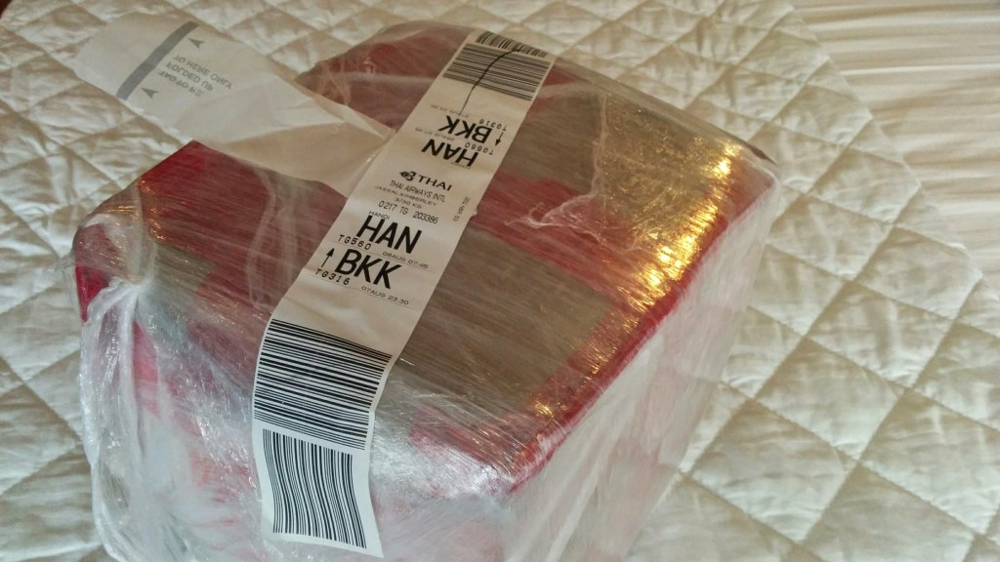

Before leaving India we wanted to ship the souvenirs we have purchased over the last month back to the United Kingdom.

**TL;DR**

Don't think shipping your items from India will be easy, simple and cheap.  Most souvenirs you buy will likely be rejected from main stream carriers for some silly reason.  If you're flying back home, take your souvenirs with you, don't buy anything too big that you will have to ship (you might be disappointed).

The morning before we fly out to Vietnam and checkout out of our hotel, we went on a mission to find DHL to ship our consignment. We failed to find DHL, our Tuk-Tuk driver drove us around all of Connaught Place in search of carriers.

We found FedEx after an hour of searching and dived right in requesting to ship our items.  The itinerary scrutinised, and the attitude of the staff was really unpleasant, (like he did not want our custom). We were continuously told "Tea can not be shipped", with no real explanation. Reluctant of this we still wanted to go ahead and ship the 4.2kg of stuff home.  FedEx provided a box, but it was too small to send our items. The only other alternative would be a 10kg box (a box which is filled up-to 10kg at a fixed price).  However the fixed price for this box equal's the total value amount of items (₹9000+ forgot to note down the exact figure). After receiving negative customer service, and extreme shipping costs, we stormed out of  there and insisted to find the DHL branch.

Another 30 minutes searching and we found a DHL branch (screaming out tho the Tuk-Tuk driver "THERE, THERE!"). Speedily entering the branch, we again quizzed about the contents of our consignment, again told "Tea can not be shipped". This time the staff shown us a carrier shipment book that has terms and conditions in. The exception for Tea read something like "Tea can not be shipped from Hong Kong or China, Tea shipped from Hong Kong or China will be sent back to the origin", as we are in India this exception should not concern our consignment.  The company told us that our consignment may go via China and thus could be stopped, (this should not matter as the origin is India). We were later told, "Solid wooden items can not be exported" this infuriated us, we buy nice decorative souvenirs as tourists to India and it seems there is no way to ship them home. Curious of what DHL would have charged, the same as FedEx ₹9370.

We did not want to pay nearly £100 to send 4.2kg of souvenirs home, we now have a box taped up and intend on taking the consignment to Vietnam with us to try again there (hopefully much less the cost) This was not a fun way to spend the last day in India. Luckily we did not spend ₹220,000 on a large wooden elephant statue, we would not have been able to ship it back home with ease.
