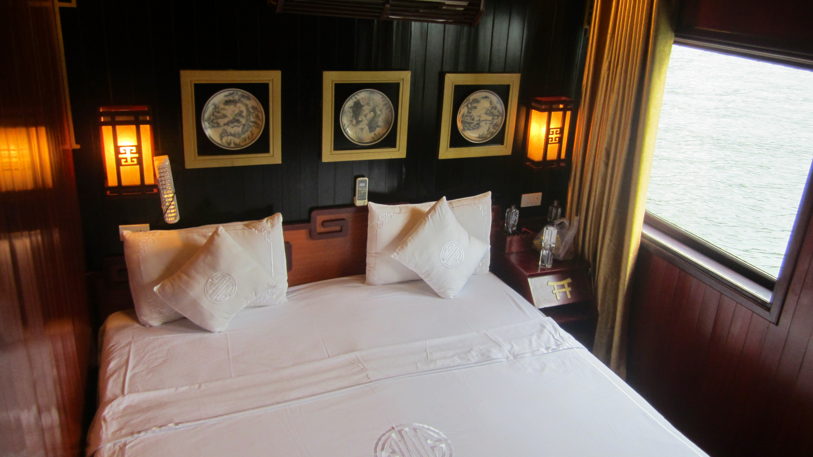
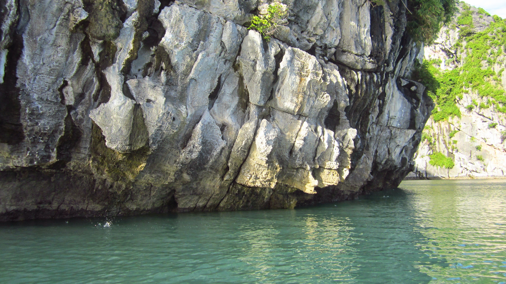
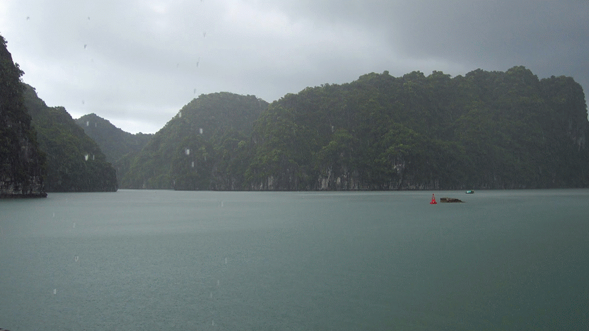
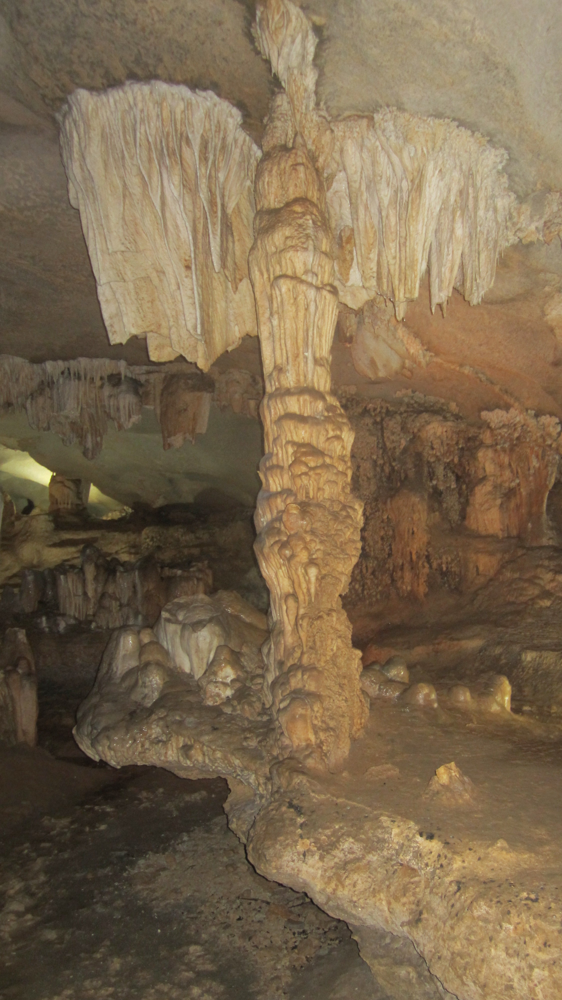

A visit to Vietnam can not be complete without visiting the [UNESCO world heritage site Hạ Long Bay](https://whc.unesco.org/en/list/672).

A collection over 1960 limestone islands and islets in the Gulf of Tonkin are divided into three sections, Hạ Long, Bái Tử Long and Lan Ha Bay. Ha Long Bay is the most popular section to visit for tourists, Bái Tử Long Bay is a protected national park and requires permission to take tourists to this part of Hạ Long Bay.

Visiting these limestone formations is only possible via water, and there are now plenty of cruise companies that will sail around the islands varying in price.

We booked a 3 day 2 night cruise on Dragons Pearl part of Indochina Junks fleet. Indochina Junks are a mid to high price company offering deluxe cruises around exclusive parts of Bái Tử Long Bay.

**Day 1** Collected from our hotel shortly after 8am via Luxury Private MiniBus that has 7 comfortable cream leather seats, we relaxed for the 4 hour journey to Ha Long bay from Hanoi.

Upon arrival to the Indochina Junks port offices we hardily had any wait before we were introduced to our tour leader 'Toni'. Toni took us to our vessel and explained in detail the cruise itinerary - much of which I immediately forgot but each day and activity was clearly explained throughout the tour.

We had a beautifully prepared multi course lunch onboard while we sailed to exclusive waters. The food served was some of the best tasting food I have eaten while in Vietnam. Fresh salads, seafood of epic proportion and plenty of steamed rice.

After lunch a kayak activity would take us out onto the waters for over an hour around a calm quiet section to get up close and personal with the beautiful seascape. After an hour of calm kayaking we took a short swimming break on a small beach.

{{}}

The water is warm and inviting and a pleasure to relax in on this small beach.

{{}}

It was interesting to see luscious greenery clinging onto the rocks.



I saw a fight between a large spider and a humongous hornet - the hornet worn, only just.

After this short break we made our way back to the cruise Junk. The tide was going out and the ugly side of the bay was exposing its self. As there has been loads of neglect from locals over the many years of habitation of these waters, the water is littered with bottles, styrofoam, wood and other manmade rubbish. - I took the liberty to collect any rubbish that floated past me "doing my bit".

There was enough time to get a refreshing shower, change into some nice cloths (if we had brought any) for the evening meal and enjoy some cocktails on the upper deck as the sunset. As the weather is calm the crew set dinner on the outer deck. The food again was flavourful with fresh salad, amazing spring rolls, and cooked crab which we had to crack open to enjoy the meat inside.

A really pleasant end to a wonderful relaxing enjoyable day, we retreated to our air-conditioned cabin and slumbered in complete darkness - no city lights out in the middle of Ha Long bay.

**Day 2** A nice late start, we enjoyed breakfast while Toni explained the day's itinerary. This day involved more kayaking, and Kim joined me this time. As the tide was low we had hopes to enter a limited availability lagoon. Sadly when we arrived to the entrance the tide was rising making the lagoon too dangerous to visit. We paddled around for more than two hours, even crossing large open bodies of water and having a break on a beach again before returning to the cruise Junk for lunch, we had worked up an appetite.

{{}}

Lunch again was more wonderful salads, beef, pork ribs in BBQ sauce and steamed rice. - I am really impressed with the quality of food served.

After lunch we had the opportunity to visit an exclusive beach on paradise island, being exhausted from the mornings kayaking we decided to rest on the Junk instead. We did not miss out on what paradise island had to offer. Paradise island is exclusively owned by Indochina Junks meaning we're the only guests who can explore and enjoy this island.

{{}}

In the evening the crew prepared a BBQ, a BBQ which we enjoyed in the cave on the island. We were served Large prawn, chicken and pork skewers, salad, and rice. This meal in its unimaginable beautiful environment was such a treat. You can hear the droplets of water slowly forming stalactites and stalagmites, we did not realise it rained outside while we enjoyed dinner.

I had to capture this moment, almost being left behind, I took [this 360 sphere photo](https://www.google.com/maps/views/view/103958417703949399427/gphoto/6057735921755214450) while inside the cave.

The night could not get any better... but it did. The clear night sky allowed us to see in awe the vastness of space. Without light pollution from cities or towns, millions of stars can be seen - even two shooting stars.

{{}}

Our camera set with the highest ISO setting managed to capture the silhouette of the islands with the glowing night sky with some stars. Really surprised as we were on water moving to the anchorage point for another peaceful night sleep in complete darkness.

**Day 3** We had an early start with a quick breakfast consisting of egg, sausage, and toast. It was not as great as the other meals we have had, but kudos to the crew for being up so early to prepare it. After breakfast we were taken to a floating village community, which is the second largest in Ha Long Bay. Placed on small local fishing boats, local people rowed the boats around the village.



The boats move quietly and calmly over the water. We visited the floating fishery where they school different species of fish. On this same floating section is the village school, the local children would row themselves to school to get an education.

{{}}

The village is mostly derelict as the government is attempting to move the community to the land as an attempt to cut the environmental impact on Ha Long bay. These villages are a likely source of some of the loose styrofoam, plastics and manmade items littering around the bay.

**Conclusion** We have not cruised with any other cruise companies that sail in Ha Long Bay but from what we have heard and read, you get what you pay for. If you go cheap then you will get a cheap service. Indochina Junks have made huge efforts to stand out from the rest of the cruise companies.

{{}}

I would highly recommend you consider Indochina Junks for your Ha Long Bay cruise.

This tour cost us $278 per person (including transportation from Hanoi).






  {{}}
  {{}}
  {{}}
  {{}}
  {{}}
  {{}}
  {{}}
  {{}}
  {{}}
  {{}}
  {{}}
  {{}}
  {{}}
  {{}}
  {{}}
  {{}}
  {{}}
  {{}}
  {{}}
  {{}}
  {{}}
  {{}}
  {{}}
  {{}}
  {{}}
  {{}}
  {{}}
  {{}}
  {{}}
  {{}}
  {{}}
  {{}}
  {{}}
  {{}}
  {{}}
  {{}}
  {{}}
  {{}}
  {{}}
  {{}}
  {{}}
  {{}}
  {{}}
  {{}}
  {{}}
  {{}}
  {{}}
  {{}}
  {{}}
  {{}}
  {{}}
  {{}}
  {{}}
  {{}}
  {{}}
  {{}}
  {{}}
  {{}}
  {{}}
  {{}}
  {{}}

