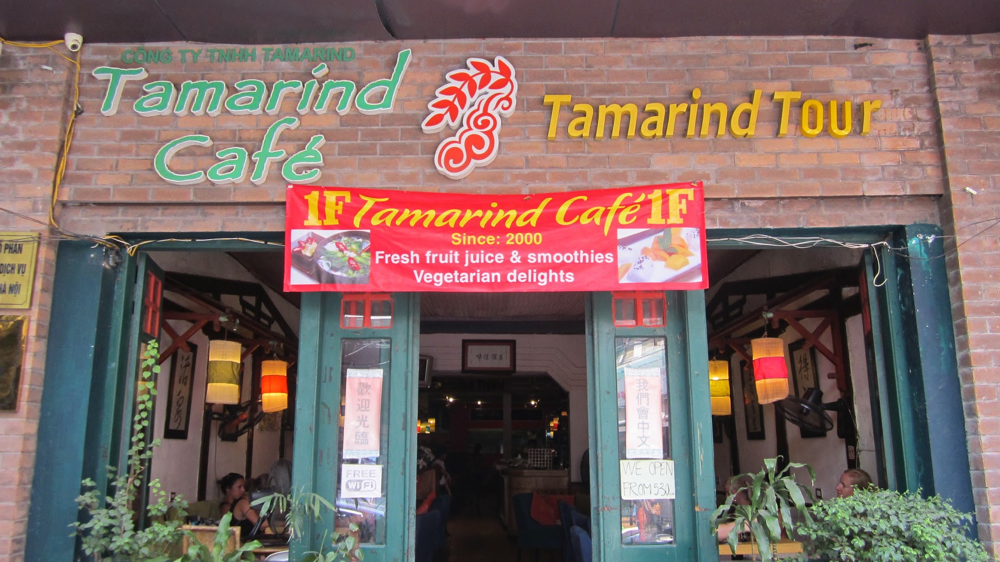
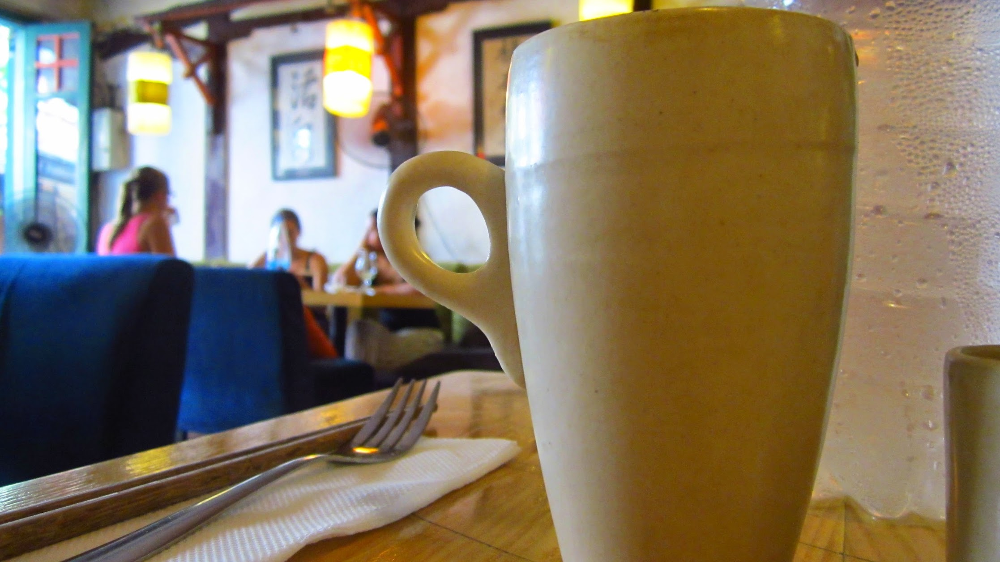
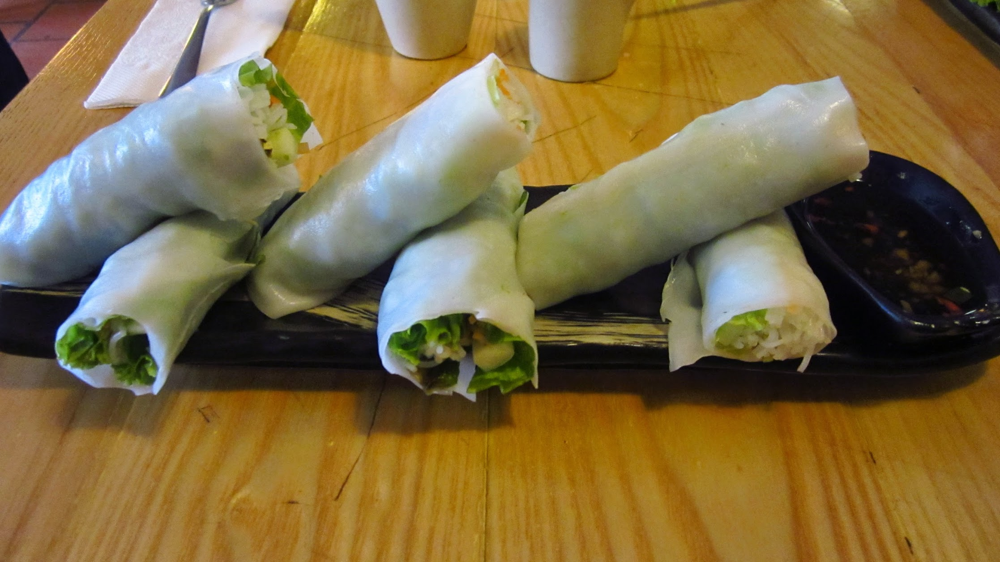
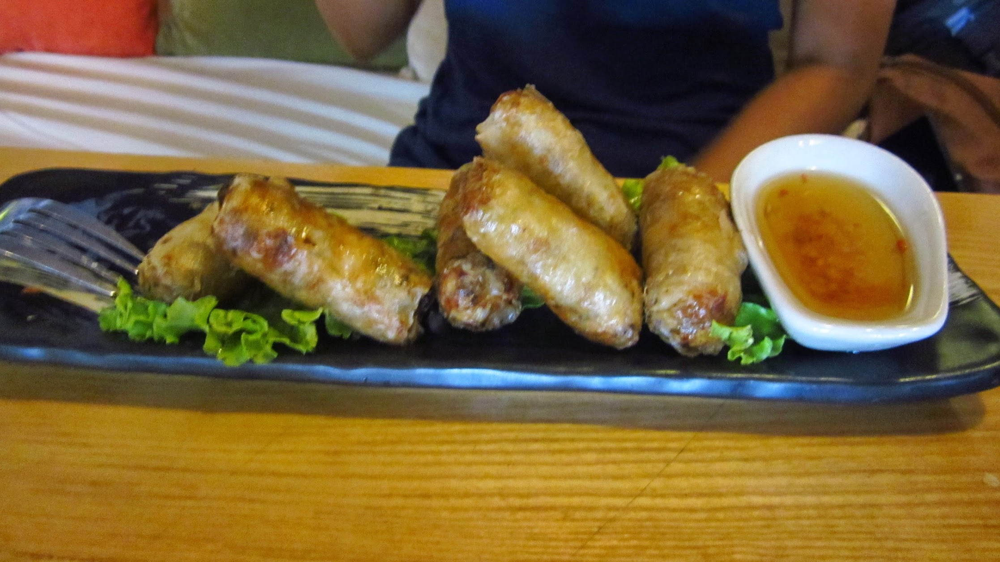

We visited Tamarind Cafe which is next door to Tu Linh Palace Hotel 2.  Tamarind Cafe is a vegetarian restaurant with a relaxed couch atmosphere. We order spring rolls, both fresh and fried, the food tastes bland. I don't think this place is good value. We stayed for a while as the place has many plug sockets, good WiFi and relaxed atmosphere.

 


  {{}}
  {{}}
  {{}}
  {{}}

