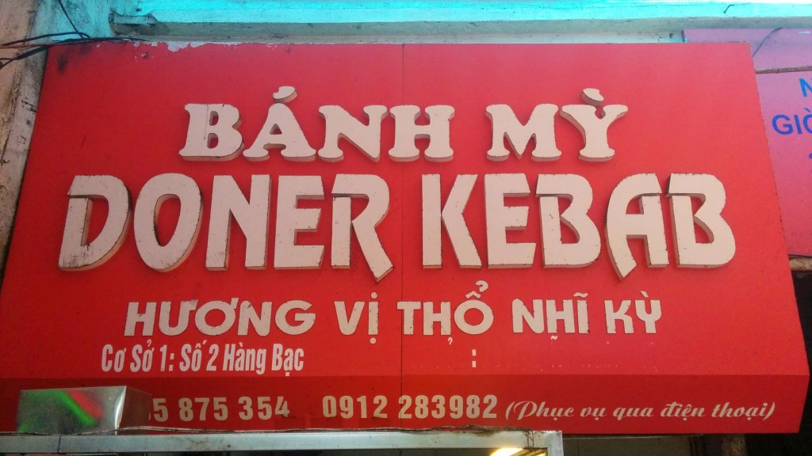
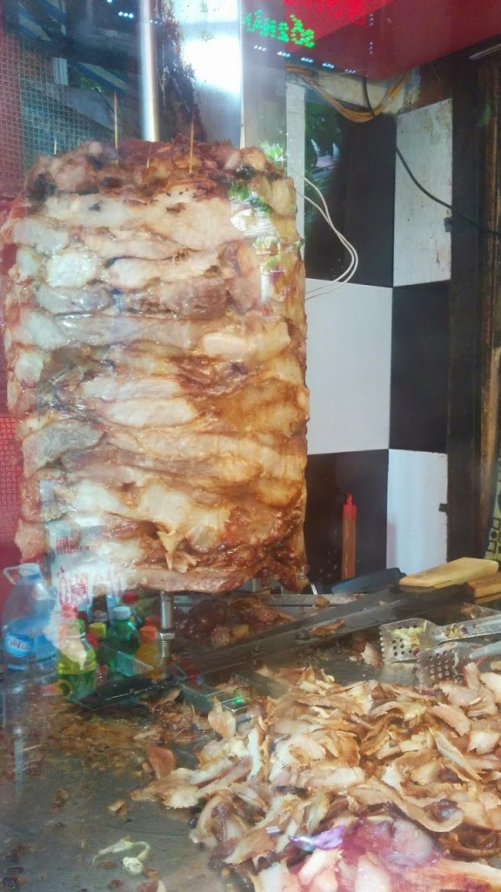

Bánh Mỳ (Bánh Mì) Doner Kebab on the intersection of Hàng Bạc and Hàng Bè. It serves seasoned pork cooked on a rotary for 30,000₫ a sandwich. Really popular as a "drive-thru", many motorcycles will pull up and ask a take-away. Highly recommended for a quick-lunch or sandwich on the go.

> [Bánh Mỳ Doner Kebab](https://www.google.com/maps/place/2+H%C3%A0ng+B%E1%BA%A1c,+Ho%C3%A0n+Ki%E1%BA%BFm,+H%C3%A0+N%E1%BB%99i,+Vietnam/@21.0336422,105.8536992,20z/data=!4m2!3m1!1s0x3135abc08c461303:0x66ae33d7bea53587), 2 Hàng Bạc, Hoàn Kiếm, Hà Nội

