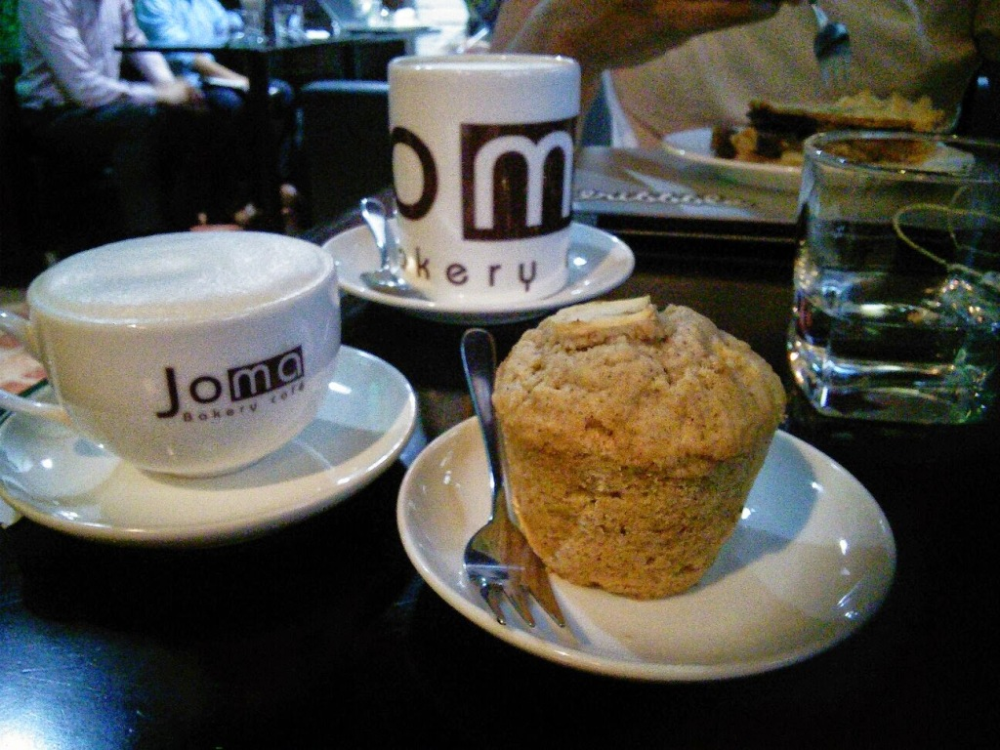

Joma Bakery Cafe (rated #27 out of 926 restaurants in Hanoi on [TripAdvisor](http://www.tripadvisor.com/Restaurant_Review-g293924-d1733461-Reviews-Joma_Bakery_Cafe-Hanoi.html)) is a quality reliable café and bakery in Hanoi. We regally went to work, or chat with family on Skype as they have very reliable internet, great coffee and yummy pies and cakes.

It's calm atmosphere allows the creative to work, complementary glasses filtered water is continuously filled and Caffè Americano coffee includes a free refill.

Perfect place to escape and get your coffee fix while catching up on the world affairs.

> [Joma Bakery Cafe](https://plus.google.com/104182545549629953621/about), 22 Lý Quốc Sư, Hàng Trống, Hoan Kiem District, Hà Nội, Vietnam Website: [www.joma.biz/the-cafes/ly-quoc-su/](http://www.joma.biz/the-cafes/ly-quoc-su/)
