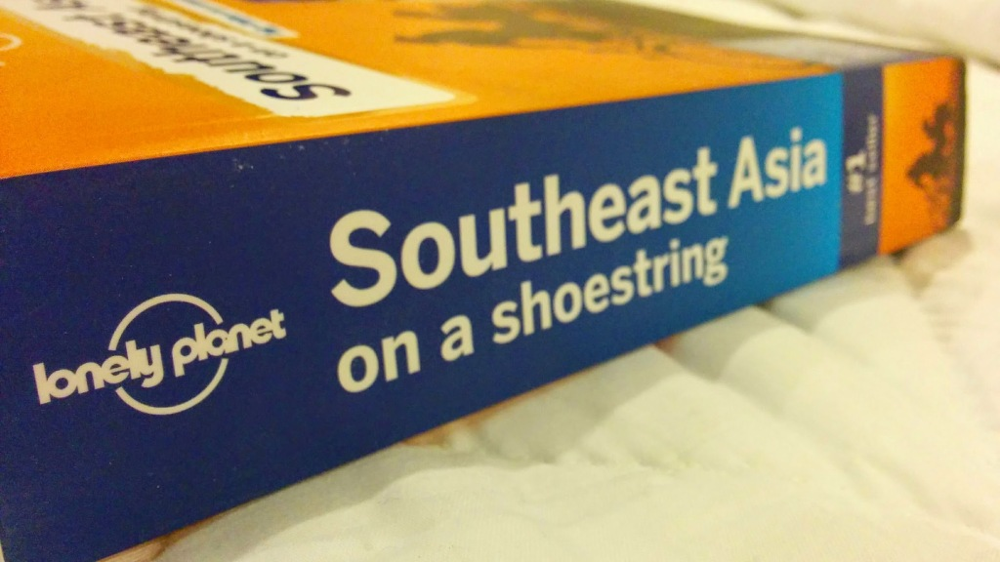
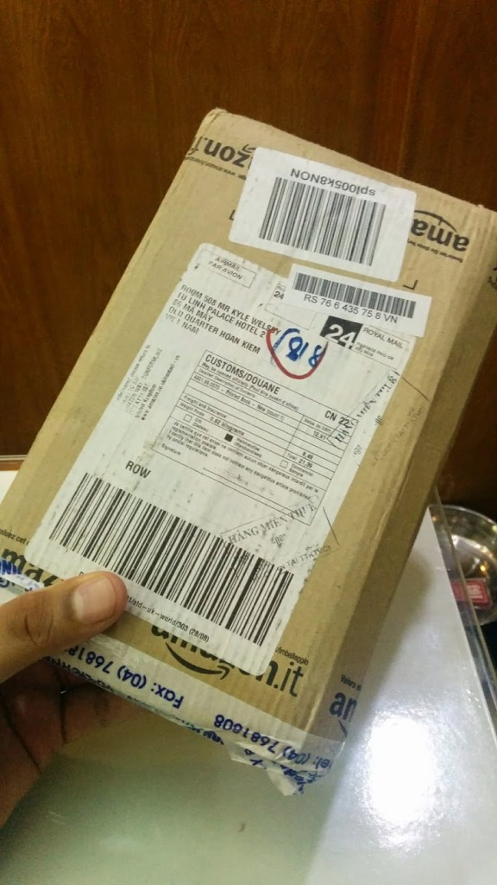

I ordered the latest [Lonely Planet Southeast Asia on a shoestring](http://www.amazon.co.uk/gp/product/1742207537/ref=as_li_tl?ie=UTF8&camp=1634&creative=19450&creativeASIN=1742207537&linkCode=as2&tag=gonetraveli02-21) book from Amazon.co.uk in hope it would arrive. Little to our despair the estimated delivery time came and gone, I started to worry that the book would not arrive in time for the next section of traveling.Luckily 2 days after the estimated date and 2 days we leave Hanoi, it arrives!

<iframe style="float: left; width: 120px; height: 240px;" src="//ws-eu.amazon-adsystem.com/widgets/q?ServiceVersion=20070822&amp;OneJS=1&amp;Operation=GetAdHtml&amp;MarketPlace=GB&amp;source=ss&amp;ref=ss_til&amp;ad_type=product_link&amp;tracking_id=gonetraveli02-21&amp;marketplace=amazon&amp;region=GB&amp;placement=1742207537&amp;asins=1742207537&amp;linkId=&amp;show_border=true&amp;link_opens_in_new_window=true" width="300" height="150" frameborder="0" marginwidth="0" marginheight="0" scrolling="no"></iframe>

Super happy, I now have something to study on the train to Hué on Saturday.
