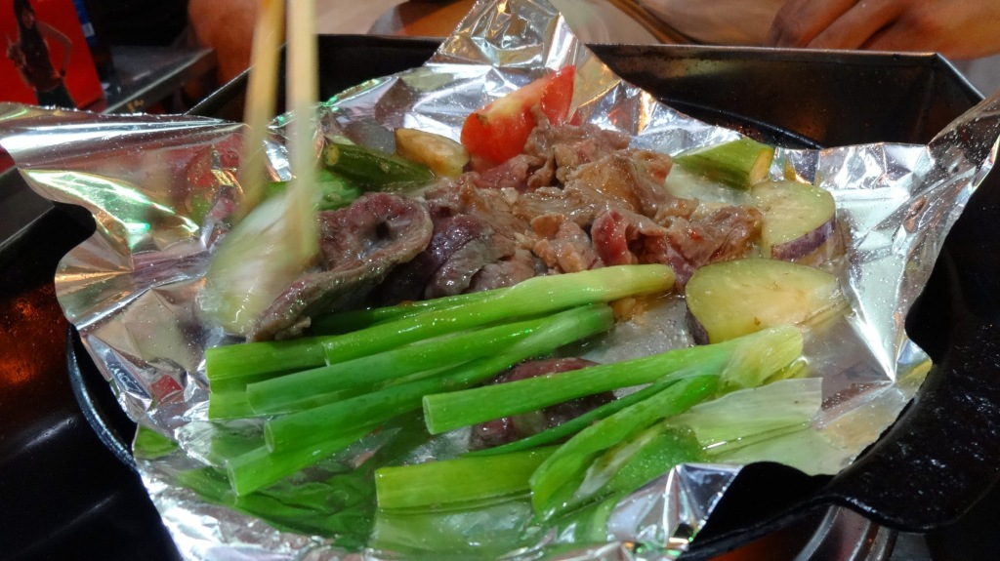

We regularly go to _Bò Nướng Xuân Xuân 47 Mã Mây_ (ranked #46 out of 923 restaurants in Hanoi on [TripAdvisor](http://www.tripadvisor.co.uk/Restaurant_Review-g293924-d2391034-Reviews-Xuan_Xuan-Hanoi.html "Xuan Xuan on TripAdvisor")) for a simple cheap evening dinner that we can cook to our own liking.  You get given a BBQ griddle, a heap of meat and vegetables, a lime chilli & salt dipping sauce and can choose to add bread or rice. The BBQ grill's use smokeless fuel that lasts about 10-15 minutes, we usually have to ask for more fire (at no extra charge).

This all costs between 250,000đ and 300,000đ including a drink (less than £8.70).

Highly recommended for a good fill of meat.

> [Quán Bò Nướng Xuân Xuân](https://plus.google.com/116293814760268920345/about "Google+"), 47 Mã Mây, Hàng Buồm, Hoàn Kiếm, Hanoi, Vietnam

\[gallery link="file" columns="3" orderby="post\_date"\]
