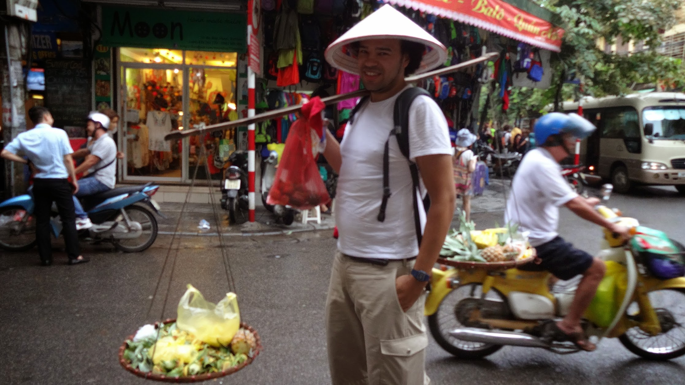
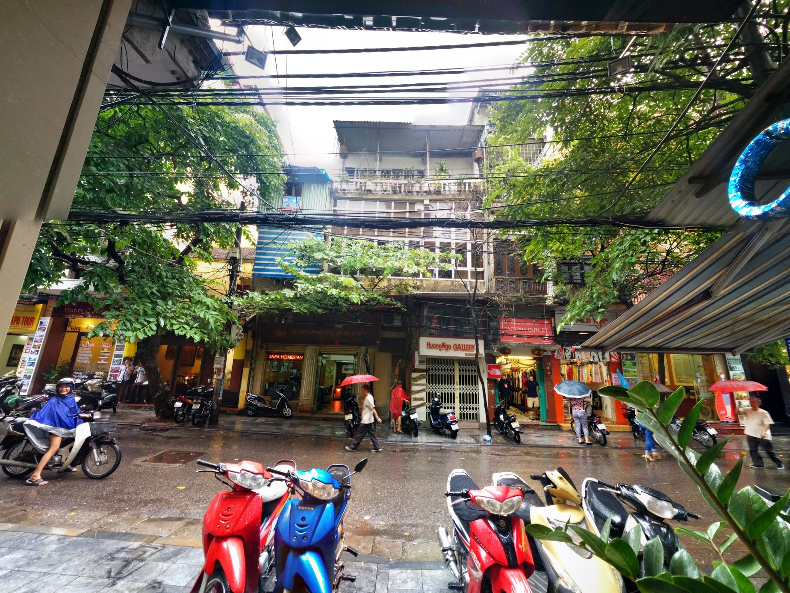

Hanoi is the current capital of Vietnam and the second largest city in Vietnam with an estimated population of over 2.6 million residents. Hanoi is a popular city for tourists traveling to [Sapa](http://gonetraveling.me/2014/08/sa-pa/ "Sa Pa") or [Halong Bay](http://gonetraveling.me/2014/08/ha-long-bay/ "Hạ Long Bay & Bái Tử Long Bay"), many tour operators and hotels will insist you book the tours.

\[caption id="attachment\_1173" align="aligncenter" width="700"\] Many motorbikes taking up the sidewalk.\[/caption\]

The crowded streets make walking a test of the brave as sidewalks are mostly occupied by parked motorbikes. Road traffic although slow closely brushes past you and if there is no space to pass you they will be right behind you beeping horns - quite literally running over you. The city does have traffic lights and zebra crossings but locals do not alway adhere to the rules - you're not guaranteed the traffic will stop and safe crossing at a zebra crossing.

\[soundcloud url="https://api.soundcloud.com/tracks/166612809?secret\_token=s-eucs7" params="color=57ad68&auto\_play=false&hide\_related=false&show\_comments=true&show\_user=true&show\_reposts=false" width="100%" height="166" iframe="true" /\]

Many cycle rickshaws will grab your attention by ringing a bell, and hail you with the palm down 'come here' hand gesture. It becomes second nature to ignore bells and continue walking as close to the side of the road as possible.

Many street vendors in the evenings will bombard you with lighters, wallets and disgusting tasting fried donut sticks (out of all the things why donut's?)

Backpackers and travellers will more than likely hit the old quarter beer corner where you can get 1/2 pint of local beer for 5,000₫ (thats 15p!), the beer is not the greatest tasting but still attracts a crowd.

The [Hoàn Kiếm Lake](https://www.google.com/maps/place/Hoan+Kiem+lake,+Ho%C3%A0n+Ki%E1%BA%BFm+District,+Hanoi,+Vietnam "Hoàn Kiếm Lake on Google Maps") is a focal point of Hanoi, people gather on all occasions, to relax, exercise, pray, socialise, and learn english. I even went for a [run around this lake](http://runkeeper.com/activity?userId=111806&trip=412669340 "RunKeeper Activity") early one morning. The start of September brought many locals out around the lake to celebrate Vietnam Independence from France on 2nd September 1945.

Venturing away from the tourist spots you'll find streets of single trade shops; for example example. [Lý Thường Kiệt](https://www.google.com/maps/place/L%C3%BD+Th%C6%B0%E1%BB%9Dng+Ki%E1%BB%87t,+Ho%C3%A0n+Ki%E1%BA%BFm,+H%C3%A0+N%E1%BB%99i,+Vietnam/@21.0235326,105.8500159,17z/data=!3m1!4b1!4m2!3m1!1s0x3135ab9374be085d:0x8ad98efdf21cf664 "Lý Thường Kiệt on Google Maps") has a row of stationary shops competing for price - The most interesting single trade streets selling is one that sells LED lighting and signage.

One thing you will notice is that Hanoi is clean, the local people take pride in keeping their streets clean and tidy. Each night rubbish would be collected from the street sides, and any road repairs would promptly be actioned.

There is a great sense of pride in Hanoi, much to admire.

**Shopping** Corner shops you visit regularly recognise your face and offer discounts for being loyal. The mini mart on Mã Mây regularly discounted 10,000₫-50,000₫ off the bill. You'll find the guy playing games late into the night.

[Intimex](http://www.intimexco.com/eng/?act=content&pid=4&cid=12) is a large 2 floor supermarket on the [west side of the lake](https://www.google.com/maps/search/Intimex,+23+L%C3%AA+Th%C3%A1i+T%E1%BB%95,+Ho%C3%A0n+Ki%E1%BA%BFm,+H%C3%A0+N%E1%BB%99i,+Vietnam/@21.0280588,105.8512401,16z/data=!3m1!4b1 "on Google Maps"), you'll be able to find everything at less the price than local mini marts.

There are many souvenir shops selling all the same stuff - plenty of completion for the best price. For me I could not set my heart on what souvenirs to buy so ended up not buying anything, except a magnet of Ha Long Bay.

Each weekend an entire stretch of road (from [Hàng Đào](https://www.google.com/maps/place/H%C3%A0ng+%C4%90%C3%A0o,+Ho%C3%A0n+Ki%E1%BA%BFm,+H%C3%A0+N%E1%BB%99i,+Vietnam/@21.0341209,105.8501575,17z/data=!3m1!4b1!4m2!3m1!1s0x3135abbf1a49e6b1:0x80450f404dd7dfec) to [Hàng Giấy](https://www.google.com/maps/place/H%C3%A0ng+Gi%E1%BA%A5y,+%C4%90%E1%BB%93ng+Xu%C3%A2n,+Ho%C3%A0n+Ki%E1%BA%BFm,+H%C3%A0+N%E1%BB%99i,+Vietnam/@21.0382704,105.848638,17z/data=!3m1!4b1!4m2!3m1!1s0x3135abb99fc84f1d:0x5fe6189791ca14cb)) is closed from motor traffic and outdoor stalls are setup selling cloths, watches, sunglasses and other souvenirs.  It gets really warm with the gathering of people trying to haggle a bargain.

**Eating** When arriving in Hanoi take the [Hanoi Street Food Tour](http://gonetraveling.me/2014/08/hanoi-street-food-tour/ "Hanoi Street Food Tour") to get a crash course into street food, some dishes are liked, some not. We would regularly go to [Xuân Xuân](http://gonetraveling.me/2014/09/bo-nuong-xuan-xuan-47-ma-may/ "Bò Nướng Xuân Xuân 47 Mã Mây"), [New Day](http://gonetraveling.me/2014/09/new-day-restaurant/ "New Day Restaurant"), and [Bánh Mì Doner Kebab](http://gonetraveling.me/2014/09/banh-mi-doner-kebab-hang-bac/ "Bánh Mì Doner Kebab Hàng Bạc").  [The Moose and Roo Pub & Grill](http://gonetraveling.me/2014/09/the-moose-and-roo-pub-grill/ "The Moose and Roo Pub & Grill"), would be the most notable restaurant for western food for those who miss the good ol' home style food.

**Working** I'm a lead web developer on a project based in the United Kingdom (my residence country). While in Hanoi I decided to commit couple weeks to catching up with some work tasks to keep my clients and accounts happy. This time allowed an [Amazon order](http://gonetraveling.me/2014/09/it-arrived/ "It arrived!") to be shipped from the United Kingdom using standard postage. I would normally work from [our hotel](http://gonetraveling.me/2014/09/tu-linh-palace-hotel-2/ "review of Tu Linh Palace Hotel 2") as the internet is mostly reliable but would highly recommend [Joma Bakery Cafe](http://gonetraveling.me/2014/09/joma-bakery-cafe/ "Joma Bakery Cafe") as the internet is fast and reliable, and they have decent coffee. Lunch most days was kept simple and cheap by going Highlands Coffee, or [Bang Mi](http://gonetraveling.me/2014/09/banh-mi-doner-kebab-hang-bac/ "Bánh Mì Doner Kebab Hàng Bạc") - this keeps lunch cheap and simple.

**Lodging** We spent the entire time (except for when at Sapa and Halong bay) at [Tu Linh Palace Hotel 2](http://gonetraveling.me/2014/09/tu-linh-palace-hotel-2/ "Tu Linh Palace Hotel 2"), which is clean and comfortable. It has high pressure hot running water, good WiFi, and cable channels. However in retrospective we should have downgraded the room after a week or re-negotiated the rate as the final bill was much more than we anticipated, there was no loyalty discount for the length of stay and kind gestures and time we spend with the staff.

**Money** [CityBank ATM's](http://www.citibank.com/locations "CitiBank ATM's on Google Maps") apply no charge to withdrawals, and allow users to withdraw up-to 8,000,000₫ per transaction.  It is worth keeping an eye out for CityBank ATM's. Standard ATM charges up-to 50,000₫ per transaction.

For the entire month we stayed in Hanoi we withdrawn ₫70,290,000 (exactly £1,999.71), this paid for our hotel, tours, food, drink, confectionaries, everything...

**Other Services** We used the USP postal services to ship some [souvenirs we failed to ship from New Delhi](http://gonetraveling.me/2014/08/shipping-from-india/ "Shipping from India") from Hanoi, the staff are very polite and assisting. Our package went on the cheapest method possible, which is expected to arrive in the United Kingdom in November - (we're not going to see it for over a year anyway).

**Overall** I liked our stay in Hanoi, there are plenty of things to do and navigating is easy enough. If your are not working, blogging or something I would recommend about 1 week to enjoy the sights, sounds and food.


  {{}}
  {{}}
  {{}}
  {{}}
  {{}}
  {{}}
  {{}}
  {{}}
  {{}}
  {{}}
  {{}}
  {{}}
  {{}}
  {{}}
  {{}}
  {{}}
  {{}}
  {{}}
  {{}}
  {{}}

