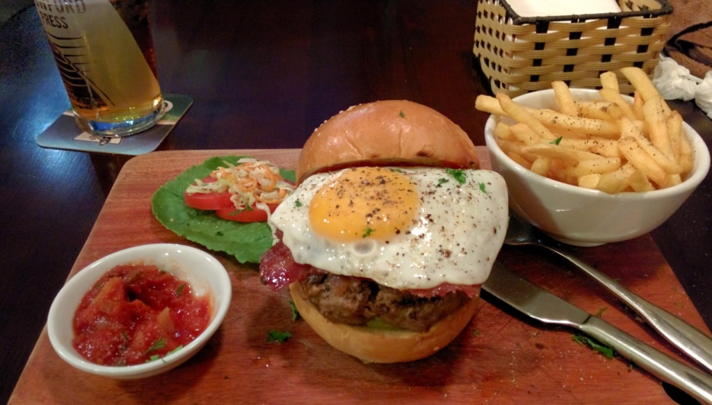

The Moose and Roo Pub & Grill (rated #8 out of 926 restaurants on TripAdvisor) is a quality gastropub in the heart of the old quarter in Hanoi.

We have visited twice and both times enjoyed the gluttonous food served. This restaurant serves, every good British and Australian dish you'll miss from home. Beef and Bone Marrow Burgers, Fish and Chips, Pie and Mash, and much more. Both times I ordered the Beef Burger as they serve the best Beef Burger, on-par with burgers served in Manchester U.K. The main meal prices are equal to western prices, 145,000₫ - 500,000₫ but is worth it for a good taste of home - the burger costs 195,000₫ (about £5.65). I would really recommend you visit this restaurant if you're missing homely food.

> [The Moose and Roo Pub & Grill](https://plus.google.com/104076497730617131587/about), 42 Mã Mây, Hàng Buồm, Hoàn Kiếm, Hà Nội Tel: [+84 4 3200 1289](tel:+84432001289)
