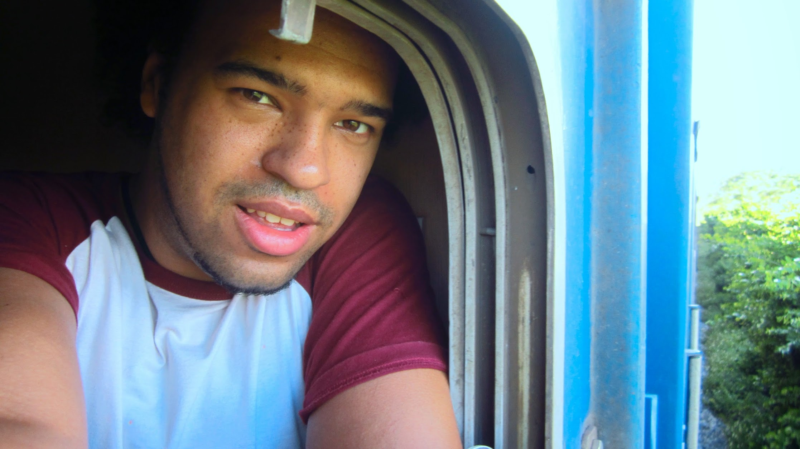

We booked a soft seat train from Hanoi to Hué.  There is only one soft seat carriage for the entire train, the rest are hard seats or sleeper carriages. In the soft sleeper 2 televisions play movies, food programmes, music, document about the rail line and a prank show. Sometimes the programmes are really long and boring and there is no escape as it is amplified though the carriage P.A. system.

Our seats had a table (4 seats facing each other) the passenger facing us had a huge box (which took all the legroom) and some box with some unknown but live creature within - printed on the side, "900 压缩干粮".

Some lady brought a entire picnic to prepare herself a fresh baguette. She taken a good 20-30 minutes carefully building her sandwich. Kudos to her, it looked really good. But I did wonder why she went yo such the effort to bring all the ingredients and sauces and not pre-build it at home?

Towards the end, some passengers where eager to watch the football, they found a video stream and blue-tooth loud speaker and played it loud.

Small cockroaches would crawl the tiny gaps around the windows, fighting to find food and water.  Us not having anywhere to go we can only scare them back to their hiding place.

The train departed Hanoi at 06:00 and arrived in Hue at 20:20 the same day (From dark to dark). This 14+ hour train journey took it out of us, even though we got a good nights rest and napped throughout.

Much preferred the soft seat day time ride than the looks of the hard seat.  The air conditioning makes a big difference. Be sure to bring plenty of snacks and pot noodles. Food is served and noodles are available but choice is limited and frankly do not trust transportation food.

We paid $30 per person (inflated from $22 due to hotel commission), and got to see plenty of land culture as we travelled, not sure what the air fair would have been but it would have been too easy not have been so eventful.


  {{}}
  {{}}
  {{}}
  {{}}
  {{}}
  {{}}
  {{}}
  {{}}
  {{}}

