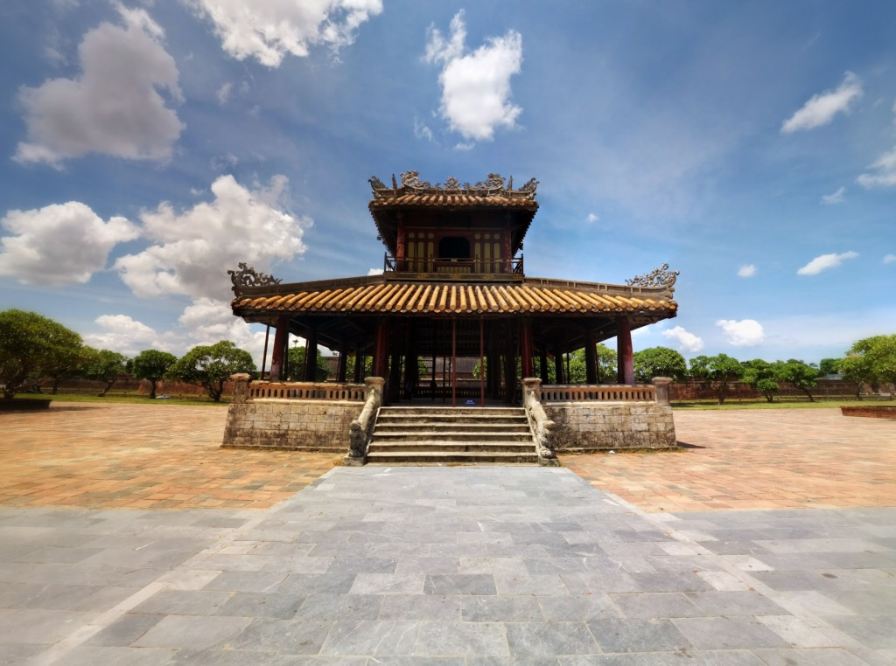

The adventure outside of Vietnam's capital begins with Hue, 14 hour day [train took us from Hanoi to Huế](http://gonetraveling.me/2014/09/train-from-hanoi-to-hue/ "Train from Hanoi to Hué") and arrived in the evening after dark (20:20 PM). Maylin taxi (the green cars, heard to be the most reliable and honest) to deliver us to [Than Thien Hotel](http://gonetraveling.me/2014/09/than-thien-hotel-friendly-hotel/ "Than Thien Hotel – Friendly Hotel").

Exhausted from sitting on a train all day, we needed a filling meal before we can take Doxycycline (an anantimalarial antibiotic) - the antibiotic is rejected from the body if consumed on a empty stomach. Walking around the 'touristy' area of Huế we got bombarded with rickshaw riders wanting us to uptake there services, cannabis dealers making the international spiff to mouth gesture (we all understand what it means). Ideally something that is not desired when you just want to relax. We finally decided on a cheap simple restaurant and had fried Noodles - a very basic meal.

We did not stay out too late as we were exhausted, and stinky.

The next day we made it our mission to go and book our bus tickets for onward travel to Hoi An and walk around the city to see what is what. We booked an afternoon bus to Hoi An for the following day through [TheSinhTourist](https://www.thesinhtourist.vn/bus/hu/vc-huha-08/hue-hoi-an) costing 89,000₫ per person.

After sorting bus tickets, exploration of the city could commence. We turned one corner and 4 rickshaws jumped on us whilst trying to take a photo. (nearly breaking into a run to get away) we walked across the large steel bridge with calm and piece from hawkers as pedestrians are separate from road traffic. Making it to the other side we realised a historic military presence. Vendors along the rider side streets would sell old coins, Chinaware and medals. We made some effort to visit the Imperial city, entrance is 110,000₫ per person (very pricy for ruins)  without no guide, maps or detail what this place really is. We exhausted ourselves walking around in the hot sun looking at some of the beautiful reconstructions and ruins - we only lasted a couple of hours until migraine set in.

\[caption id="attachment\_1208" align="aligncenter" width="700"\] Lotterria - Vietnam's McDonalds fast food alternative\[/caption\]

We had a quick lunch at Lotterria (Vietnam's McDonalds fast food alternative) having a Shrimp burger, fried chicken and some other weird tasting burger, was not amazing. Directly next door is a large supermarket, we resupplied water, snacks and soap.

Walking along the riverside we got pestered and followed by ladies trying to sell there "1 hour, 1hour" boat cruises. Exhausted from the sun and not wanting to exhaust energy explaining why we do not want a cruise we simply ignored them. They were most persistent following us and tapping at the flyer for the entire stretch of the banks.   Finally reaching the refuge of the hotel we could cool down with the air conditioning and cool shower.

We assessed TripAdvisor and found [Zucca](http://gonetraveling.me/2014/09/zucca/ "Zucca") and enjoyed a great evening meal, I really liked this place. Great food and service!

As it was the last night in Huế I wanted to enjoy a cocktail and some conversation, suggesting Huế Backpackers, we got cheap 2-4-1 cocktails, chatted with another traveler from Germany and seen a couple who were on the same train with us to Huế. Did not make a big night of it, kept it to one drink and bed to try and sleep off the migraine from the daytime sun.

Sadly only got a few hours of sleep, the room air-conditioning unit failed and I failed to sleep in the 27°+ heat.

Waking up cranky and tired we had breakfast, showered, packed our bags and departed to get our bus to Hoi An.

\[gallery link="file" type="rectangular" ids="1208,1212,1213,1214,1215,1216,1217,1219,1220,1221,1222,1223,1224,1225,1226,1228,1227,1233,1232,1231,1230,1229" orderby="post\_date"\]
