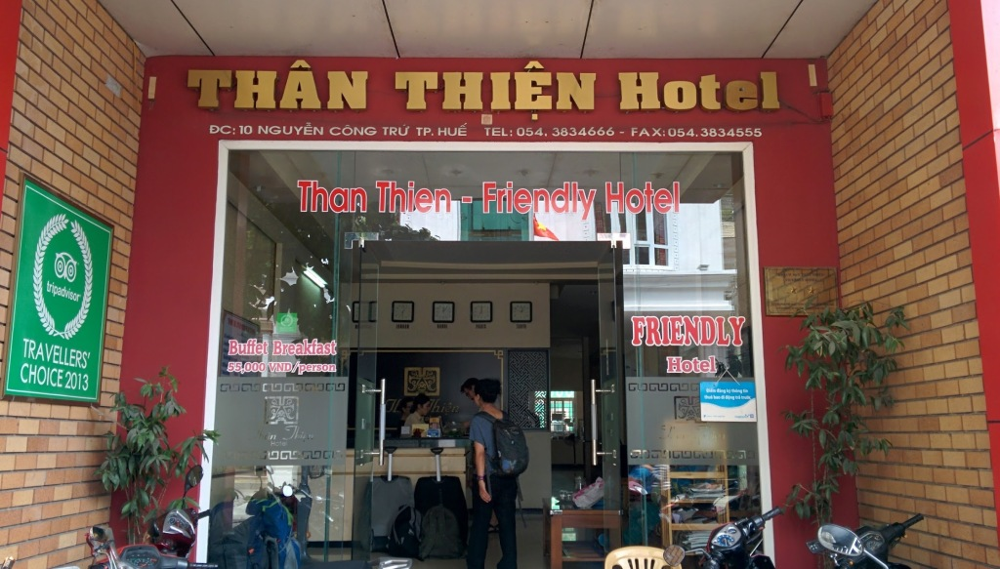

Than Thien Hotel - Friendly Hotel (ranked #14 out of 110 Hotels in Hue on [TripAdvisor](http://www.tripadvisor.com/Hotel_Review-g293926-d1604085-Reviews-Than_Thien_Hotel_Friendly_Hotel-Hue_Thua_Thien_Hue_Province.html)) is a hotel in a great location allowing quiet getaway while still being in the City region.

Pros:

- Spacious rooms
- Rooms have windows
- Staff are friendly
- Good quiet location
- Great breakfast selection
- Huge Window with view

Cons:

- Air-conditioning units may fail.

Rooms are spacious with a quality bathroom that has a glass separator for the shower. Breakfast has a great buffet selection, with fresh fruit, fruit juices, cooked to order eggs, fried rice, bacon, toast, banana pancakes and much more. The air-conditioning unit failed on the second night and no compensation was offered for the loss of sleep.

Would stay again.

\[usrlist Service:4 Room:4 Value:5 English:5 Overall:4\]

> [Than Thien Hotel - Friendly Hotel](https://plus.google.com/114365367536127799600/about), 10 Nguyen Cong Tru Street, Hue, Vietnam Tel: [+84 543 834 666](+84543834666) Email: [thanthienhuehotel@gmail.com](mailto:thanthienhuehotel@gmail.com) Website: [www.thanthienhotel.com.vn](http://www.thanthienhotel.com.vn/)

\[gallery link="file" columns="3" orderby="post\_date"\]
