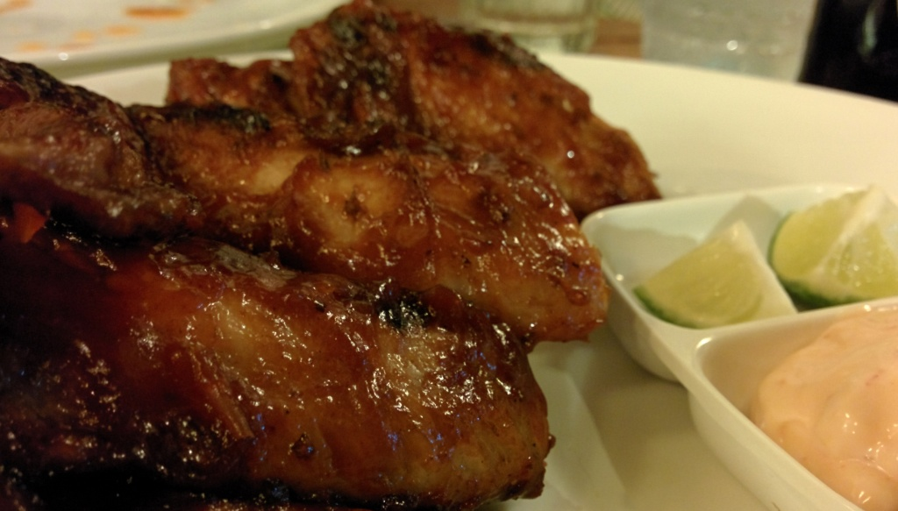
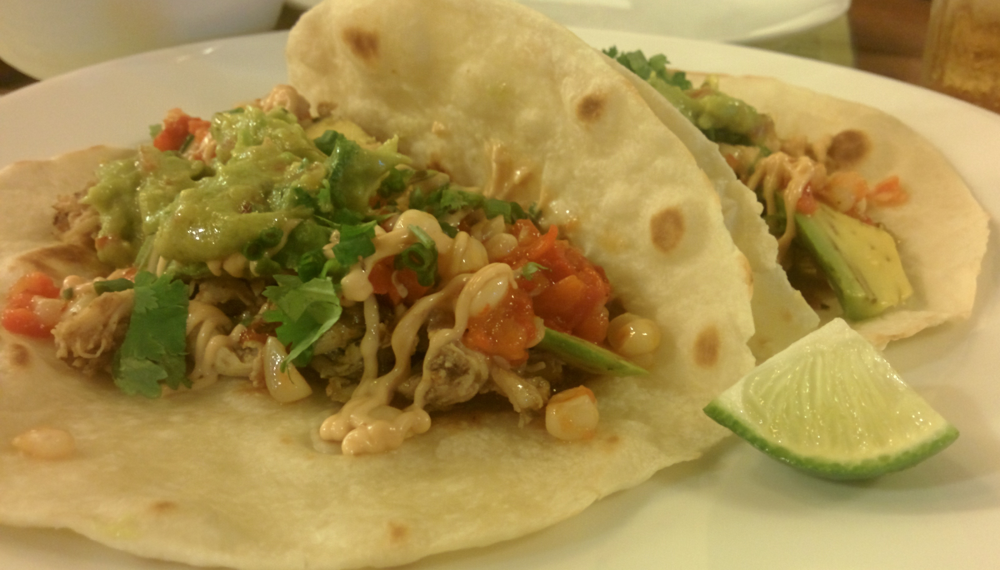
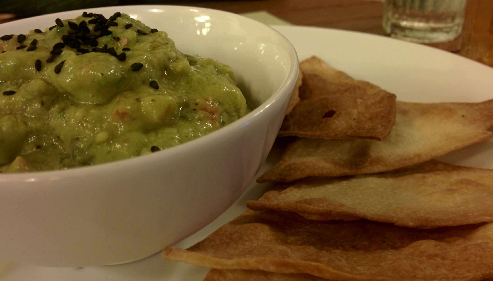

\[caption id="attachment\_1271" align="aligncenter" width="700"\] Best Chicken Wings Ever!\[/caption\]

Hola Taco is a Mexican restaurant (ranked 38 out of 412 restaurants on Hoi An on [TripAdvisor](http://www.tripadvisor.co.uk/Restaurant_Review-g298082-d6736464-Reviews-HOLA_TACO-Hoi_An_Quang_Nam_Province.html) ) We could not be more satisfied with the food, service and price.  The music and atmosphere is really relaxing, staff are friendly and food is just damn awesome!

We tried the Chicken Taco, Pork Taco Guacamole with baked nachos and BBQ wings. Every flavour carefully balanced and subtly spiced.

It's rare for restaurants to serve cider so to see Magners on the menu it was hard not to have a drink.

It is so nice, we ate here twice!

> [Hola Taco](https://plus.google.com/104244464240025294088/about), 5 Phan Châu Trinh, Minh An, tp. Hội An, Quảng Nam, Vietnam Tel:  +84 91 296 11 69


  {{}}
  {{}}
  {{}}

